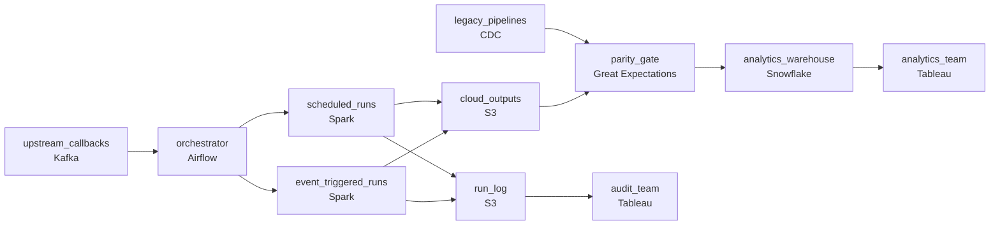

# Five Years of Cron Jobs
_Half the jobs run on cron. Half run on events. All of it has to move._

- **Domain:** pipeline_architecture
- **Difficulty:** Hard
- **Est. time:** 10 min
- **URL:** https://datadriven.io/problems/five_years_of_cron_jobs

## Problem

We have a data platform that has grown organically over five years: some pipelines run on-premises as scheduled cron jobs, others are event-driven workflows triggered by upstream system callbacks. We need to migrate everything to a single cloud-native orchestration platform without disrupting the analytics team. Design the migration architecture and the logging and observability schema that supports it.

**Concepts tested:** `paBatchVsStreaming`, `paCiCd`, `paDagOrchestration`, `paDataQuality`, `paDeadLetterQueue`, `paDependencyMgmt`, `paEnvironmentMgmt`, `paEventDriven`, `paEventPlatforms`, `paIdempotency`, `paMonitoring`, `paRetryHandling`

## Requirements

- Analytics teams rely on these pipelines daily; the migration cannot create a gap where they see stale data or missed runs.
- Audit requires that every pipeline run be queryable for years; today logs are flat text files that no one can search across.
- About a third of pipelines fire on upstream events rather than on a schedule; their behavior can't change after migration.
- For each migrated pipeline, the cloud and on-prem runs are compared during dual-run; if they diverge, on-prem stays authoritative.

## Must-have components

- The whole point is a single cloud-native orchestration platform that handles both scheduled and event-driven pipelines. Without an orchestration tier there's no migration target. Add Airflow, Dagster, Prefect, or Composer.
- Audit requires that every pipeline run be queryable for years; the run log has to land somewhere durable and structured. Add a cold-storage layer (S3, GCS, ADLS) or warehouse target for the structured run log.

**Expected stages:** `pipeline_run_log` → `task_execution_log` → `data_lineage_events` → `sla_tracking` → `migration_state`

## Solution walkthrough

### What this really is

This is a strangler-fig migration dressed up as a logging question. Anyone can draw Airflow and an S3 bucket. What separates candidates is treating cutover as an evidence-gated decision. Every pipeline dual-runs, a parity check compares cloud against on-prem, and on-prem stays authoritative until the diff holds. Skip that and three things break. The analytics team becomes your test suite. The third of pipelines that fire on callbacks silently start waiting for a cron tick. And the first audit question gets answered with grep.

> **Cutover is a gate, not a date**
>
> During migration, analytics never reads cloud output directly. It reads through the parity gate, which promotes cloud results only after the diff against the legacy run has stayed within tolerance for the agreed window. The cutover flag lives in `migration_state`, so every flip has a recorded reason.

### Walk the requirements

**Step 1: Dual-run every migrating pipeline**

Cloud and legacy both run for one to several weeks, and each writes to its own output path. Analytics keeps reading the legacy outputs the whole time. That is what makes the migration invisible: the old path never stopped, so there is no freshness gap and no missed run.

**Step 2: Keep event triggers as event triggers**

A third of pipelines fire on upstream callbacks. Route those callbacks onto a queue the orchestrator listens to, so each run starts when the upstream is ready. If you fold them into a schedule, you add a polling interval of latency nobody signed up for.

**Step 3: Diff the outputs and let on-prem win**

The parity gate compares cloud and legacy outputs run by run. Out of tolerance means an alert, and legacy stays authoritative. In tolerance for the full window means the pointer flips. There is no manual sign-off on Monday morning.

**Step 4: Write a structured record for every run**

During dual-run, every run from both systems writes a row to `pipeline_run_log`: run id, pipeline, trigger type, start, end, status, input and output pointers, and error context. Task-level detail goes to `task_execution_log`. The log lands in S3 with a query layer over it and is retained for the regulatory window.

### The reference design

| node | type | tech | details |
|---|---|---|---|
| upstream_callbacks | queue | Kafka |  |
| legacy_pipelines | source | CDC |  |
| orchestrator | transform | Airflow | errorAction: alert; monitorAlert: Daily diff out of tolerance for migrating pipeline |
| scheduled_runs | transform | Spark | idempotencyStrategy: staging_table |
| event_triggered_runs | transform | Spark | idempotencyStrategy: staging_table |
| cloud_outputs | storage | S3 | backfillStrategy: partition_overwrite |
| parity_gate | quality_gate | Great Expectations | errorAction: alert |
| run_log | storage | S3 | backfillStrategy: incremental |
| analytics_warehouse | storage | Snowflake | slaFreshness: < 24h |
| analytics_team | consumer | Tableau | slaFreshness: < 24h |
| audit_team | consumer | Tableau | slaFreshness: < 24h |

| Port and switch | Dual-run with parity gate |
|---|---|
| Pipelines move one at a time, and analytics is repointed after a spot check. Discrepancies surface a week later, reported by the analytics team. Rolling back means re-enabling cron by hand. | Both systems run side by side, a daily diff decides, and the flip is config. Rolling back means flipping the pointer back, and the diff history explains why. |

> **Event pipelines quietly become cron**
>
> The new platform gets set up schedule-first, and callback pipelines get a `*/15` schedule as a stopgap. Every downstream consumer of those jobs has just lost up to fifteen minutes of freshness, and nobody told them.

> **The run log is a schema, not a file**
>
> Strong candidates name the tables: `pipeline_run_log`, `task_execution_log`, `data_lineage_events`, `sla_tracking`, `migration_state`. When audit asks what ran last March 15, the answer should be a SQL query joining runs to lineage, not a forensic grep.

> **Dual-run doubles compute per window, not forever**
>
> Running both systems roughly doubles compute, but only during each pipeline's own window, because pipelines migrate in waves. The run log grows for years, yet one row per run on partitioned S3 is cheap. The expensive outcome is an audit you cannot answer.

- **A pipeline's diff has held for two weeks, then spikes on a quarter-end run. What happens?**
  - _Whether the gate is continuous: the spike halts or rolls back cutover until someone decides whether legacy or cloud is wrong._
- **An auditor wants the input data of a run from two years ago. Where does the log point them?**
  - _Whether the log stores pointers rather than copies. The input data follows its own retention policy._
