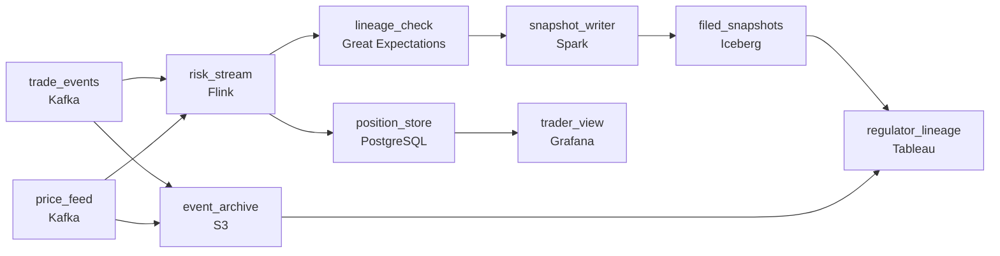

# Flying Blind Until Midnight
_Intraday risk, full lineage. The regulator is watching._

- **Domain:** pipeline_architecture
- **Difficulty:** Hard
- **Est. time:** 10 min
- **URL:** https://datadriven.io/problems/flying_blind_until_midnight

## Problem

Our capital markets desk runs trading books across fixed income, FX, and derivatives, and we need intraday margin calculations that reflect current market positions. Right now risk runs nightly and the trading desk is flying blind intraday. The bigger challenge: our regulators in Canada require BCBS 239-compliant lineage on every risk number - every P&L figure must be traceable back to its source trade and price. Design a risk data pipeline that satisfies both the latency and the compliance requirements.

**Concepts tested:** `paApiIngestion`, `paBatchVsStreaming`, `paCdc`, `paDagOrchestration`, `paDataQuality`, `paDataSkew`, `paDeadLetterQueue`, `paDeduplication`, `paEventDriven`, `paEventPlatforms`, `paFullVsIncremental`, `paIdempotency`, `paKappaArch`, `paLateData`, `paMemoryManagement`, `paMicroBatchVsTrue`, `paMonitoring`, `paPartitioning`, `paRetryHandling`, `paScdPipeline`, `paSchemaEvolution`, `paStreamProcessing`, `paTableFormats`

## Requirements

- The trading desk has been flying blind during the day; they want to see positions and risk while the market is open.
- Regulators can ask for the source of any P&L or risk number on a report, and the answer can't be 'we'd have to look at the code'.
- Canadian customer data has to stay in Canada and US data has to stay in the US; only group-level numbers cross borders.
- Once we file a regulatory snapshot, that snapshot can't quietly change later.

## Must-have components

- Traders need positions and risk while the market is open; nightly is the named problem. Add a streaming technology (Flink, Kafka Streams, Spark Streaming) on the trade-event path or set SLA Freshness to real-time / < 1min on a processing node so risk reflects intraday activity.
- Regulators reconstruct positions for any past hour, and once a snapshot is filed it can't change. Without a cold storage tier (S3, GCS, ADLS, or equivalent) there's no place to write the immutable hourly snapshots, and lineage has nowhere to anchor.

**Expected stages:** `intraday_positions` → `risk_metrics` → `data_lineage_graph` → `regulatory_reports`

## Solution walkthrough

### Why this problem exists in real interviews

Two requirements are pulling in opposite directions. Traders want risk in seconds; regulators want every number on every report traceable back to the trade and the price that produced it. Streaming makes the desk happy and the compliance officer nervous; a heavy lineage-everywhere approach makes compliance happy and the desk blind. The shape that wins isn't a compromise on either side, it's a stream that emits an immutable audit trail as it goes.

Most candidates draw nightly batch for the official numbers and bolt a separate streaming view on the side for traders. Two pipelines, two answers, and the trader's intraday view drifts from the nightly book within an hour. The auditor asks 'what was the position at a particular hour?' and the answer is 'we'd have to reconstruct it.' That's the exact failure BCBS 239 was written to prevent.

> **Trick to Solving**
>
> When latency and audit both matter, don't run two pipelines; run one streaming pipeline that writes an immutable trail as it computes.
>
> 1. Streaming is the path; cold storage is the audit. Every event the stream consumes also lands in object storage, partitioned by hour, never overwritten.
> 2. Lineage is a column on the row, not a doc someone updates. Each risk number carries the trade ids and price ids it was computed from, queryable in the warehouse.
> 3. Data residency is a layout decision, not a query-time filter. Run a Canadian pipeline in Canada and a US pipeline in the US; only aggregates cross.

---

### Walk the requirements

**Step 1: Put the trader on a streaming path**

Trade events flow through a queue and a stream processor that updates positions and intraday margin in seconds. The trader's view reads from a serving store fed by the stream, not from the nightly batch. The streaming path is what stops the desk from flying blind; without it the named problem in the prompt is unaddressed. Whatever stream tech you pick (Flink, Kafka Streams, Spark Streaming), the property that matters is sub-minute end-to-end from trade event to trader screen.

**Step 2: Write lineage on the row, not in a wiki**

Each computed risk number carries the ids it was derived from: the trade ids and the price snapshot id. Those ids point at the cold-storage records the stream wrote on its way through. When a regulator asks 'where did this number come from,' the answer is a SQL query against the lineage columns, not a code archaeology project. The trail is queryable because it lives in the data, not next to it.

**Step 3: Run two regional pipelines and only let aggregates cross**

Canadian customer data has to stay in Canada and US data in the US. That's a layout requirement, not a where-clause. Run a Canadian copy of the pipeline in a Canadian region and a US copy in a US region, each writing to its own warehouse. The group-level rollup that crosses borders consumes only aggregated numbers, no row-level customer data. A single global pipeline with a residency filter at the end is the version that fails an audit.

**Step 4: Make filed snapshots immutable, corrections additive**

When a regulatory snapshot is filed, write it to cold storage in a location that can't be overwritten (versioned object storage, write-once policy, or an immutable lakehouse table). Corrections aren't overwrites; they're new versioned records that reference the original. The audit story becomes 'here's what we filed, here's the correction we filed two days later, here's what we believe today,' all three queryable. Overwriting yesterday's snapshot is the move that makes a regulator escalate.

---

### The shape that fits

| node | type | tech | details |
|---|---|---|---|
| trade_events | source | Kafka | parallelism: 16 partitions |
| price_feed | source | Kafka | parallelism: 8 partitions |
| risk_stream | transform | Flink | errorAction: dlq; slaFreshness: real-time |
| event_archive | storage | S3 | backfillStrategy: partition_overwrite |
| position_store | storage | PostgreSQL | slaFreshness: < 1min |
| lineage_check | quality_gate | Great Expectations | errorAction: alert; monitorAlert: Risk row missing trade_ids or price_id |
| snapshot_writer | transform | Spark | idempotencyStrategy: staging_table |
| filed_snapshots | storage | Iceberg | backfillStrategy: incremental |
| trader_view | consumer | Grafana | slaFreshness: real-time |
| regulator_lineage | consumer | Tableau | slaFreshness: < 24h |

> **What this design gives up**
>
> Streaming with column-level lineage costs more storage and more compute than a nightly batch with a wiki page. Every input event lands in cold storage and every output row carries lineage ids. Two regional pipelines means duplicated infrastructure. The cost goes up so the audit answer is a query, not a project. That's the only answer the regulator accepts.

> **What reviewers check**
>
> A reviewer looks at the canvas for these properties:
> - A streaming path lands trade events at the trader's view in seconds, with a separate path that writes the same events to a queryable archive.
> - Filed snapshots live in immutable storage; lineage ids on each row resolve back to the archived events.

> **The mistake that ships**
>
> The shape that ships keeps nightly batch for the books and adds a Grafana view fed by a side stream. By month two, intraday positions on Grafana drift from the nightly book by a few percent, traders stop trusting Grafana and go back to flying blind, and a Canadian examiner asks for the lineage of a P&L number from a particular hour last week. The answer is 'we'd have to reconstruct it.' The bank gets a finding, the team spends a quarter retrofitting lineage onto the existing pipeline, and discovers that retrofitting lineage is harder than building it in.

---

- **A regulator asks for the position at a specific hour last Tuesday and the price quotes that fed it. What query do you run, and against which store?**
  - _Tests whether the candidate sees that the answer comes from the cold-storage event archive and the filed snapshots, joined on lineage ids. If they reach for the position store, they've forgotten that the position store holds current state, not history._
- **A desk on the Canadian side wants to see US positions in the same view. What changes, and what stays the same?**
  - _Tests whether the candidate keeps customer data in-region and only sends aggregates across the border. Streaming raw US position data across the border is the wrong answer; computing US-side aggregates and shipping those is the right one._
