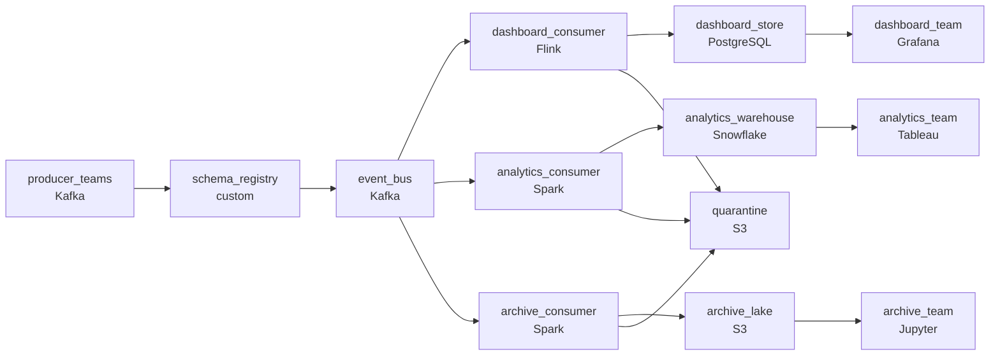

# Four Teams, One Topic, No Agreement
_Everybody is writing to it. Nobody documented it. Now production is fragile._

- **Domain:** pipeline_architecture
- **Difficulty:** Hard
- **Est. time:** 30 min
- **URL:** https://datadriven.io/problems/four_teams_one_topic_no_agreement

## Problem

Four teams publish independently to one shared event topic, and three streaming jobs read it on their own release cycles. How would you design the pipeline so an incompatible schema change is refused when it is published, not discovered when a consumer crashes? An event one job still cannot read must be set aside durably for replay without stalling the other two jobs, and the dashboard team's real-time job cannot absorb a per-message validation cost.

**Concepts tested:** `paDataQuality`, `paDeadLetterQueue`, `paEventPlatforms`, `paSchemaEvolution`, `paStreamProcessing`

## Requirements

- Four producer teams deploy independently and unilateral schema changes have been breaking the consumer jobs and waking on-call.
- Three consumer jobs read from the same topic on different release cycles; if one trips on a schema issue it can't stop the others from making progress.
- The real-time dashboard team has a contracted latency on this topic; schema enforcement can't add meaningful overhead per message.

## Must-have components

- Multi-team events flow through Kafka topics shared across producers and consumers; without a message queue / log tier there's no shared backbone or schema-validation point. Add Kafka or an equivalent event bus.
- Producer changes have been silently breaking consumers; rejected events have to be set aside in a recoverable location for replay after the schema is fixed. Add a durable storage tier (S3, GCS, ADLS) for the dead-letter / quarantine path.

**Expected stages:** `Kafka Producers` → `Schema Registry` → `Kafka Topic` → `Spark Streaming Job` → `Target Data Store`

## Solution walkthrough

### Why this problem exists in real interviews

Four teams publishing to the same topic without coordination is a guaranteed schema-drift problem. The trap is treating it as a discipline problem (more code reviews, a wiki page) when it's a contract problem. Producers and consumers will deploy independently; the bus has to be where the contract is enforced, not somebody's standup.

The simple answer is one Kafka topic, three consumer jobs, and a 'best practices' wiki page about schema discipline. A producer team adds a required field on Tuesday; one consumer crashes Tuesday night, the on-call engineer rolls back the producer's change and writes a postmortem about it. A different producer team renames a field two weeks later; a different consumer crashes; another postmortem. Each consumer's outage takes the topic with it because the bad event keeps getting redelivered.

> **Trick to Solving**
>
> Schema contract enforced at publish; per-consumer offsets so failures stay local; bad events to a quarantine that doesn't slow anyone down.
>
> 1. The contract belongs at the bus, not in standups. A producer publishing through the registry can't ship an incompatible change.
> 2. Failure isolation lives in offsets. Each consumer maintains its own progress, so one team's outage doesn't park behind the topic.
> 3. The dashboard's hot path can't be where bad events get retried. Validation routes failures to a quarantine and the good events keep moving.

---

### Walk the requirements

**Step 1: Schema contract enforced at publish, not discovered downstream**

The bus's schema-contract layer holds a contract per topic. Producers publish through the registry; an incompatible change (removed required field, type change, renamed field without an alias) is rejected at publish time. The producing team sees the error immediately and either updates the contract with backward-compatible evolution or reverts. A 'we'll catch breaking changes in code review' approach is the version where four producers ship and three consumers crash at midnight. The contract lives in the registry, not in standups.

**Step 2: Per-consumer isolation so one failure doesn't block the others**

Each consumer is its own consumer group with its own offsets. When a consumer fails on an unexpected event, the bus retains messages within retention; the other consumers don't notice. When the failing consumer is fixed, it replays from where it left off. A shared consumer group across teams is the version where one team's restart blocks every other team. Per-group isolation is the property that contains the failure.

**Step 3: Quarantine for failed validation; the dashboard keeps its latency**

Validation that fails (in the consumer's adapter or in a stream-side check) routes to a quarantine in cold storage, with the rejection reason. The good events keep flowing through the consumer's hot path. The dashboard team's latency budget isn't burned on retrying bad events. A separate triage consumer reads the quarantine on its own schedule, fixes the upstream issue, and replays. Letting the bad event halt the consumer is the version where the dashboard's contract gets violated by a single malformed message.

---

### The shape that fits

| node | type | tech | details |
|---|---|---|---|
| producer_teams | source | Kafka |  |
| schema_registry | quality_gate | custom | errorAction: alert; monitorAlert: Producer rejected on incompatible schema change |
| event_bus | queue | Kafka | parallelism: 8 partitions |
| dashboard_consumer | transform | Flink | errorAction: dlq; slaFreshness: real-time |
| analytics_consumer | transform | Spark | errorAction: dlq; slaFreshness: < 1h |
| archive_consumer | transform | Spark | errorAction: dlq; slaFreshness: < 24h |
| quarantine | storage | S3 | monitorAlert: Quarantine depth above expected baseline |
| dashboard_store | storage | PostgreSQL | slaFreshness: real-time |
| analytics_warehouse | storage | Snowflake | slaFreshness: < 1h |
| archive_lake | storage | S3 | backfillStrategy: partition_overwrite |
| dashboard_team | consumer | Grafana | slaFreshness: real-time |
| analytics_team | consumer | Tableau | slaFreshness: < 1h |
| archive_team | consumer | Jupyter | slaFreshness: < 24h |

> **What this design gives up**
>
> A schema-contract layer adds a publish-time check producers have to integrate with. Per-consumer groups mean per-consumer monitoring and per-consumer alerts. A quarantine adds a triage workflow somebody has to actually run. 'Just put it on Kafka' is the simpler design; in return for the additional pieces, the platform contains schema breakage at the boundary, isolates consumer failures from each other, and protects the dashboard's latency from a malformed message.

> **What reviewers check**
>
> A reviewer looks at the canvas for these properties:
> - An event bus sits between producers and per-consumer paths, with a schema contract enforced before publish.
> - Validation failures route to a quarantine in cold storage so the dashboard's hot path keeps moving.

> **The mistake that ships**
>
> The team's first cut uses one Kafka topic, ad-hoc schema discipline through code review, and a single shared consumer group. A producer team adds a required field; one consumer crashes that night and a postmortem follows. A different producer renames a field; a different consumer crashes. Each crash takes the consumer offline until somebody manually intervenes, and the bad events keep redelivering, which keeps blocking the consumer. The team rebuilds with a registry, per-group consumers, and a quarantine. The team-by-team workarounds outlast the rebuild and have to be unwound one at a time.

---

- **A producer ships a 'compatible' schema change that adds an optional field; one consumer's deserializer breaks anyway. What does the design require from consumers, and where should the fix go?**
  - _Tests whether the candidate sees the contract as two-sided: the registry's compatibility rule defines what 'compatible' means, and consumers' deserializers have to be aligned with that rule (handling unknown fields gracefully). The fix is in the consumer's deserializer if it fails to handle the registry's contract._
- **The quarantine is filling up because one upstream system has been emitting malformed events for hours. What does the dashboard see, what does the analytics team see, and what does on-call do?**
  - _Tests whether the candidate has thought about quarantine ops: the dashboard's hot path is unaffected (good events flow through), the analytics warehouse is missing the bad events (which appear in the quarantine for triage), and on-call engages the upstream system's owner from the quarantine alert._
