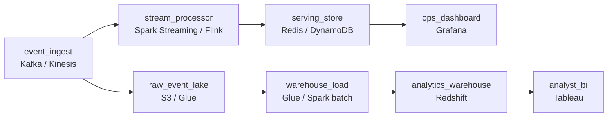

# Fresh and Forever

- **Domain:** pipeline_architecture
- **Difficulty:** Medium
- **Est. time:** 30 min
- **URL:** https://datadriven.io/problems/fresh_and_forever

## Problem

We run an event platform that ingests roughly 5 billion user-interaction events a day, and two groups depend on it: an operations team that watches live dashboards where a delay past a few seconds is useless, and analysts who run ad-hoc queries across years of history. Design a pipeline that serves both audiences, keeps the live view within seconds, and keeps per-event counts correct when events arrive late or duplicated.

**Concepts tested:** `paApiIngestion`, `paBackfill`, `paBatchProcessing`, `paBatchVsStreaming`, `paColumnarVsRow`, `paCompression`, `paDataLake`, `paDataQuality`, `paDeduplication`, `paEventDriven`, `paFullVsIncremental`, `paIdempotency`, `paLambdaArch`, `paLateData`, `paMedallion`, `paMicroBatchVsTrue`, `paMonitoring`, `paPartitioning`, `paRetryHandling`, `paSchemaEvolution`, `paStreamProcessing`, `paTableFormats`

## Requirements

- Operations needs the live dashboard to reflect what is happening within a few seconds; anything slower and we are reacting to the past.
- Analysts run ad-hoc queries going back years and cannot be limited to a short retention window.
- Our counts have to be right even when events show up late or get sent twice; finance and ops both trust these numbers.

## Must-have components

- 5 billion events a day with a seconds-fresh dashboard needs a streaming ingestion and processing tier, not a periodic batch pull. Add a streaming stage.
- The operations dashboard is useless past a few seconds, so at least one stage has to run at a sub-minute freshness tier. Mark the live path sub-minute.
- Live dashboards need a low-latency serving store to read aggregated counts from. Add a serving store the dashboard queries.
- The streaming path has to actually feed the serving store the dashboard reads. Connect the stream processor downstream into the serving store.
- Analysts query years of history, so every raw event has to land in durable, replayable storage that the serving store cannot economically hold. Add a raw event lake.
- Ad-hoc analytics over years of history belong in a warehouse, not the live serving store. Add a warehouse the analysts query.

**Expected stages:** `Event ingestion` → `Stream processing` → `Real-time serving store` → `Durable raw event lake` → `Analytics warehouse`

## Solution walkthrough

### Why this problem exists in real interviews

This looks like 'build a real-time pipeline,' but the real probe is whether you notice there are two consumers with opposite budgets. Operations wants the last few seconds and will trade exactness for speed; analysts want the last few years and will wait until tomorrow for a correct number. The trap is one store and one freshness tier that tries to serve both: stream everything into the analytics warehouse and the dashboard lags; size one store to hold years at sub-second latency and the bill is absurd. The seconds-vs-years split, not the word 'Kafka,' is the answer.

The naive design pipes the stream straight into the warehouse and points both the dashboard and the analysts at it. The dashboard is slow because warehouse loads batch up, and the historical queries are expensive because they scan a store that is also trying to ingest 5 billion rows a day. On top of that, producer retries double-count and a late event lands outside its window, so the numbers the ops team reacts to are quietly wrong.

> **Trick to Solving**
>
> Split by freshness budget, not by tool. One ingest log, two paths.
>
> 1. A streaming path aggregates and writes recent counts to a low-latency serving store the dashboard reads within seconds; approximate-but-live is the budget.
> 2. Every raw event also lands in a durable lake and is batch-loaded into a warehouse for years of ad-hoc history; exact-but-T+1 is the budget.
> 3. Dedup on `event_id` and window with a grace period so both views stay correct under retries and late data.

---

### Break down the requirements

**Step 1: Pin the two freshness tiers**

Operations dashboards are useless past a few seconds; analyst history queries are fine at T+1. That single fact rules out one shared store. The live path runs sub-minute; the analytics path runs batch. Forcing analysts onto streaming wastes money; forcing ops onto batch misses the requirement.

**Step 2: Land every raw event durably before processing**

The durable event lake is the system of record and the replay source. The serving store only needs the last few hours, but the lake holds 3+ years and lets you backfill the warehouse when a load fails. Without it, a downstream bug means lost history you can never reconstruct.

**Step 3: Make counts correct under retries and late data**

Producers retry, so the same `event_id` can arrive twice; dedup on it at the stream processor and on load to the warehouse. Late events are expected, so windowed aggregates carry a grace period instead of dropping anything past the watermark. Skip this and the live number the ops team trusts is inflated and jittery.

---

### The reference architecture

| node | type | tech | details |
|---|---|---|---|
| event_ingest | source | Kafka / Kinesis | parallelism: 256 partitions |
| stream_processor | transform | Spark Streaming / Flink | slaFreshness: real-time; idempotencyStrategy: dedup_on_event_id |
| serving_store | storage | Redis / DynamoDB | slaFreshness: < 1min; idempotencyStrategy: upsert |
| ops_dashboard | consumer | Grafana | slaFreshness: < 1min |
| raw_event_lake | storage | S3 / Glue | backfillStrategy: partition_overwrite |
| warehouse_load | transform | Glue / Spark batch | slaFreshness: < 24h; idempotencyStrategy: staging_table |
| analytics_warehouse | storage | Redshift | slaFreshness: < 24h |
| analyst_bi | consumer | Tableau | slaFreshness: < 24h |

One ingest log fans out. The stream processor maintains windowed aggregates and upserts them into a small low-latency serving store the dashboard polls; only the last few hours live there. In parallel, raw events land in a partitioned lake that is the replayable system of record, and a batch job dedups and loads them into the warehouse where analysts run multi-year queries. The serving store stays small and fast; the warehouse stays cheap per query because it is not also ingesting the firehose.

> **Scale + Cost**
>
> At ~5B events/day with 3x evening peaks, ingest is sized on peak (partitions to absorb the burst), not the average. Cost concentrates in two places: the streaming aggregation compute and warehouse storage of years of raw events. The serving store stays cheap precisely because retention is hours, not years; the lake holds the cheap durable copy. The bottleneck under a viral spike is the stream processor's stateful windows, so size its state backend and checkpoints for peak.

> **Interviewers Watch For**
>
> Whether you justify streaming for the dashboard and batch for analysts instead of streaming everything; whether the durable lake is the replay source for backfills; and whether you name dedup-on-`event_id` and late-event grace periods without being prompted. Saying 'exactly-once' as a slogan without naming where dedup happens is a weak answer.

> **Common Pitfall**
>
> Streaming the full firehose into the warehouse and pointing both the dashboard and the analysts at it. The dashboard lags behind the warehouse's micro-batch loads, the analysts' queries fight the ingest for resources, and the first producer retry double-counts because nothing dedups. The fix is the two-path split with a serving store for live and a lake-plus-warehouse for history.

---

- **The event volume 10x's to 50 billion a day for a launch. What in this design absorbs it and what has to change first?**
  - _Tests whether the candidate sizes ingest partitions and stream-processor state for peak, and isolates the live path so a spike does not stall warehouse loads._
- **An analyst reports that a count in the warehouse disagrees with what the live dashboard showed yesterday. How do you reconcile them?**
  - _Tests understanding that the live view is approximate within its window while the warehouse is the corrected, deduped, late-data-included source of truth, reconciled from the lake._
