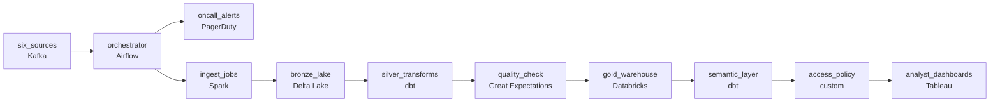

# Greenfield Build for Six Sources
_Infrastructure as code. Meaning as a service._

- **Domain:** pipeline_architecture
- **Difficulty:** Hard
- **Est. time:** 25 min
- **URL:** https://datadriven.io/problems/greenfield_build_for_six_sources

## Problem

We're standing up a fresh data platform on Databricks: six sources that need to be ingested, transformed through medallion layers, and served to business analysts through one consistent semantic layer. Analysts open dashboards at 8am every weekday, so every pipeline feeding them must complete by 7:30am and alert the moment a source is at risk of missing that window. Leadership currently sees a different revenue number in every meeting because each analyst writes their own KPI SQL, and finance analysts must never see raw card data from the payments feed, so every consumer has to read the metrics through a governance layer that enforces column-level access rather than off the tables directly. Design the end-to-end platform: the infrastructure-as-code config for each source, the orchestration DAG, one canonical definition per KPI in the semantic layer, and the governance checkpoint that sits between the serving layer and the dashboards to enforce column-level access.

**Concepts tested:** `paApiIngestion`, `paBackfill`, `paBatchProcessing`, `paDagOrchestration`, `paDataLake`, `paDeduplication`, `paDependencyMgmt`, `paEltVsEtl`, `paEnvironmentMgmt`, `paFileIngestion`, `paFullVsIncremental`, `paIdempotency`, `paLateData`, `paMedallion`, `paMonitoring`, `paPartitioning`, `paRetryHandling`, `paSchemaEvolution`

## Requirements

- Analysts open dashboards at 8am every weekday; the pipelines that feed those dashboards have to complete by 7:30am, and we need an alert before that window if any source is at risk.
- Today every analyst computes MRR and Net Revenue Retention slightly differently and the numbers diverge across dashboards; leadership wants one canonical definition for each KPI.
- Finance analysts can't see raw card data from the payments source; access has to be enforced by a platform governance layer that every consumer reads through, not by which table they choose to open.

## Must-have components

- The semantic layer with one canonical KPI definition lives over a warehouse; without a warehouse tier there's nowhere to host the gold layer or enforce column-level access. Add Snowflake, BigQuery, Redshift, or Databricks.
- Six sources on different cadences, dependency-ordered transformations, and a 7:30am completion SLA require an orchestration layer. Without one, no piece is responsible for sequencing or alerting. Add Airflow, Dagster, Prefect, or Composer.

**Expected stages:** `source_config_iac` → `orchestration_dag` → `bronze_ingestion` → `silver_transform` → `gold_aggregates` → `semantic_layer` → `access_governance`

## Solution walkthrough

### What this really is

This is a question about ownership dressed up as a source-ingestion exercise. Six connectors into Databricks is the easy half. The real test is whether you **separate source connectivity from KPI meaning**. Config-driven ingestion feeds a medallion lakehouse. An orchestrator owns the clock. A semantic layer owns each metric's definition. The platform, not the analyst, owns column access. Most candidates draw six arrows into the warehouse and stop. The result is three MRR numbers in three meetings, a finance analyst reading raw card data, and blank 8am dashboards with nobody paged.

> **Give every promise exactly one owner**
>
> Each requirement in the prompt is a promise: done by 7:30am, one MRR, no card data for finance. Draw the one node that is accountable for each promise. If a promise has no node, nobody keeps it.

### Walk the requirements

**Step 1: Make the orchestrator the spine**

Every ingest, transform and check is a task with declared dependencies. The DAG is sized so the slowest source still lands before 7:30am. Sensors on expected landing times alert while there is still time to act, not when an analyst sees a blank chart.

**Step 2: Land raw, then refine through medallion layers**

Ingest jobs write idempotently into a bronze Delta table, so a retry or backfill overwrites a partition instead of doubling it. Silver dedups and conforms. A quality gate blocks bad data before it reaches gold.

**Step 3: Publish each KPI once**

The semantic layer holds the canonical SQL for MRR and Net Revenue Retention, version-controlled and reviewed. Dashboards read the named metric. A new variant ships as a pull request, not a private query.

**Step 4: Route every read through governance**

The column policy sits between the serving layer and the dashboards. Finance gets masked card fields no matter which table or query they use.

### The reference design

| node | type | tech | details |
|---|---|---|---|
| six_sources | source | Kafka |  |
| orchestrator | transform | Airflow | errorAction: alert; monitorAlert: Source landing late vs 7:30am SLA |
| oncall_alerts | consumer | PagerDuty |  |
| ingest_jobs | transform | Spark | parallelism: 8 partitions; idempotencyStrategy: staging_table |
| bronze_lake | storage | Delta Lake | backfillStrategy: partition_overwrite |
| silver_transforms | transform | dbt | slaFreshness: < 1h |
| quality_check | quality_gate | Great Expectations | errorAction: alert |
| gold_warehouse | storage | Databricks | slaFreshness: < 1h |
| semantic_layer | transform | dbt | slaFreshness: < 1h |
| access_policy | quality_gate | custom | errorAction: alert |
| analyst_dashboards | consumer | Tableau | slaFreshness: < 1h |

> **Table grants are not column policy**
>
> Candidates propose "just don't grant finance the payments table." That breaks the first time someone builds a derived table that carries the card column forward. The policy has to follow the column, which is why `access_policy` sits on the read path for every consumer.

> **Alerting before the deadline, not at it**
>
> The senior tell is a sensor that fires at 6:45am when a source is late, wired to an on-call destination. A job that fails and turns red in the UI at 8am is not monitoring.

> **You pay up front for the twelfth source**
>
> The orchestrator, semantic layer and IaC slow down the first dashboard, and masking adds a small cost on each read of the masked columns. In return, going from six sources to twelve and from three KPIs to thirty becomes config and pull requests, not a rebuild.

- **Two analysts disagree on the MRR definition. What does the semantic layer settle, and what does it not?**
  - _The layer makes the choice visible and reviewable. People still make the choice._
- **A vendor source arrives on an unpredictable schedule. What changes?**
  - _Only the DAG: a wider sensor window, downstream tasks gated on it, and its own SLA alert._
