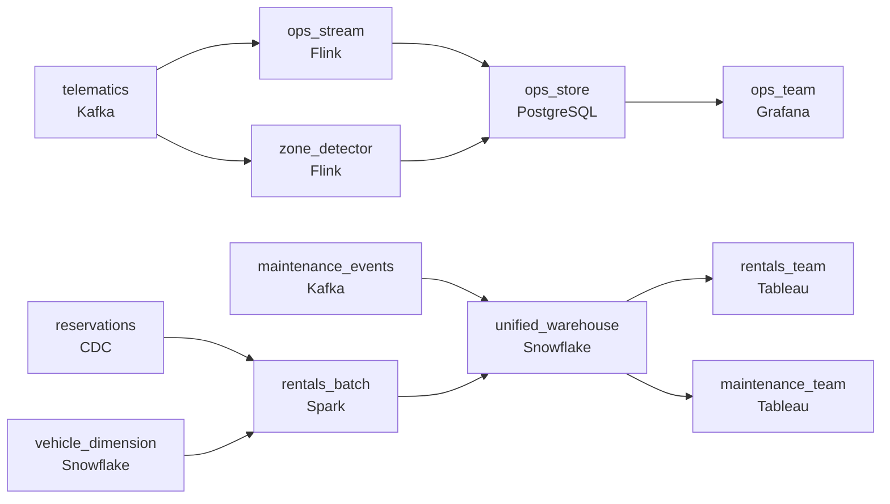

# Half a Million Rental Cars
_Every vehicle is reporting. Every rental matters._

- **Domain:** pipeline_architecture
- **Difficulty:** Medium
- **Est. time:** 10 min
- **URL:** https://datadriven.io/problems/half_a_million_rental_cars

## Problem

We operate a fleet of 500,000 rental vehicles across thousands of locations, each streaming continuous telematics while our reservation system records rentals and service centers log maintenance events, and the operations team has no unified view across the three. Operations dispatches off live vehicle position and needs it within minutes, with fast alerts when a vehicle leaves its assigned region or sits parked for days, while rental visibility can lag up to half an hour and fleet-utilization and maintenance reporting is fine the next day. Because vehicles constantly change depot, accumulate damage, and rack up odometer readings, any report on a past rental must reflect the vehicle's state as of that rental's date, so design the end-to-end pipeline and warehouse that unify the three sources on vehicle id and serve each consumer at its required freshness.

**Concepts tested:** `paBackfill`, `paBatchProcessing`, `paBatchVsStreaming`, `paColumnarVsRow`, `paCompression`, `paDagOrchestration`, `paDataLake`, `paDataQuality`, `paDeduplication`, `paDependencyMgmt`, `paEltVsEtl`, `paEventDriven`, `paEventPlatforms`, `paFullVsIncremental`, `paIdempotency`, `paLambdaArch`, `paLateData`, `paMedallion`, `paMicroBatchVsTrue`, `paMonitoring`, `paPartitioning`, `paScdPipeline`, `paSchemaEvolution`, `paSmallFiles`, `paStreamProcessing`, `paTableFormats`

## Requirements

- Operations dispatches off live vehicle position and needs minutes, rental visibility tolerates up to half an hour, and maintenance scheduling tolerates a day.
- Vehicles change depot, accumulate damage, and rack up odometer readings; a historical rental has to report the vehicle's depot, damage status, and odometer as they were on that date.
- When a vehicle leaves where it's supposed to be, enters a restricted zone during a rental, or sits parked for too long, ops needs to act quickly.

## Must-have components

- Operations dispatching needs minutes, rental visibility tolerates up to half an hour, and maintenance scheduling tolerates a day. One shared cadence under-serves at least two of these. Show at least one streaming path and at least one batch path.
- Three sources unify on vehicle id and analysts query the unified view from a warehouse; without a warehouse tier there's nowhere for the unified fact tables. Add Synapse, Snowflake, BigQuery, or Databricks.

**Expected stages:** `vehicle_telematics_raw` → `rental_transaction_events` → `maintenance_events` → `dim_vehicle` → `fact_rental_session` → `operations_dashboard_mart`

## Solution walkthrough

### Why this problem exists in real interviews

Three consumers (ops, rentals, maintenance) with three freshness budgets, vehicle attributes that change over time so historical rentals need point-in-time joins, and zone / parked alerts that have to fire fast. The trap is one shared store at the slowest budget or losing point-in-time when the vehicle's depot changes.

The default reach is one nightly batch into a shared warehouse. Ops sees yesterday's positions and dispatches off stale data. Historical rentals join to today's vehicle attributes and report depot information that's wrong for that rental's date. Zone and parked alerts run as nightly scans and ops finds out about a vehicle in a restricted zone the next morning.

> **Trick to Solving**
>
> Streaming for ops, batch for rentals and maintenance, vehicle attributes as a slowly-changing dimension, stream-side detection for zone and parked alerts.
>
> 1. Telematics streams to ops within minutes; rental and maintenance facts batch on slower cadences.
> 2. Vehicle attributes (depot, damage, odometer) live as a slowly-changing dimension keyed on (`vehicle_id`, `valid_from`, `valid_to`); rental facts join on `rental_date` BETWEEN `valid_from` AND `valid_to`.
> 3. Zone and parked detection run on the streaming consumer; alerts fire to ops within minutes when a state changes.

---

### Walk the requirements

**Step 1: Three consumers, three cadences off one telemetry stream**

Telematics flows into a streaming consumer that updates the ops live store within minutes; rental and maintenance facts read from batches on hourly and daily cadences. Without two cadences either ops is on a slow path or rental and maintenance pay streaming compute they don't need.

**Step 2: Vehicle attributes as a slowly-changing dimension for historical rentals**

Vehicles change depot, accumulate damage, rack up odometer readings. The vehicle dimension is keyed on (`vehicle_id`, `valid_from`, `valid_to`); each change writes a new row. Rental facts join on `rental_date` BETWEEN `valid_from` AND `valid_to` so a historical rental reports the depot, damage status, and odometer as they were on that date. Joining to today's attributes is the version that silently rewrites history every time a vehicle changes depots; the SCD plus point-in-time join is the contract.

**Step 3: Zone and parked detection on the stream, alerts to ops**

A stream-side detection compares each vehicle's position against zone boundaries and tracks idle time. When a vehicle enters a restricted zone during a rental, leaves where it's supposed to be, or sits parked too long, an alert fires to ops within minutes. A 'nightly scan' is the version where ops finds out about a vehicle in a restricted zone the next morning; stream-side detection is what makes the alert actionable.

---

### The shape that fits

| node | type | tech | details |
|---|---|---|---|
| telematics | source | Kafka | parallelism: 16 partitions |
| reservations | source | CDC |  |
| maintenance_events | source | Kafka |  |
| ops_stream | transform | Flink | slaFreshness: real-time; idempotencyStrategy: upsert |
| ops_store | storage | PostgreSQL | slaFreshness: < 1min |
| zone_detector | transform | Flink | slaFreshness: real-time |
| rentals_batch | transform | Spark | slaFreshness: < 1h; idempotencyStrategy: upsert |
| vehicle_dimension | storage | Snowflake |  |
| unified_warehouse | storage | Snowflake | slaFreshness: < 24h |
| ops_team | consumer | Grafana | slaFreshness: < 1min |
| rentals_team | consumer | Tableau | slaFreshness: < 1h |
| maintenance_team | consumer | Tableau | slaFreshness: < 24h |

> **What this design gives up**
>
> Three consumer paths cost more than one shared store; the SCD grows the vehicle dimension over time and the point-in-time join is more expensive than equi; stream-side detection holds state per vehicle. Implementation cost is the price; the win is ops within minutes, historical rentals that report what was true then, and zone alerts that fire fast enough to act on.

> **What reviewers check**
>
> A reviewer looks at the canvas for these properties:
> - A streaming path serves ops within minutes; rental and maintenance batch on slower cadences.
> - Vehicle attributes are a slowly-changing dimension; rental facts join on rental-date for point-in-time correctness.
> - Zone and parked detection run on the streaming consumer with alerts to ops.
> - A unified warehouse anchors the cross-consumer view.

> **The mistake that ships**
>
> What gets shipped runs one nightly batch into a shared warehouse. Ops dispatches off stale data; historical rentals join to today's vehicle attributes; zone alerts run nightly. The eventual rebuild adds the streaming ops path, the SCD vehicle dimension, and the stream-side zone detection.

---

- **A vehicle's depot changes mid-rental. What does this design report for that rental, and what does ops see?**
  - _Tests whether the candidate sees the SCD writing a new row at the depot change; the rental fact joins by `rental_date`, so reports for the rental's start date show the prior depot. Ops's live view shows the current depot from the streaming store. The two views answer different questions correctly._
- **A vehicle's idle timer fires while it's actually being serviced. What in this design avoids the false positive?**
  - _Tests whether the candidate sees the maintenance events feeding the zone detector's state: a vehicle in active maintenance suppresses the idle alert. The zone detector reads a small piece of cross-stream state to avoid alerting on legitimate idle time._
