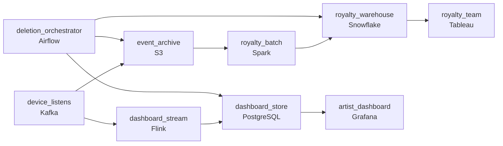

# Listens From Everywhere, Counted Once
_Phones, tablets, laptops. And some of them report late._

- **Domain:** pipeline_architecture
- **Difficulty:** Hard
- **Est. time:** 30 min
- **URL:** https://datadriven.io/problems/listens_from_everywhere_counted_once

## Problem

Our users stream music on phones, desktop apps, smart speakers, and web browsers. We want to show artists and labels near-real-time stats on how their tracks are performing, and we need a historical record for royalty calculations. Design a data pipeline that collects listening events from all our device types.

**Concepts tested:** `paApiIngestion`, `paBatchVsStreaming`, `paDagOrchestration`, `paDataLake`, `paDataQuality`, `paDeadLetterQueue`, `paDeduplication`, `paEventDriven`, `paEventPlatforms`, `paFullVsIncremental`, `paIdempotency`, `paKappaArch`, `paLateData`, `paMedallion`, `paMonitoring`, `paPartitioning`, `paRetryHandling`, `paSchemaEvolution`, `paStreamProcessing`

## Requirements

- Artists watch their stream counts and want them updated within minutes of an actual listen; royalty calculation runs nightly.
- Royalty payouts are calculated from the exact play count per track; we can't afford to over- or under-count even slightly.
- Mobile and smart-speaker clients buffer events for hours; a listen has to be reported under the time the user actually listened, not the time we received the data.
- Users can request deletion of their listening history; deletion has to remove their events from the raw archive and any aggregation that included them.

## Must-have components

- Artists need a near-real-time dashboard and royalties need an exact historical record; those have different freshness and correctness profiles. Show at least one streaming path and at least one batch path.
- Royalty calculations are exact and reprocessed when logic changes; the raw event archive is the source of truth and has to be retained. Add a cold-storage tier (S3, GCS, ADLS) so the historical record can be reread for retrospective royalty calculations.

**Expected stages:** `device_event_ingestion` → `stream_processor` → `windowed_aggregations` → `serving_layer` → `raw_archive`

## Solution walkthrough

### The trap

This is a two-reader correctness split dressed up as music analytics. The artist dashboard wants minutes and tolerates a little noise. Royalties want every qualifying listen counted exactly once, under the moment it actually happened, and erasable on request. Anyone can draw Kafka into Flink into a dashboard. What separates candidates is **refusing to let royalties read that streaming aggregate**. Do it and a phone that buffered March listens offline drains them in April: April's payout inflates, March's shrinks, and the rolled-up counts have no `user_id` left to delete.

> **The archive is the royalty ledger, the stream is a preview**
>
> Land every raw event once in `event_archive`, partitioned by device `event_time`. The streaming path is a fast, disposable view for artists. The nightly `royalty_batch` rereads the archive, so exactness, late data and deletion are all solved in one replayable place instead of patched into a running aggregate.

### Walk the requirements

**Step 1: Split by correctness budget, not by team**

`device_listens` fans out twice: Flink into `dashboard_store` for sub-minute counts, and S3 for the durable record. Two freshness tiers off one source means the paths cannot disagree about what happened, only about how soon they report it.

**Step 2: Make `listen_id` the contract**

The client stamps a stable `listen_id`. `royalty_batch` dedups on it before counting, then writes through a staging table with partition overwrite, so a retry, a double-send or a rerun lands the same number every time.

**Step 3: Partition on `event_time`, never `received_at`**

Smart speakers replay hours of buffered listens. Attribute on the device clock and a late drain simply reopens an older partition, which the nightly overwrite recomputes. Attribute on arrival and every drain shifts money between months.

**Step 4: Route deletion to every place the user's rows live**

`deletion_orchestrator` tombstones the user in `event_archive`, then triggers recompute of the affected partitions in `royalty_warehouse` and `dashboard_store`. Deleting at the raw layer alone passes the demo and fails the audit.

### The shape that fits

| node | type | tech | details |
|---|---|---|---|
| device_listens | source | Kafka | parallelism: 16 partitions |
| event_archive | storage | S3 | backfillStrategy: partition_overwrite |
| dashboard_stream | transform | Flink | slaFreshness: real-time |
| dashboard_store | storage | PostgreSQL | slaFreshness: < 1min |
| royalty_batch | transform | Spark | slaFreshness: < 24h; backfillStrategy: partition_overwrite; idempotencyStrategy: staging_table |
| royalty_warehouse | storage | Snowflake | slaFreshness: < 24h; backfillStrategy: partition_overwrite |
| deletion_orchestrator | transform | Airflow | errorAction: alert; monitorAlert: Deletion confirmations missing past SLA |
| artist_dashboard | consumer | Grafana | slaFreshness: < 1min |
| royalty_team | consumer | Tableau | slaFreshness: < 24h |

> **One counts table for both readers**
>
> The design that ships first has Flink write a counts table and royalties read it at month end. It looks efficient until a buffer drain lands in the wrong month and a deletion request finds no `user_id` in the aggregate. The rebuild is always the archive-first shape above.

> **Say which clock and which key, unprompted**
>
> Strong candidates name `event_time` and `listen_id` before being asked. Saying "we dedup" without naming the key, or "we handle late data" without naming the clock, reads as a design that has never paid anyone.

> **A viral track is a hot key**
>
> One release can put millions of listens on a single `track_id` in minutes. Salt the key in the Flink aggregation and merge the salted partials downstream, or one task slot carries the whole spike while fifteen idle.

- **A buggy client double-sends every listen for a week. What protects payouts, and what do artists see meanwhile?**
  - _Royalty dedup on `listen_id` absorbs it; the streaming counts may run high unless dedup also happens upstream._
- **The qualifying-listen rule changes retroactively. What reruns and what stays untouched?**
  - _The archive is immutable history; `royalty_batch` reruns the affected periods with partition overwrite into `royalty_warehouse`._
