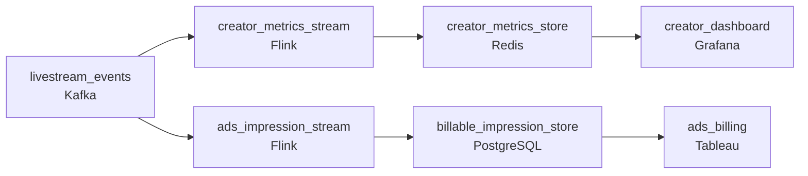

# Live Viewers, Live Billing
_The stream is live. The data cannot wait._

- **Domain:** pipeline_architecture
- **Difficulty:** Hard
- **Est. time:** 30 min
- **URL:** https://datadriven.io/problems/live_viewers_live_billing

## Problem

We run a live video platform where creators broadcast to thousands of viewers at once. The product team wants real-time viewer counts and chat activity for creators, and the ads team needs accurate impression data for billing. Design a data pipeline for our livestream events.

**Concepts tested:** `paBatchVsStreaming`, `paDataQuality`, `paDeadLetterQueue`, `paDeduplication`, `paEventDriven`, `paEventPlatforms`, `paIdempotency`, `paKappaArch`, `paLateData`, `paMonitoring`, `paPartitioning`, `paRetryHandling`, `paStreamProcessing`

## Requirements

- Creators watch their concurrent viewer count and chat rate during a stream and need it to feel live, not a few minutes behind.
- Ad impressions are billed to advertisers; an under-count loses revenue and an over-count creates contractual risk.

## Must-have components

- Creators see live viewer counts and chat activity, and ad billing has to count impressions in flight. Add a streaming layer on the event path or set SLA Freshness to real-time / < 1min on the aggregator.

**Expected stages:** `event_ingestion` → `creator_metrics_stream` → `creator_metrics_store` → `ads_impression_stream` → `billable_impression_store`

## Solution walkthrough

### Why this problem exists in real interviews

Two consumers reading the same event stream with completely different correctness budgets: creators want a feel-live viewer count where approximate is fine, ads billing wants exactly-once where a duplicate impression is a contractual problem. The trap is one stream that satisfies neither: too approximate to bill on, too slow to feel live.

The default reach is one stream that aggregates events into a 'metrics' table the creator dashboard and ads billing both read. The dashboard feels close to live but the metrics aggregator is slow enough that the count lags behind chat. Ads billing reads the same metrics table and double-counts when a producer retries because nothing was deduplicating on a stable id, or under-counts when an event missed the aggregation window. Both consumers are unhappy in different ways.

> **Trick to Solving**
>
> Two paths sized for two correctness budgets: approximate-and-live for creators, exactly-once-and-billable for ads.
>
> 1. Creator metrics run on a streaming path that emits in-flight counts to the dashboard within seconds. Approximate is acceptable; live is not.
> 2. Ads impressions ride a parallel path with dedup on a stable impression id and a qualifying-watch check before they count toward billing. Exactness is the budget.
> 3. Both consume the same source events; the budgets diverge after ingest.

---

### Walk the requirements

**Step 1: Stream creator metrics live; approximate is fine**

Concurrent viewer counts and chat rate flow through a stream processor that emits aggregated metrics to the creator dashboard within seconds. The dashboard reads from the streaming-fed store. Approximate counts (a viewer in transition between joining and leaving might be counted briefly inconsistently) are acceptable here; the live-feel matters more than the count being exact to the unit. A 'compute exact viewer counts before we publish' approach is the version where creators wait long enough to notice.

**Step 2: Bill ads exactly once on a stable id, after the qualifying-watch threshold**

Ads billing counts an impression once and only when the qualifying-watch threshold was met. Each impression carries a stable impression id from the player; the ads path dedups on that id and applies the qualifying-watch check before incrementing the billable count. Idempotent writes on the same id mean a producer retry doesn't double-count. A duplicate that costs a tenth of a cent isn't billing's problem until it scales; the dedup contract has to hold from day one. Counting in the same approximate aggregator that serves creator metrics is the version that gets ads billing wrong in either direction.

---

### The shape that fits

| node | type | tech | details |
|---|---|---|---|
| livestream_events | source | Kafka |  |
| creator_metrics_stream | transform | Flink | slaFreshness: real-time |
| creator_metrics_store | storage | Redis | slaFreshness: < 1min |
| ads_impression_stream | transform | Flink | slaFreshness: real-time |
| billable_impression_store | storage | PostgreSQL |  |
| creator_dashboard | consumer | Grafana | slaFreshness: < 1min |
| ads_billing | consumer | Tableau | slaFreshness: < 24h |

> **What this design gives up**
>
> Two paths from one event stream is two sets of operational machinery. The exactly-once contract on ads adds a dedup index and a qualifying-watch state-machine the creator path doesn't need. Pipeline simplicity is the cost; the win is creators see live counts and ads bills accurate impressions, instead of one aggregator that satisfies neither.

> **What reviewers check**
>
> A reviewer looks at the canvas for these properties:
> - A streaming path delivers concurrent-viewer and chat metrics to the creator dashboard within seconds.
> - The ads path counts each impression exactly once on a stable id and only after the qualifying-watch threshold is met.

> **The mistake that ships**
>
> What ends up in production aggregates everything in one streaming job into one metrics table the creator dashboard and ads billing both query. Creators feel the dashboard lag a few seconds because the aggregator runs the heavier ads computation alongside theirs. Ads billing double-counts when an upstream producer retries because nobody added a dedup key, and under-counts when an impression slips an aggregation window. Advertisers raise contract questions on the next invoice and creators stop trusting the dashboard. The team rebuilds with two paths, dedup-on-impression-id, and a qualifying-watch state machine. The advertiser refund is the part that tells leadership the design was wrong.

---

- **An impression is counted on the player but the qualifying-watch event never arrives. What does the ads path do, and how does it eventually decide?**
  - _Tests whether the candidate has thought about late or missing qualifying-watch signals: the ads path holds the impression in pending state for a window, and either bills it when the qualifying-watch lands or expires it without billing when the window closes. A timer-based policy keeps the billable count converging._
- **A creator's dashboard freezes during a stream because the streaming aggregator is overloaded. What in this design lets ads billing keep working through that?**
  - _Tests whether the candidate sees the two paths as independent: ads billing's path is its own consumer group, its own state, its own throughput; the creator path's overload doesn't propagate. Without two paths, an ads spike during a viral stream takes both consumers down._
