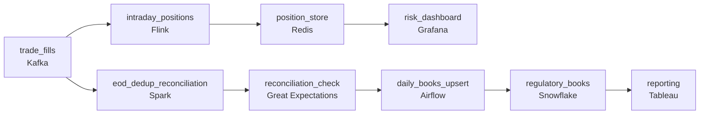

# Mark to Market

- **Domain:** pipeline_architecture
- **Difficulty:** Medium
- **Est. time:** 30 min
- **URL:** https://datadriven.io/problems/mark_to_market

## Problem

A brokerage platform processes about 2 billion trade execution events a day, and two teams read them: risk wants intraday position dashboards that stay within a few seconds of the market, while regulatory reporting needs every trade counted exactly once in the end-of-day books. Trades arrive out of order and some are corrected hours after execution, so the design has to reconcile late and amended fills without double-counting or dropping them.

**Concepts tested:** `paBatchProcessing`, `paBatchVsStreaming`, `paCdc`, `paDataQuality`, `paDeduplication`, `paEventDriven`, `paEventPlatforms`, `paFullVsIncremental`, `paIdempotency`, `paLambdaArch`, `paLateData`, `paMonitoring`, `paPartitioning`, `paStreamProcessing`

## Requirements

- Risk wants position dashboards that stay within a few seconds of the market during trading hours.
- Regulatory reporting needs every trade counted exactly once in the end-of-day books.
- Trades can arrive out of order and some are corrected hours after execution.
- The two teams have different correctness budgets and should not block each other.

## Must-have components

- Trade fills arrive out of order and need to be replayable for corrections, so ingestion has to land on a durable, replayable log (a message queue) rather than a direct write to a store.
- Risk needs intraday positions within seconds of the market, which requires a streaming path. Add a stream processor that aggregates fills in near real time.
- The intraday dashboard requirement is sub-minute freshness. At least one node must carry a sub-minute freshness tier to prove the latency target is met.
- End-of-day regulatory books are a daily batch job that reconciles the full day including late and corrected trades. Add a daily batch stage.
- Regulatory reporting reads exact end-of-day counts, which belong in a warehouse the reporting team queries, not in the volatile intraday serving store.
- The intraday dashboard has to read from a low-latency serving store fed by the streaming path. Wire the stream processor into a serving store the dashboard queries.
- The reconciled daily books must flow from the batch reconciliation into the reporting warehouse. Connect the daily batch stage to the warehouse so regulatory reporting reads the settled numbers.

**Expected stages:** `Trade event ingestion` → `Intraday streaming positions` → `End-of-day batch reconciliation` → `Correction and dedup handling` → `Serving and reporting`

## Solution walkthrough

### Two correctness budgets, one log

This is a lambda architecture dressed up as a brokerage dashboard. The skill being probed is whether you can fan one replayable log out to two paths with opposite contracts. Risk will forgive a position that is off by a fill for a few seconds. Regulators will not forgive a fill counted twice. Anyone can draw a stream processor. **The trap is letting one aggregate serve both readers.** It is never fast enough to feel live or exact enough to file, and a retry or a late amendment lands in the filed books as a reportable error.

The obvious answer is a stream that aggregates fills into a positions table, with the end-of-day report taken as a snapshot of that table at the close. Two facts in the prompt break it: fills arrive out of order, and some are amended or busted hours later. A correction after the close never reaches the snapshot, and a producer retry double-counts a fill.

> **Exactly-once is a property of the books, not the stream**
>
> Stop asking the streaming path to be exact. Let it be fast and approximate, and make the daily batch the only writer of the filed record: replay the whole day from the log, dedup on the execution id, upsert idempotently into the warehouse.

### Building it

**Step 1: Land every fill on a replayable log first**

Out-of-order arrival and hours-late corrections mean no downstream store can be the source of truth, since it only reflects what arrived before it ran. A Kafka topic keyed by execution id lets the stream and the batch consume the same events independently, and lets the batch replay a whole trading day on demand.

**Step 2: Stream intraday positions into a serving store**

Flink aggregates fills with sub-minute freshness into Redis, and the risk dashboard reads Redis. A position briefly off by one trade hurts nobody on the desk. Making this path exact is what makes it slow, and it still would not be safe to file.

**Step 3: Reconcile the books in a daily replay**

After the close, a Spark job rereads the full day off the log, anchors every aggregation on execution time rather than arrival time, dedups on the stable execution id and applies amendments and busts against the original id. A quality gate checks counts against the log, then an Airflow-scheduled daily task upserts the settled books into Snowflake. Because it replays, a late fill still lands in the right trading day.

| node | type | tech | details |
|---|---|---|---|
| trade_fills | source | Kafka |  |
| intraday_positions | transform | Flink |  |
| position_store | storage | Redis |  |
| risk_dashboard | consumer | Grafana |  |
| eod_dedup_reconciliation | transform | Spark |  |
| reconciliation_check | quality_gate | Great Expectations |  |
| daily_books_upsert | transform | Airflow |  |
| regulatory_books | storage | Snowflake |  |
| reporting | consumer | Tableau |  |

> **Pay for the full replay once a day**
>
> At 2 billion fills a day, volume spikes at the open and the close. The streaming path is sized for that peak and is the steady cost. The batch is one heavy pass over the day. Replaying everything instead of an incremental window is the deliberate price of never missing a correction, and keying the upsert on execution id keeps reruns idempotent.

> **Name which path owns correctness**
>
> The senior tell is saying out loud that the intraday numbers are approximate by design and that reporting never reads them. Then: execution time, not arrival time, and dedup on a stable id, so retries and amendments are handled rather than assumed away.

> **The close snapshot files a double count**
>
> Reusing the streaming aggregate as the end-of-day report looks elegant and ships fast. Then a producer retry double-counts a fill and a post-close correction never lands. The fix is the separate replay-and-dedup batch the single-path design skipped.

- **A correction arrives three hours after the books were submitted. What does the design do?**
  - _Whether the books are restateable: rerun the replay for that day and file an amendment with an audit trail, rather than editing in place._
- **Volume doubles and the intraday path lags at the open. What changes, and does it touch the books?**
  - _Scaling the stream with partitions and parallelism while seeing the batch path is decoupled and unaffected._
