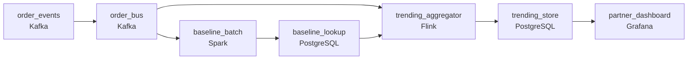

# Near-Real-Time Trending Dishes Dashboard
_The dish rankings update faster than the kitchen._

- **Domain:** pipeline_architecture
- **Difficulty:** Hard
- **Est. time:** 25 min
- **URL:** https://datadriven.io/problems/near_real_time_trending_dishes_dashboard

## Problem

Our food delivery platform wants to show restaurant partners which dishes are trending in their city right now. A dish is trending when its order rate over the last 30 minutes is significantly higher than its baseline. We want this updated every few minutes. Design the data pipeline that powers this dashboard.

**Concepts tested:** `paBatchVsStreaming`, `paDataQuality`, `paDeadLetterQueue`, `paDeduplication`, `paEventDriven`, `paEventPlatforms`, `paFullVsIncremental`, `paIdempotency`, `paLateData`, `paMicroBatchVsTrue`, `paMonitoring`, `paPartitioning`, `paRetryHandling`, `paStreamProcessing`

## Requirements

- Restaurant partners want to see what's trending in their city right now, not yesterday; a few minutes is fine.
- A dish counts as trending only when its current rate is well above its own historical pace; common dishes shouldn't trend just because they have steady volume.
- A viral social media post can drive a single dish to spike many times normal; that can't break the dashboard for every other dish in every other city.

## Must-have components

- A trending-dishes dashboard updated every couple minutes from a 30-minute sliding window is by definition a streaming aggregation. Add a streaming layer on the order event path or set SLA Freshness to real-time / < 1min on the aggregator.
- Restaurant partners hit the dashboard interactively and orders flow through a high-cardinality stream; without a queue/log tier between order events and the trending processor there's no buffer for spikes. Add Kafka, Kinesis, or Pub/Sub.

**Expected stages:** `order_event_stream` → `stream_processor` → `baseline_store` → `trending_scorer` → `dashboard_serving`

## Solution walkthrough

### Why this problem exists in real interviews

Trending isn't 'top-N orders right now' , it's 'dish whose current rate is well above its own baseline.' That changes the design from a sort to a per-dish state machine that compares a recent window against a historical reference, and it has to absorb a viral spike without taking down the dashboard for every other dish.

The default reach is a streaming aggregator that counts orders per dish over the last 30 minutes and sorts by absolute volume. Common popular dishes always 'trend' because they always have volume; small dishes that just spiked don't. A viral post drives one dish to many times its normal rate; the aggregator's hot key saturates one partition and trending data for every other dish in every other city goes stale.

> **Trick to Solving**
>
> Compare current window against per-dish baseline, partition the stream so a hot key stays on its own worker, serve the dashboard from a precomputed state.
>
> 1. Trending is per-dish: current 30-minute rate divided by the dish's baseline rate at the matching time-of-week. Absolute volume isn't the score.
> 2. Baselines are precomputed off the order history, kept in a lookup the streaming aggregator reads on every event. They refresh on a slower batch.
> 3. The stream partitions by `dish_id` (or city + `dish_id`) so a single hot dish's spike stays on its own worker; other partitions keep moving.
> 4. The dashboard reads from a precomputed trending store updated by the aggregator, not from the raw stream on every page load.

---

### Walk the requirements

**Step 1: Order events to the trending view within minutes**

Order events ride a queue into a streaming aggregator that maintains the last-30-minute rate per dish per city. The aggregator updates the trending store every few minutes; the dashboard reads from there. Without a streaming layer the trending view runs on whatever cadence batch supports, which can't satisfy 'right now.' Without a queue between producers and the aggregator, a spike that exceeds the aggregator's throughput either drops events or blocks the producer.

**Step 2: Score each dish against its own historical baseline**

A dish trends when its current rate is well above its own pace at the matching time-of-week, not when its absolute volume is high. The pipeline precomputes a per-dish baseline from order history off a slower batch (hourly or daily refresh) and stores it in a lookup the streaming aggregator reads on every order. Trending score is `current_rate` / `baseline_rate` (with a noise floor). Sorting by absolute volume is the version where the same popular dishes always trend regardless of what's actually happening; the baseline is what distinguishes 'spike' from 'normal.'

**Step 3: Partition by dish so one viral spike doesn't take everything down**

Streaming aggregators distribute work by partition key. Partitioning by `dish_id` (or city + `dish_id`) puts each dish's state on one worker; a viral spike on a single dish saturates its own worker but every other partition keeps moving. The trending view for other dishes and other cities updates on schedule. A poorly-chosen key (e.g. `order_id`) spreads each dish across every worker; a single hot dish then puts pressure on every worker and the dashboard for everyone falls behind.

---

### The shape that fits

| node | type | tech | details |
|---|---|---|---|
| order_events | source | Kafka | parallelism: 16 partitions |
| order_bus | queue | Kafka | parallelism: 16 partitions |
| baseline_batch | transform | Spark | slaFreshness: < 24h; idempotencyStrategy: upsert |
| baseline_lookup | storage | PostgreSQL | slaFreshness: < 24h |
| trending_aggregator | transform | Flink | parallelism: 16 partitions; slaFreshness: real-time |
| trending_store | storage | PostgreSQL | slaFreshness: < 1min |
| partner_dashboard | consumer | Grafana | slaFreshness: < 1min |

> **What this design gives up**
>
> Per-dish state in the aggregator costs memory proportional to the active-dish working set; baselines have to be recomputed periodically and stored alongside the streaming state; the partition key locks in the parallelism shape. Implementation cost is the price; the win is trending that means trending (not 'always popular'), one viral dish that doesn't take the dashboard down for everyone, and updates within minutes for restaurants who care.

> **What reviewers check**
>
> A reviewer looks at the canvas for these properties:
> - A queue or log buffers order events between producers and the streaming trending aggregator.
> - The aggregator scores each dish against its own baseline at the matching time-of-week, not by absolute volume.
> - The stream is partitioned per-dish so a viral spike on one dish stays on one worker and the rest keep updating.
> - The dashboard reads from a precomputed trending store updated within minutes.

> **The mistake that ships**
>
> What gets shipped runs a streaming aggregator that counts orders per dish and sorts by absolute volume, with the dashboard sorted top-N. The same popular dishes trend every day regardless of what's actually trending; restaurants stop reading the dashboard. A viral social post drives a single dish to many times normal; the aggregator's partition for that dish saturates and trending data for every other dish in every other city goes stale. The eventual rebuild adds per-dish baselines and a partition key sized for hot keys, neither of which were on the first sketch.

---

- **A new dish appears that has no history. How does this design score it, and what shows on the dashboard during its first hour?**
  - _Tests whether the candidate has thought about cold-start: with no baseline, the trending score is undefined; the design either marks the dish as 'new' on the dashboard (no trending score until baseline accumulates) or uses a category-level baseline as a fallback. The aggregator handles both cases without crashing on a missing lookup._
- **Restaurants want to see trending dishes from a specific neighborhood, not just citywide. What changes in this design, and where?**
  - _Tests whether the candidate sees the partition key as the lever: adding neighborhood means the aggregator's key becomes (city, neighborhood, dish), which scales the per-key state and may need re-partitioning. The baseline computation also has to refresh per (neighborhood, dish, time-of-week) which costs more storage._
