# Nightly Exports Are Too Slow
_Healthcare claims change constantly. The warehouse cannot fall behind._

- **Domain:** pipeline_architecture
- **Difficulty:** Medium
- **Est. time:** 10 min
- **URL:** https://datadriven.io/problems/nightly_exports_are_too_slow

## Problem

Our healthcare analytics platform pulls claims and member data from several operational databases, and the nightly full exports are both too slow for the utilization management team's same-day authorization decisions and heavy enough that the database teams will not sign off on any further load to production. Every record that lands in the analytics warehouse is regulated PHI, so member identifiers and clinical fields have to be stripped or pseudonymized before they reach the warehouse, not masked in views layered on top of it. Design a change-capture replication pipeline that keeps the warehouse current without adding load to the source systems.

**Concepts tested:** `paBackfill`, `paBatchVsStreaming`, `paBroadcastJoin`, `paCdc`, `paCostOptimization`, `paDagOrchestration`, `paDataLake`, `paDataQuality`, `paDataSkew`, `paDeadLetterQueue`, `paDeduplication`, `paEltVsEtl`, `paEventDriven`, `paFullVsIncremental`, `paIdempotency`, `paKappaArch`, `paLambdaArch`, `paLateData`, `paMedallion`, `paMemoryManagement`, `paMicroBatchVsTrue`, `paMonitoring`, `paPartitioning`, `paPredicatePushdown`, `paRetryHandling`, `paSaltingStrategy`, `paScdPipeline`, `paSchemaEvolution`, `paShuffleOptimization`, `paSmallFiles`, `paSparkCaching`, `paSparkExecutionModel`, `paStreamProcessing`, `paTableFormats`

## Requirements

- The utilization management team makes same-day authorization calls; the six-hour nightly export has them missing the window.
- Every record in the analytics warehouse is regulated PHI; identifiers and clinical fields must be de-identified before they cross into the warehouse, or we fail a HIPAA audit.
- All three database teams have refused to sign off on anything that risks slowing or breaking the live applications, so no new query or write load on the source systems is acceptable.

## Must-have components

- Database teams have refused anything that adds load to the live applications; the only viable replication is log-based CDC. Add a CDC capture mechanism (Debezium, GoldenGate, or built-in CDC) reading the change log.
- Utilization management queries adjudicated claims from the analytics warehouse with PHI stripped or pseudonymized. Without a warehouse tier there's nowhere for the de-identified analytics layer to live. Add Snowflake, BigQuery, Redshift, or Databricks.

**Expected stages:** `cdc_raw_events` → `claims_current` → `member_current` → `provider_dim` → `utilization_mart`

## Solution walkthrough

### Why this problem exists in real interviews

The named problem is the nightly export missing UM's window, but the harder constraint is the database teams refusing any new load and HIPAA refusing any raw PHI in the warehouse. The trap is replacing nightly with hourly polling: faster, but still query load on production, and PHI still ends up in the warehouse if masking is an afterthought.

The natural shape is hourly SELECTs against the source databases that pull only changed rows. UM is happier; database teams notice the new load and ask the data team to back off. Masking gets done in the warehouse via views, which means raw PHI lives in the underlying tables, and the first HIPAA assessor finds it. A consumer stalls and the source database's CDC slot grows quietly until disk pressure causes its own incident.

> **Trick to Solving**
>
> Log-based CDC, mask before the warehouse, monitor replication lag and bound the slot.
>
> 1. Log-based CDC reads the WAL/binlog the database is already writing; zero query load on the OLTP. The database team has refused the alternative.
> 2. PHI is masked or pseudonymized at the connector or in the staging step, before the warehouse holds it. The warehouse only ever holds the de-identified form.
> 3. The replication slot has a bounded retention; if a consumer stalls past the bound, the connector alerts before it threatens the source. Unbounded slot growth on a stalled consumer is the failure mode the database team is worried about.

---

### Walk the requirements

**Step 1: Adjudicated claims to the warehouse within hours, on a streaming path**

CDC events for adjudicated claims flow into a stream that lands them in the warehouse within hours, not at the end of the night. UM reads the warehouse for same-day authorization calls. A six-hour nightly export is the named problem; without a streaming/CDC path the requirement is unaddressed. Without a warehouse tier the analytics layer has nowhere to live.

**Step 2: Mask PHI before the warehouse, not in views over it**

Raw PHI can't sit in the analytics warehouse. The masking step runs at the connector or in the staging transform, before the warehouse load: identifiers become hashed tokens or are dropped, free-text fields are scrubbed. The warehouse holds only the de-identified form. A 'mask in BI views' approach leaves raw PHI in the underlying tables an assessor will query directly. Masking belongs at the boundary, before the warehouse.

**Step 3: Log-based CDC with bounded replication slots**

Database teams have refused query load and write load. Log-based CDC reads the WAL/binlog and adds zero load on the OLTP; that's the configuration the database team will sign for. The replication slot has a bounded retention with monitoring: when a consumer stalls and the slot grows past a threshold, the connector alerts before the slot threatens the source database. Without the bound, a stalled consumer is the failure the database team will reject the design over.

---

### The shape that fits

```mermaid
flowchart LR
    production_dbs["production_dbs<br/>PostgreSQL"]
    cdc_capture["cdc_capture<br/>CDC"]
    change_stream["change_stream<br/>Kafka"]
    phi_masker["phi_masker<br/>Spark"]
    staged_lake["staged_lake<br/>S3"]
    warehouse_loader["warehouse_loader<br/>Spark"]
    analytics_warehouse["analytics_warehouse<br/>Snowflake"]
    utilization_management["utilization_management<br/>Tableau"]
    production_dbs --> cdc_capture
    cdc_capture --> change_stream
    change_stream --> phi_masker
    phi_masker --> staged_lake
    staged_lake --> warehouse_loader
    warehouse_loader --> analytics_warehouse
    analytics_warehouse --> utilization_management
```

| node | type | tech | details |
|---|---|---|---|
| production_dbs | source | PostgreSQL |  |
| cdc_capture | source | CDC | errorAction: alert; monitorAlert: Replication slot growth past bound |
| change_stream | queue | Kafka | parallelism: 8 partitions |
| phi_masker | transform | Spark | errorAction: dlq; slaFreshness: < 15min |
| staged_lake | storage | S3 | backfillStrategy: partition_overwrite |
| warehouse_loader | transform | Spark | slaFreshness: < 1h; idempotencyStrategy: upsert |
| analytics_warehouse | storage | Snowflake | slaFreshness: < 1h |
| utilization_management | consumer | Tableau | slaFreshness: < 1h |

> **What this design gives up**
>
> Log-based CDC with masking-before-warehouse is more pieces than a nightly export: connectors to operate, replication slots to monitor, a masking step that has to be tested. The bounded slot means a stalled consumer can lose events past the bound, so consumer reliability matters more. Operational complexity is the cost; the win is UM's window being met, no PHI in the warehouse, and a database team that will sign off.

> **What reviewers check**
>
> A reviewer looks at the canvas for these properties:
> - A change-data-capture path off the production log adds zero query load.
> - Adjudicated claims land in a warehouse where PHI has been masked at the boundary, never in the warehouse rows.

> **The mistake that ships**
>
> The design the team ships uses hourly SELECTs against production for incremental pulls and masks PHI in BI views. Database teams notice the new load and ask the data team to back off. A HIPAA assessor finds raw PHI in the warehouse's underlying tables. A consumer stalls during a deploy and the source database's CDC slot grows past disk capacity, taking the OLTP down with it. The team rebuilds with log-based CDC, masking at the boundary, and slot bounds with alerting. The OLTP outage and the HIPAA finding both predate the rebuild; either one alone would have forced it.

---

- **An auditor asks for the lookup of a specific patient's claim history. Where do they go, and where do they not?**
  - _Tests whether the candidate keeps PHI scope tight: raw patient data lives only in the source databases under existing controls. The warehouse holds only de-identified records. The auditor's lookup goes through a controlled, audited path at the source, not through analytics._
- **The masking step changes (a new identifier needs scrubbing). What in this design needs to be redone, and what doesn't?**
  - _Tests whether the candidate sees the masker as the extension point: a new rule is a code change with a backfill of recently-loaded data. The CDC capture, the stream, and the warehouse layout don't change; only the masking step and the affected partitions do._
