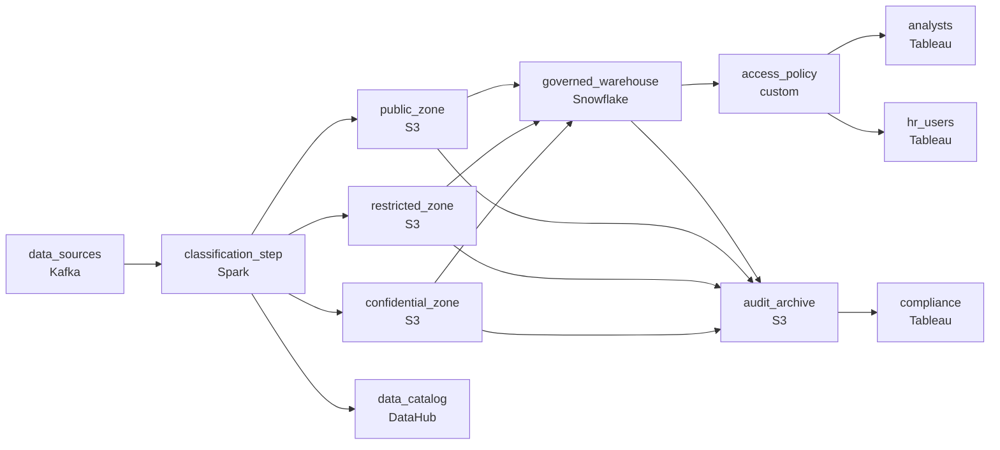

# Not Every Team Can See Every Row
_Everyone can see the bucket. Not everyone should._

- **Domain:** pipeline_architecture
- **Difficulty:** Hard
- **Est. time:** 25 min
- **URL:** https://datadriven.io/problems/not_every_team_can_see_every_row

## Problem

We store all our data in S3 and want to build a warehouse on top of it. The challenge is that different teams have strict data access requirements: some data is confidential and can only be queried by specific groups, and we need that access control enforced at the file level in S3, not just at the query layer. Design the warehouse architecture.

**Concepts tested:** `paBatchProcessing`, `paFileIngestion`, `paPartitioning`, `paSchemaEvolution`, `paTableFormats`

## Requirements

- Application-layer filtering has been bypassed by direct API calls; the storage itself has to enforce who can read which files.
- Reclassifying data after it lands is too late; sensitivity has to be assigned at write time, with routing following the classification.
- Some tables hold both public columns like name and department alongside confidential columns like salary; analysts need the public columns and HR needs all of them.
- Compliance requires a record of every query and file access for years, queryable; today there's no audit trail.

## Must-have components

- Access has to be enforced at the storage layer via per-unit prefixes / buckets, not only by the query engine. Without a cold-storage tier there's nowhere to apply file-level access boundaries. Add S3, GCS, or ADLS.
- Mixed tables with public columns alongside confidential ones need column-level visibility enforced at the platform; without a warehouse / governed query engine there's nowhere to express that. Add Snowflake, BigQuery, Redshift, Databricks, or equivalent with column-level access controls.

**Expected stages:** `data_ingestion` → `s3_partitioned_store` → `access_control_layer` → `query_engine` → `data_catalog`

## Solution walkthrough

### The trap

This is a defense-in-depth problem dressed up as a warehouse build. The skill is running **two access boundaries that hold at the same time**: file isolation in storage and column visibility in the engine. Anyone can draw S3 feeding a warehouse. The candidates who stand out refuse to let the query engine be the only lock. Put all governance in warehouse views, and one direct `GetObject` call against the bucket returns the confidential file without touching the engine.

> **Views are not a bucket policy**
>
> The design that usually ships uses one prefix for everything and relies on views for access. An engineer copies a salary file straight from S3 because the bucket never said no. An analyst queries the base table instead of the view and gets `salary`. Compliance asks who read what, and nobody can answer.

### Walk the requirements

**Step 1: Classify at write time, not after landing**

`classification_step` tags every record from a rule, a column match or an upstream tag, then routes it on that tag. If you reclassify later, confidential rows sit in the public prefix for a while, and that is long enough for someone to download them.

**Step 2: Enforce at the storage layer with per-sensitivity zones**

`public_zone`, `restricted_zone` and `confidential_zone` are separate prefixes or buckets, and each has its own IAM policy. A direct API call from the wrong role fails at S3, whichever query path it came from.

**Step 3: Put column policies on mixed tables**

An employee table holds `name` and `department` next to `salary`. Column masking policies in `governed_warehouse` show analysts the public columns and show HR all of them, from the same table. Hiding the columns in BI fails as soon as someone queries the base table.

**Step 4: Archive every query and file access**

Engine query history and S3 access logs both feed `audit_archive`, which is retained for the regulatory window. Then 'who read this last March' is a SQL query, not a forensic project.

### The shape that fits

| node | type | tech | details |
|---|---|---|---|
| data_sources | source | Kafka |  |
| classification_step | transform | Spark | errorAction: alert |
| public_zone | storage | S3 | backfillStrategy: partition_overwrite |
| restricted_zone | storage | S3 | backfillStrategy: partition_overwrite |
| confidential_zone | storage | S3 | backfillStrategy: partition_overwrite |
| governed_warehouse | storage | Snowflake | slaFreshness: < 1h |
| access_policy | quality_gate | custom | errorAction: alert |
| audit_archive | storage | S3 | backfillStrategy: incremental |
| data_catalog | consumer | DataHub |  |
| analysts | consumer | Tableau | slaFreshness: < 1h |
| hr_users | consumer | Tableau | slaFreshness: < 1h |
| compliance | consumer | Tableau | slaFreshness: < 24h |

| Engine-only governance | Storage plus engine |
|---|---|
| A single prefix with secure views. Access holds only while every request goes through the warehouse, and a direct S3 read skips the entire policy. | Bucket policies per zone block direct reads, and column masking in `governed_warehouse` handles mixed tables. Each layer covers the other's blind spot. |

> **File access logs, not just query logs**
>
> Most candidates audit only warehouse queries. Strong ones also route S3 access logs from each zone into `audit_archive`, because the threat model here is the read that never went through the engine.

> **The cost is configuration, not compute**
>
> Three zones triple the IAM surface, the classifier must be right on every record, and the audit archive grows for years. Partition it by date and keep it in cheap object storage, so lookups scan only the window compliance asks about.

- **A new department gets access to a confidential dataset. What changes?**
  - _Only policy changes: a grant on `confidential_zone` and the column policy. No data moves, and the grant itself is audited._
- **The classifier misses a confidential row. How do you find who saw it?**
  - _Move the row to the correct zone, then query `audit_archive` for every read of the wrong zone during the exposure window._
