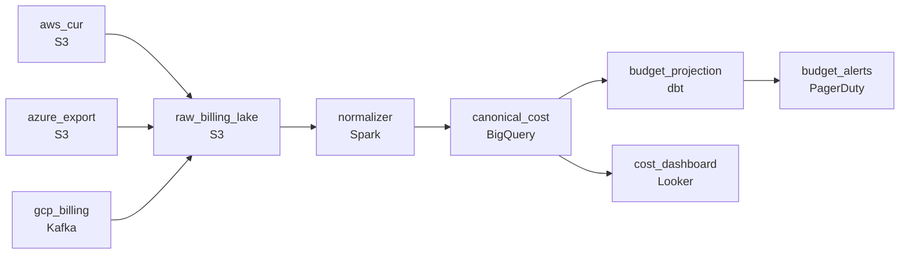

# One Bill Across Three Clouds
_AWS, Azure, GCP. Three bills. One truth._

- **Domain:** pipeline_architecture
- **Difficulty:** Medium
- **Est. time:** 10 min
- **URL:** https://datadriven.io/problems/one_bill_across_three_clouds

## Problem

We manage cloud infrastructure for thousands of enterprise customers across AWS, Azure, and GCP. Every customer wants a single unified view of their cloud spend, but each cloud provider delivers billing data on a different schedule with a completely different schema - AWS Cost and Usage Reports are hourly CSVs, Azure exports daily JSON, and GCP streams near-real-time. Design a pipeline that unifies these into a consistent cost analytics layer and alerts us when any managed account is trending toward a budget breach.

**Concepts tested:** `paApiIngestion`, `paBackfill`, `paBatchProcessing`, `paBatchVsStreaming`, `paDagOrchestration`, `paDataLake`, `paDataQuality`, `paDeadLetterQueue`, `paDeduplication`, `paEltVsEtl`, `paEventDriven`, `paFileIngestion`, `paFullVsIncremental`, `paIdempotency`, `paLateData`, `paMedallion`, `paMonitoring`, `paPartitioning`, `paRetryHandling`, `paSchemaEvolution`, `paStreamProcessing`

## Requirements

- Customers want one view of cloud spend across providers; today they get three separate bills with three formats they have to reconcile themselves.
- Cloud providers re-deliver billing files with corrections under the same path; the raw payloads have to be retained so the unified view can be rebuilt from them.
- Customers don't want to discover they breached their budget after the month closes; the alert has to come early enough to act on.

## Must-have components

- Customers query unified cost from a canonical analytics layer and budget alerts read from it too. Without a warehouse tier there's nowhere for the canonical cost view to live. Add Snowflake, BigQuery, Redshift, or Databricks.
- Three providers deliver billing files with corrections under the same path; the unified view has to be reproducible from the raw files. Without a cold-storage landing zone there's nowhere to keep the per-provider raw payloads. Add S3, GCS, or ADLS.

**Expected stages:** `cloud_costs_raw` → `cloud_costs_canonical` → `account_cost_daily` → `sla_breach_alerts`

## Solution walkthrough

### Why this problem exists in real interviews

Three providers, three schemas, three cadences, three currencies, and a budget alert that has to fire before the month closes. The trap is normalizing too late and budgeting too late: schema differences ignored until query time produces a canonical view that doesn't reconcile, and budgeting from the closed bill defeats the purpose.

The default reach is to load each provider's billing into its own warehouse table and tell customers to union them in their dashboard. The unions don't actually align because the cost columns mean slightly different things across providers. A re-delivered AWS Cost and Usage Report appends rather than replaces, doubling line items for that period. Budget alerts run end-of-month and arrive after the customer has already overspent.

> **Trick to Solving**
>
> Per-provider raw landing in cold storage, canonical cost record after normalization, partition-overwrite by period for corrections, daily projection against the budget so the alert fires before close.
>
> 1. Each provider's raw billing lands in cold storage unchanged so the canonical view is reproducible from the source if normalization improves.
> 2. Normalization produces one cost record per resource with both original-currency and unified-currency totals, plus the canonical resource id and account.
> 3. Corrections replace by period: a re-delivered file for a given month writes via partition-overwrite on that month, not as new rows.
> 4. Budget alerts run on a daily projection of month-to-date spend against the customer's budget, not at close.

---

### Walk the requirements

**Step 1: One unified cost record per resource, both currencies present**

Each provider's billing has its own schema, granularity, and currency. Normalization runs after raw landing and produces one cost record per resource with the canonical fields (account, resource id, period, original amount, original currency, unified-currency amount, FX rate used). Customers query the canonical view and see spend across providers as a single sum with both currencies on the row. A 'union three tables in BI' approach produces a number that doesn't reconcile because the columns mean different things; canonical-up-front is what makes the view answerable.

**Step 2: Corrected files overwrite the period, not append next to it**

Cloud providers re-deliver billing for a period with corrections. The loader uses partition-overwrite keyed on the period (and provider, and account) so the corrected file replaces the originals atomically. A correction for last month rebuilds last month's partition; the unified view ends up with the corrected version, not duplicates. An append-style load doubles line items the first time a provider re-delivers and the budget alerts start firing on numbers that aren't real.

**Step 3: Daily budget projection so alerts fire before the month closes**

Budget alerts run daily against each account's month-to-date spend with a projection to end-of-month based on the current run rate. When the projection crosses the budget threshold, the alert fires to the customer with days remaining to act. Waiting for the bill is exactly what the requirement is calling out; the projection is what makes the alert actionable. The threshold per account lives alongside the canonical cost view so the daily run can read both with one query.

---

### The shape that fits

| node | type | tech | details |
|---|---|---|---|
| aws_cur | source | S3 |  |
| azure_export | source | S3 |  |
| gcp_billing | source | Kafka |  |
| raw_billing_lake | storage | S3 |  |
| normalizer | transform | Spark |  |
| canonical_cost | storage | BigQuery |  |
| budget_projection | transform | dbt |  |
| cost_dashboard | consumer | Looker |  |
| budget_alerts | consumer | PagerDuty |  |

> **What this design gives up**
>
> Per-provider raw landing plus normalization plus partition-overwrite plus daily projection is more pieces than 'load each into a table and union in BI.' The canonical schema has to absorb new fields when providers add SKUs. Implementation cost is the price; the win is one unified view customers can actually query, corrections that don't double-count, and budget alerts that arrive in time to do something about.

> **What reviewers check**
>
> A reviewer looks at the canvas for these properties:
> - Each provider's raw billing lands in cold storage; the canonical cost view is built from the raw payloads.
> - The canonical record carries both original currency and unified-currency totals so 'spend across providers' is a single sum.
> - Corrected files overwrite by period rather than appending alongside the originals.
> - A daily budget projection against month-to-date spend produces alerts before the month closes.

> **The mistake that ships**
>
> What gets shipped loads each provider into its own table and lets customers union in BI. The unions don't reconcile because the cost columns mean slightly different things; customers email asking why the dashboard total differs from the provider invoices. AWS re-delivers a corrected report and the table doubles line items for that period; budget alerts fire on numbers that aren't real. Customers find out about a budget breach when the bill arrives, which is the failure the requirement is calling out. The rebuild centres on canonical-up-front, partition-overwrite, and daily projection, in that order.

---

- **A new provider is added to the platform with its own schema. What in this design extends, and what doesn't?**
  - _Tests whether the candidate sees the per-provider normalizer as the extension point: a new mapping into the canonical schema, a new path in the raw lake. The canonical cost view, the budget projection, and the customer dashboard don't change._
- **An account's currency changes mid-month. What does the canonical record do, and what does the projection use?**
  - _Tests whether the candidate sees that the canonical record stores original-currency per row and unified-currency per row using the FX rate at the row's period; the projection sums unified-currency by month. Mid-month currency changes show up as rows in different original currencies, all rolled up in the unified column._
