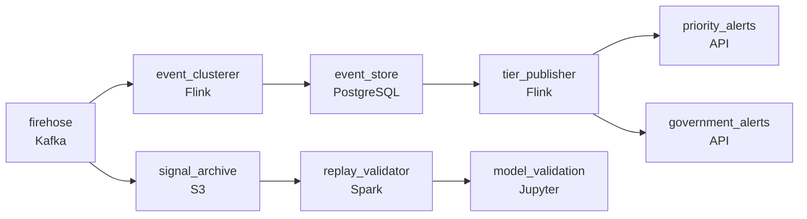

# One Earthquake, Ten Thousand Tweets
_The firehose is on. Separate signal from noise._

- **Domain:** pipeline_architecture
- **Difficulty:** Hard
- **Est. time:** 10 min
- **URL:** https://datadriven.io/problems/one_earthquake_ten_thousand_tweets

## Problem

We detect breaking news and real-world events from the full Twitter firehose and 1 million other data sources. When an earthquake happens or a building catches fire, we need to identify it from thousands of simultaneous posts and send a single validated alert to our clients - hedge funds, newsrooms, and government agencies - within 60 seconds. Right now our pipeline can detect events but the deduplication logic is brittle and we miss multi-source signals. Design the event detection and deduplication pipeline.

**Concepts tested:** `paApiIngestion`, `paDataQuality`, `paDeduplication`, `paEventDriven`, `paEventPlatforms`, `paIdempotency`, `paLateData`, `paMicroBatchVsTrue`, `paMonitoring`, `paPartitioning`, `paRetryHandling`, `paStreamProcessing`

## Requirements

- Hedge fund and government clients pay for the fastest alerts; a slower delivery costs them their competitive advantage.
- An earthquake produces ten thousand posts about the same event; clients receive one alert per event, not ten thousand.
- Government clients act on alerts and a false positive can drive a real-world emergency response; the published false-positive rate has to stay very low.

## Must-have components

- A 60-second alert SLA against a high-volume firehose is true streaming, not micro-batch. Add a streaming layer with sub-second per-document processing or set SLA Freshness to real-time / < 1min on the processor.
- Model validation replays 30 days of raw signals through new model versions; that requires a durable raw archive that doesn't depend on the live stream. Add a cold-storage layer (S3, GCS, ADLS) for the replayable archive.

**Expected stages:** `raw_signals` → `event_candidates` → `published_alerts` → `alert_delivery_log`

## Solution walkthrough

### Why this problem exists in real interviews

Sub-minute alerts off a high-volume firehose with three properties pulling apart: paying-tier delivery has to be fast, the same event has to produce one alert not ten thousand, and government tier can't tolerate false positives. The trap is treating speed and confidence as a single dial; the design has to let priority and confidence vary per tier.

The default reach is a streaming aggregator that emits an alert as soon as confidence crosses a threshold. The first earthquake produces ten thousand similar posts; the aggregator's dedup matches on text similarity and most fire as separate events. False positives at the speed threshold reach government clients and create a real-world response. The replay path nobody built means a model-version change can't be validated against history before going live.

> **Trick to Solving**
>
> Cluster signals into events on the stream, publish per-tier with tier-specific confidence, archive raw signals for replay.
>
> 1. Event clustering happens on the stream: signals about the same real-world event group on shared geography, time window, and content similarity. The cluster is the event; one event yields one alert.
> 2. Per-tier publishing applies different confidence thresholds: priority tier gets the alert when corroboration crosses its threshold (faster, lower bar), government tier waits for the higher-confidence threshold.
> 3. Raw signals land in a durable archive replayable through new model versions for validation before they go live.

---

### Walk the requirements

**Step 1: Sub-minute alerts on a streaming path with per-tier publishing**

Raw signals flow through a streaming clusterer into an event store; published alerts route per tier. The priority tier's alert publishes when its threshold is met (faster). The streaming budget end-to-end stays inside the 60-second SLA. Without a streaming tier the SLA is unattainable; without a durable archive the replay validation has nothing to read.

**Step 2: One event yields one alert through stream-side clustering**

An earthquake produces thousands of posts about the same event. The streaming clusterer groups signals by shared (geography, time-window, content-similarity) into a single event entity; the cluster's confidence accumulates as more signals arrive. The published alert emits once per event with the corroborating signals attached. Text-similarity-only dedup is the version where ten subtly different post phrasings get treated as ten events; multi-feature clustering is the contract that collapses them.

**Step 3: Per-tier confidence thresholds, not speed alone**

Government clients can't act on a false positive; a real-world emergency response is the consequence. The design publishes per tier with tier-specific thresholds: priority tier publishes at one confidence level, government tier waits until corroboration crosses the higher threshold. The same event can fire to priority within seconds and to government a minute later when more signals confirm. Publishing at one threshold to all tiers is the version where speed wins for one client and burns another; per-tier thresholds make speed and confidence both variables of the publish decision.

---

### The shape that fits

| node | type | tech | details |
|---|---|---|---|
| firehose | source | Kafka | parallelism: 16 partitions |
| signal_archive | storage | S3 | backfillStrategy: partition_overwrite |
| event_clusterer | transform | Flink | slaFreshness: real-time; idempotencyStrategy: upsert |
| event_store | storage | PostgreSQL | slaFreshness: real-time |
| tier_publisher | transform | Flink | slaFreshness: real-time |
| replay_validator | transform | Spark | slaFreshness: < 24h |
| priority_alerts | consumer | API | slaFreshness: real-time |
| government_alerts | consumer | API | slaFreshness: real-time |
| model_validation | consumer | Jupyter | slaFreshness: < 24h |

> **What this design gives up**
>
> Stream-side clustering is more state per active event than naive dedup; per-tier publishing means more publishing logic and per-tier delivery paths; the durable archive grows with the firehose; replay infrastructure is build cost upfront. Implementation cost is the price; the win is sub-minute alerts to priority clients, one event yielding one alert across tiers, government-grade confidence at the cost of a slower government-tier publish, and replay validation that lets new model versions ship without surprises.

> **What reviewers check**
>
> A reviewer looks at the canvas for these properties:
> - A streaming layer clusters related signals into events and publishes one alert per event within sub-minute.
> - Per-tier confidence thresholds gate when each tier's alert publishes.
> - Raw signals land in a durable archive that can be replayed through new model versions for validation.

> **The mistake that ships**
>
> What gets shipped runs a streaming aggregator that publishes when confidence crosses one shared threshold, with text-similarity dedup as an afterthought. An earthquake fires ten subtly-different alerts because text dedup didn't collapse them; clients get spammed. A false positive at the speed threshold reaches government clients and an emergency response is dispatched on a phantom event. A new model version ships without replay validation and degrades performance silently. The eventual rebuild adds multi-feature event clustering, per-tier publishing, and a replay archive , all reachable up front if 'fast' and 'right' had been treated as separate dials per tier.

---

- **Two real events happen close together in geography and time (a fire next door to a power outage). How does this design avoid merging them, and what would tip it the wrong way?**
  - _Tests whether the candidate sees the clustering features as multi-dimensional (content similarity matters too, not just geography and time); the merge happens only if all dimensions agree. The risk is over-tuning the geography window to be too generous, which would merge the two events; tuning is per-feature, with replay validation against historical event pairs to verify._
- **A new model version improves recall but increases latency for high-confidence clusters. How does this design let the team ship it without burning either tier?**
  - _Tests whether the candidate uses the replay archive to validate the new model against the last 30 days, sees the per-tier latency impact, and either ships only to a tier where the latency fits or tunes the model further. Replay-driven validation is what lets the team make a quantitative call rather than an A/B-in-prod gamble._
