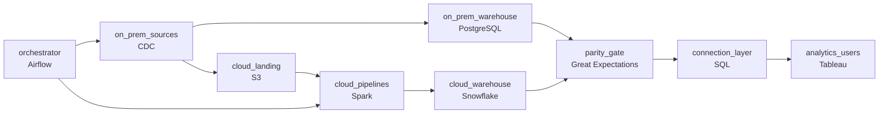

# Out of the Data Center
_The on-prem servers are not getting any younger._

- **Domain:** pipeline_architecture
- **Difficulty:** Medium
- **Est. time:** 20 min
- **URL:** https://datadriven.io/problems/out_of_the_data_center

## Problem

We have a legacy data platform running on-premises that is expensive to maintain and can't scale. We need to move our data pipelines to the cloud without disrupting the analytics team or breaking downstream reports. Design the migration architecture.

**Concepts tested:** `paBackfill`, `paBatchProcessing`, `paBatchVsStreaming`, `paCdc`, `paDagOrchestration`, `paDataLake`, `paDataQuality`, `paEltVsEtl`, `paEnvironmentMgmt`, `paFullVsIncremental`, `paIdempotency`, `paLambdaArch`, `paMedallion`, `paMonitoring`, `paPartitioning`, `paRetryHandling`

## Requirements

- Executives review dashboards at 8am every day; the migration can't ever miss a morning report, on-prem or cloud.
- Three prior modernization attempts failed; leadership will only sign off if cloud and on-prem produce identical output for a defined period before cutover.
- If a migrated pipeline misbehaves after cutover, that one has to revert to on-prem without disturbing any of the others.
- Analytics users connect to the warehouse through their existing tools; cutover can't make every user rebuild their connections.

## Must-have components

- The migration target is a cloud warehouse. Without a warehouse tier there's no destination for analytics. Add Snowflake, BigQuery, Redshift, or Databricks.
- Per-pipeline cutover with a dual-run period, parity gates, and per-pipeline rollback requires an orchestration layer. Add Airflow, Dagster, Prefect, or Composer.

**Expected stages:** `on_prem_sources` → `hybrid_bridge` → `cloud_landing` → `cloud_transform` → `cloud_warehouse`

## Solution walkthrough

### What this really is

This is a change-management problem wearing a cloud-migration costume. Anyone can draw on-prem boxes, an arrow and Snowflake. What separates candidates is making **every pipeline independently reversible**: dual-run, a numeric parity gate, per-pipeline cutover, and a connection layer users never see move. Skip that and you ship the fourth failed attempt. One pipeline diverges on Tuesday, nothing can revert only that one, the whole weekend's cutover rolls back, and every analyst's workbook points at a dead connection string.

> **Cutover is a routing flip, not an event**
>
> Treat each pipeline as a switch with two positions, on-prem or cloud, owned by the orchestrator and read by the connection layer. Cutover and rollback become the same cheap operation in opposite directions, scoped to one pipeline.

### Walk the requirements

**Step 1: Make one orchestrator own the 8am contract**

`Airflow` schedules each pipeline on whichever side is authoritative today and alerts before 7:30am if either side is late. Without it, nothing watches the deadline across both halves of the migration.

**Step 2: Dual-run and gate cutover on a number**

CDC lands the same data in a cloud landing zone while on-prem keeps running. A daily diff of both warehouses feeds `parity_gate`; a pipeline flips only after divergence stays inside tolerance for the agreed window. Leadership signs off on the gate's record, not on someone eyeballing two dashboards.

**Step 3: Scope cutover and rollback to one pipeline**

Pipeline A can be live on cloud while B and C still dual-run. If A misbehaves, A reverts and nobody else's state moves. That isolation is exactly what the three prior attempts lacked.

**Step 4: Put a stable layer in front of users**

Tableau connects to a logical connection (alias or view layer) that resolves each table to its authoritative side. A cutover is a routing change there; no user rebuilds a workbook.

### The reference design

| node | type | tech | details |
|---|---|---|---|
| on_prem_sources | source | CDC |  |
| orchestrator | transform | Airflow | errorAction: alert; monitorAlert: Per-pipeline morning SLA at risk on either side |
| on_prem_warehouse | storage | PostgreSQL |  |
| cloud_landing | storage | S3 |  |
| cloud_pipelines | transform | Spark | idempotencyStrategy: staging_table |
| cloud_warehouse | storage | Snowflake | slaFreshness: < 24h; backfillStrategy: partition_overwrite |
| parity_gate | quality_gate | Great Expectations | errorAction: alert |
| connection_layer | transform | SQL |  |
| analytics_users | consumer | Tableau | slaFreshness: < 24h |

> **Big-bang Monday is the failure you were hired to avoid**
>
> The default answer builds the cloud stack, runs it once on Sunday and flips everything Monday. That is the plan that already failed three times. If your design has no per-pipeline switch, one mismatch rolls back the whole wave.

> **Say the tolerance out loud**
>
> Strong candidates define the gate: which metrics are diffed (row counts, key sums), the tolerance, and how many consecutive clean days unlock cutover. A vague 'we validate the output' reads as the fourth attempt.

> **Dual-run doubles compute, on purpose**
>
> You pay for both sides during the window. Keep it cheap by migrating in waves, retiring each on-prem job the day its pipeline clears the gate, and using idempotent `staging_table` writes so reruns cost one pass.

- **After cutover a pipeline drifts from its dual-run output. Where do you look first?**
  - _The gate no longer runs; tests whether they reach for the dual-run diff history and per-pipeline rollback._
- **Three migrating pipelines depend on a fourth still on-prem. What happens?**
  - _Tests cross-side reads through `connection_layer` instead of forcing migration order._
