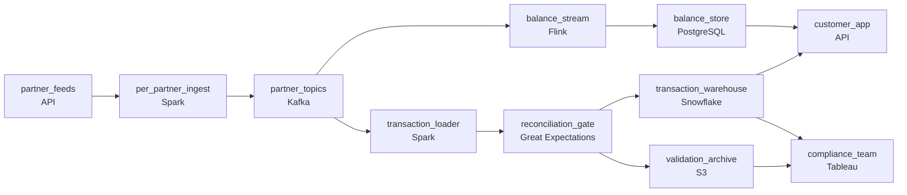

# Prove the Number Is Right
_Bad data in fintech is not just messy. It is expensive._

- **Domain:** pipeline_architecture
- **Difficulty:** Hard
- **Est. time:** 25 min
- **URL:** https://datadriven.io/problems/prove_the_number_is_right

## Problem

We're a personal finance platform. Customers connect their bank accounts and we show them a unified view of their spending. The data comes from dozens of partner integrations and our compliance team needs to be able to prove the numbers are accurate. Design the data pipeline.

**Concepts tested:** `paApiIngestion`, `paBackfill`, `paBatchProcessing`, `paDagOrchestration`, `paDataQuality`, `paDeadLetterQueue`, `paDeduplication`, `paFullVsIncremental`, `paIdempotency`, `paMedallion`, `paMonitoring`, `paPartitioning`, `paRetryHandling`, `paSchemaEvolution`, `paTableFormats`

## Requirements

- Customers expect their account balance to reflect a new transaction within minutes; transaction history can lag a couple hours.
- Compliance has to be able to prove our numbers match each partner's reported totals; today the gap can't be explained.
- When a partner's feed is late, that partner's customers should see their last known balance rather than nothing; healthy partners must keep flowing.
- SEC audit requires every validation result, pass or fail, to be retained for seven years.

## Must-have components

- Customers see their unified spending view from a warehouse-backed serving layer and compliance audits require the warehouse to be reproducible. Add Snowflake, BigQuery, Redshift, or Databricks.
- Balances refresh within minutes while transaction history can lag a couple hours; partners deliver via webhooks, scheduled files, and CDC. One shared cadence either over-spends or under-serves. Show at least one streaming path and one batch path.

**Expected stages:** `source_ingestion` → `queue_buffer` → `transform_step` → `validation_checks` → `warehouse_load`

## Solution walkthrough

### What this really is

This is a reconciliation pipeline dressed up as a spending dashboard. Anyone can draw partners flowing into a warehouse. What separates candidates is whether **proof is a stage in the pipeline** or a spreadsheet someone runs afterward. A single shared loader on one cadence fails three ways. Balances go stale. One late partner stalls everyone. And when compliance asks why partner X is short this week, nobody can explain the gap, because nothing ever compared your totals to theirs.

> **Reconciliation is a gate, not a report**
>
> Put the comparison against partner-reported totals between the loader and the warehouse, and have it write every verdict, pass or fail, to its own archive. Once the check is a node with an output, the seven-year SEC trail comes for free.

### Walk the requirements

**Step 1: Split one feed into two cadences**

Balances must land within minutes, and history can lag a couple of hours. Fan out from `partner_topics`. On one branch, `balance_stream` upserts into `balance_store` in real time. On the other, `transaction_loader` batches into the warehouse under a two-hour SLA. One shared cadence either pays streaming prices on every historical row or leaves balances stale.

**Step 2: Serve the customer from both tiers**

The unified view is a balance plus spending history. `customer_app` reads the balance from `balance_store` and the history from `transaction_warehouse`. Drop that second edge and customers see a number with no spending behind it, which is the product they signed up for.

**Step 3: Gate each batch on partner totals**

`reconciliation_gate` sums each partner's batch and compares it to the total that partner reported. If the gap is outside tolerance, the batch is flagged, publish halts and an alert fires. The gap is caught in the run that created it, not a month later.

**Step 4: Isolate partners, keep the last known balance**

Ingest is partitioned per partner, so a late feed stalls only its own partition and healthy partners keep flowing. Because `balance_store` is upserted, it still holds the late partner's last known balance. The app shows that value with a freshness hint instead of an empty page.

**Step 5: Archive every verdict for seven years**

The gate writes one row per check to `validation_archive`: partner, batch, expected total, actual total, tolerance and result. The archive is retained for the SEC window, so an auditor's question becomes a query instead of a promise.

### The reference design

| node | type | tech | details |
|---|---|---|---|
| partner_feeds | source | API |  |
| per_partner_ingest | transform | Spark | errorAction: alert; parallelism: 8 partitions; idempotencyStrategy: staging_table |
| partner_topics | queue | Kafka |  |
| balance_stream | transform | Flink | slaFreshness: real-time; idempotencyStrategy: upsert |
| balance_store | storage | PostgreSQL | slaFreshness: < 1min |
| transaction_loader | transform | Spark | slaFreshness: < 2h; idempotencyStrategy: upsert |
| reconciliation_gate | quality_gate | Great Expectations | errorAction: alert; monitorAlert: Per-partner total disagrees with partner-reported total |
| transaction_warehouse | storage | Snowflake | slaFreshness: < 2h; backfillStrategy: partition_overwrite |
| validation_archive | storage | S3 | backfillStrategy: incremental |
| customer_app | consumer | API | slaFreshness: < 1min |
| compliance_team | consumer | Tableau | slaFreshness: < 24h |

| One shared loader | Per-partner partitions |
|---|---|
| Every partner shares one job and one cadence. A late partner blocks the run, so every customer's balance goes stale, and nobody checks totals against what partners report. | Each partner gets its own partition in `partner_topics`. A late partner stalls only itself, and `reconciliation_gate` checks each partner's batch against that partner's own reported total. |

> **Validation that leaves no record**
>
> Candidates often draw the quality gate and stop there. A gate that only blocks or passes leaves no history. SEC wants seven years of results, pass and fail, and all you would have is the latest run. The gate needs a write path to `validation_archive`.

> **Balances never wait on the gate**
>
> Strong candidates say out loud that `customer_app` reads two clocks. The balance comes from the streaming tier and never waits on reconciliation. History comes from `transaction_warehouse`, so customers only ever see spending that has already passed the gate.

> **The cost is on-call, not compute**
>
> A gate that halts publish pages people more often than a silent mismatch would. The archive also grows with every batch for seven years. Both costs are cheap next to an SEC finding.

- **A partner reports totals daily but streams transactions continuously. How do you reconcile?**
  - _Tests windowing: the gate sums the window up to the partner's daily cutover and checks that sum. `balance_store` is untouched._
- **A reconciliation flag fires. What do the customer, compliance and on-call each see?**
  - _Tests triage: balances keep streaming, history holds at the last reconciled batch, compliance sees the flagged row in `validation_archive`, and on-call investigates rather than auto-correcting._
