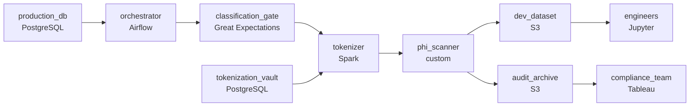

# Real Data, Fake Patients
_Dev needs production data. HIPAA says absolutely not._

- **Domain:** pipeline_architecture
- **Difficulty:** Hard
- **Est. time:** 10 min
- **URL:** https://datadriven.io/problems/real_data_fake_patients

## Problem

Our data engineering team works with protected health information in production, and engineers need realistic data in a separate development account without ever touching real patient records. Design a scheduled pipeline that ingests from production and de-identifies PHI across many foreign-key-related tables, replacing stable identifiers with synthetic tokens drawn from a consistent mapping so the same real id always resolves to the same token in every table, and landing a statistically representative dataset in the dev account's object store. The mapping lives in a vault that feeds only the de-identification step and that engineers cannot read; an orchestrator coordinates each refresh through the tables in dependency order, clears every column through a classification check before anything reaches dev, and writes a durable per-run audit log retained for years to satisfy HIPAA.

**Concepts tested:** `paBatchProcessing`, `paDagOrchestration`, `paDataQuality`, `paDeduplication`, `paDependencyMgmt`, `paEnvironmentMgmt`, `paFileIngestion`, `paIdempotency`, `paMonitoring`

## Requirements

- HIPAA forbids real PHI in development; engineers have to work with realistic data that isn't a real person.
- Engineers run tests in dev; if joins don't behave like prod, the tests pass on broken code.
- Production schema changes weekly and a new sensitive field could quietly land in dev; that has to be blocked.
- HIPAA compliance requires that every de-identification run is auditable for years.

## Must-have components

- The de-identified dev dataset has to land in a separate storage location that engineers can read while production PHI is locked away from them. Without a cold-storage tier in the dev environment there's nowhere safe to deliver the synthetic dataset. Add S3, GCS, ADLS, or equivalent in the dev account.
- De-identification runs on a refresh cadence with foreign-key ordering, PHI scanning, and an audit log; without an orchestration layer there's nothing to coordinate the dependency-ordered processing or capture the audit log per run. Add Airflow, Dagster, Prefect, or Composer.

**Expected stages:** `ingest_from_production` → `de_id_orchestrator` → `phi_classification_gate` → `tokenization_vault` → `tokenize_and_synthesize` → `dev_synthetic_dataset` → `run_audit_log`

## Solution walkthrough

### The trap

This is a referential-integrity problem dressed up as compliance. Most candidates draw a copy job with masking in the middle. The real question is whether the fake data still joins like the real data. Random replacement scrubs PHI, but it hands the same patient a different token in every table, so joins on `patient_id` come back empty and dev tests pass on code that breaks in prod. The second trap is time. The schema changes weekly, and **a masking job that passes unknown columns through** will eventually ship a new sensitive field to dev without anyone noticing.

> **Masking per table breaks every join**
>
> The version that ships first replaces identifiers independently in each table. `patients` and `encounters` each look clean on their own, but together they are fiction. Nobody notices until a join-heavy bug reaches prod after passing in dev.

### Walk the requirements

**Step 1: Tokenize from one mapping, in dependency order**

Real `patient_id` 12345 becomes '`pat_abc`' in `patients`, `encounters`, `labs` and every other table, because a single tokenize step reads one mapping. The orchestrator processes parents before children, so a child row never references a token that has not been minted yet.

**Step 2: Wall off the vault**

The original-to-token mapping is the one artifact that can re-identify a patient. It feeds the tokenizer and nothing else: no edge to the dev dataset and no edge to any consumer. Dev only ever holds tokens.

**Step 3: Gate every column before it moves**

A classification gate checks each column against its rules. It is marked safe, marked sensitive with a scrub rule, or blocked. An unclassified column halts the run and alerts. A PHI scan after tokenizing catches anything the rules missed before anything lands in dev.

**Step 4: Audit each run without PHI**

Each run writes the tables processed, row counts, rules applied and scan results to an archive retained for years. The record holds counts and rule ids, never patient values, so the audit log is not a second PHI store.

### The shape that fits

| node | type | tech | details |
|---|---|---|---|
| production_db | source | PostgreSQL |  |
| orchestrator | transform | Airflow | errorAction: alert; monitorAlert: Unclassified column blocked or run incomplete |
| classification_gate | quality_gate | Great Expectations | errorAction: alert |
| tokenization_vault | storage | PostgreSQL |  |
| tokenizer | transform | Spark | idempotencyStrategy: staging_table |
| phi_scanner | quality_gate | custom | errorAction: alert |
| dev_dataset | storage | S3 | backfillStrategy: partition_overwrite |
| audit_archive | storage | S3 | backfillStrategy: incremental |
| engineers | consumer | Jupyter | slaFreshness: < 24h |
| compliance_team | consumer | Tableau | slaFreshness: < 24h |

| Random replacement | Vaulted deterministic tokens |
|---|---|
| Each table picks its own fake `patient_id`. PHI is gone, and so are the joins. Dev tests run against relationships that do not exist. | One mapping, one tokenize step. The same real id gets the same token in every table, so joins in dev return the same shape they return in prod. |

> **Where the vault's edges point**
>
> Reviewers trace the arrows out of the mapping store. A single edge into the tokenizer signals that you understand the re-identification boundary. An edge to dev or to a dashboard is an instant fail, however good the rest of the canvas looks.

> **Blocking is the price of safety**
>
> An unclassified column stops the next refresh until someone reviews it, so dev data can lag prod by a day. That delay is deliberate. A refresh that can't stall is a refresh that can leak.

- **An engineer needs the dev row for one specific real patient. What allows it, and what prevents it?**
  - _Only the vault maps tokens back to people, and engineers have no path to it._
- **A regulator asks you to prove the dev dataset from a given date held no PHI. What answers that?**
  - _The audit record for that run: scan results, rules applied and the dataset id._
