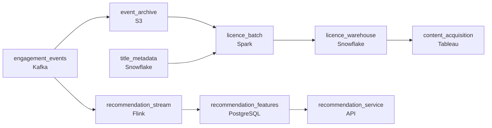

# Recommendations Now, Royalties Later
_The catalog updated. Did anyone notice?_

- **Domain:** pipeline_architecture
- **Difficulty:** Medium
- **Est. time:** 10 min
- **URL:** https://datadriven.io/problems/recommendations_now_royalties_later

## Problem

We operate a streaming service with thousands of titles across licensed and original content, and viewer engagement events must reach our recommendation system in near-real time while our content acquisition team needs daily reporting on which licensed titles are delivering value. These two consumers share the same underlying event data but have distinct latency and exactness requirements. Design a streaming pipeline that serves both efficiently.

**Concepts tested:** `paBatchProcessing`, `paBatchVsStreaming`, `paDagOrchestration`, `paDataQuality`, `paEventDriven`, `paEventPlatforms`, `paIdempotency`, `paLambdaArch`, `paMedallion`, `paMonitoring`, `paPartitioning`, `paSchemaEvolution`, `paStreamProcessing`, `paTableFormats`

## Requirements

- What the customer just watched changes their next recommendation; the recommendation system needs that signal within minutes, while licence reporting tolerates T+1.
- Studios are paid by exact viewing minutes per title per country; licence reports can't double-count or miss minutes.
- Title metadata changes when licences expire and titles are added or removed; reports have to use the metadata that was current when the user watched, not today's.

## Must-have components

- Recommendations need viewer features within minutes while licensee reporting tolerates T+1. Show at least one streaming path and at least one batch path.
- Licensee reporting is exact and reprocessed for late events up to a 48-hour window; without a durable raw archive (S3, GCS, ADLS) there's nowhere to retain the source-of-truth viewing record.

**Expected stages:** `raw_engagement_events` → `content_metadata_current` → `viewer_session_events` → `recommendation_feature_store` → `content_performance_mart`

## Solution walkthrough

### Why this problem exists in real interviews

Two consumers reading the same engagement events with opposite correctness budgets: recommendations want within-minutes-and-approximate, licence reporting wants T+1-and-exact, and the title metadata for reporting has to match what was current when the user watched. The trap is one shared aggregator that satisfies neither.

The default reach is one streaming aggregator that updates a counts table both consumers read. Recommendations get features in minutes; licence reporting reads the same counts and the studio gets paid based on approximate streaming aggregations that miss late events and double-count retries. Reports use today's title metadata so a licence that expired a week ago still appears to be valid for that period's payout.

> **Trick to Solving**
>
> Two paths from one durable archive, dedup once on event id, enrich reporting with metadata as-of viewing time.
>
> 1. Engagement events land in a durable archive partitioned by event time. The recommendation streaming path reads the same source for fast features; the licence batch reads the archive on T+1 with exact dedup.
> 2. Dedup on a stable event id at the recommendation aggregator and again at the licence batch (idempotent on the same key) so neither view double-counts.
> 3. Title metadata is a slowly-changing dimension keyed on (`title_id`, `valid_from`, `valid_to`); the licence batch joins each engagement to the metadata as of the viewing timestamp.

---

### Walk the requirements

**Step 1: Two paths sized for two correctness budgets**

Engagement events land in a durable archive in cold storage. The recommendation streaming consumer reads the events and updates per-user features within minutes; the licence reporting batch reads the archive on T+1 and produces exact per-title-per-country minute counts. Forcing licence reporting through the streaming aggregator's approximate state is the version where studios get paid the wrong number; forcing recommendations to wait for the batch is the version where what-you-just-watched isn't a signal yet.

**Step 2: Exact licence counts via dedup at the boundary, late-event window**

Each event carries a stable event id. The licence batch reads the archive over the post-period window (the configured 48 hours of allowed lateness), dedups on the event id, and counts viewing minutes per title per country exactly. Late events that arrive during the window land in the right period; the batch is rerun if the window extends past its first run. A 'count once on the streaming path and reuse for licence' approach is the version that misses late events and double-counts retries; counting exactly at the licence boundary is what makes payouts honest.

**Step 3: Reporting enriches with title metadata at viewing time**

Title metadata changes; licences expire, regions add or remove. The metadata table is a slowly-changing dimension keyed on (`title_id`, `valid_from`, `valid_to`). The licence batch joins each engagement on `viewing_time BETWEEN valid_from AND valid_to`, picking up the metadata that was current when the user watched. A title that licensed for that period gets paid for that period's views; one that expired afterward doesn't. Joining to today's metadata is the version that pays expired licences and misses ones that became active mid-period.

---

### The shape that fits

| node | type | tech | details |
|---|---|---|---|
| engagement_events | source | Kafka | parallelism: 16 partitions |
| event_archive | storage | S3 | backfillStrategy: partition_overwrite |
| recommendation_stream | transform | Flink | slaFreshness: real-time; idempotencyStrategy: upsert |
| recommendation_features | storage | PostgreSQL | slaFreshness: < 1min |
| title_metadata | storage | Snowflake |  |
| licence_batch | transform | Spark | slaFreshness: < 24h; backfillStrategy: partition_overwrite; idempotencyStrategy: staging_table |
| licence_warehouse | storage | Snowflake | slaFreshness: < 24h |
| recommendation_service | consumer | API | slaFreshness: < 1min |
| content_acquisition | consumer | Tableau | slaFreshness: < 24h |

> **What this design gives up**
>
> Two paths off one archive doubles the per-event compute (streaming aggregate plus batch read); the licence batch holds open the post-period window for late events, which adds reprocessing cost; the SCD on title metadata grows with every change. Implementation cost is the price; the win is recommendations that respond to what the user just watched and licence payouts that survive a studio audit.

> **What reviewers check**
>
> A reviewer looks at the canvas for these properties:
> - A streaming path serves recommendation features within minutes; a batch path serves licence reporting on T+1.
> - Both paths read the deduped engagement events from one durable archive; neither view double-counts.
> - Licence reporting joins each engagement to the title metadata as of the viewing time, not today's.

> **The mistake that ships**
>
> What gets shipped runs one streaming aggregator and reuses its counts for licence reporting. Studios get paid based on approximate streaming aggregations; late events are missed and retries double-count. Reports use today's metadata and pay an expired licence for last week's views. The eventual rebuild adds the durable archive, the licence batch with its post-period window and exact dedup, and the as-of-viewing metadata join , each was reachable up front if the recommendation budget and the licence budget had been treated as separate.

---

- **An event arrives 50 hours late, past the post-period window. What does this design do, and what does the licence report show?**
  - _Tests whether the candidate sees that the post-period window is bounded; events past it don't update the licence period's payout. The design either drops them or routes them to a late-data exception path that the team triages. Studios are paid against the period as it stood when the window closed; the boundary has to be explicit._
- **A title's metadata is corrected retroactively (licence terms restated). What changes for licence reporting, and what doesn't?**
  - _Tests whether the candidate sees the SCD update emerging as a new metadata version with the corrected `valid_from`; reprocessing the affected period's engagements through the licence batch produces the corrected payout. The recommendation path is unaffected because it doesn't rely on metadata for fast features._
