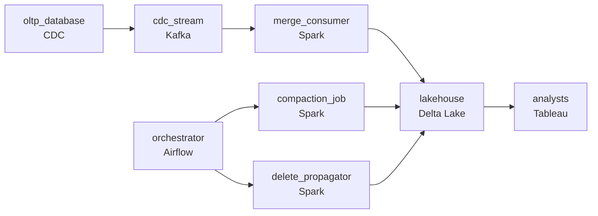

# Replicate It Without Breaking It
_The source changed. The lake needs to know immediately._

- **Domain:** pipeline_architecture
- **Difficulty:** Hard
- **Est. time:** 30 min
- **URL:** https://datadriven.io/problems/replicate_it_without_breaking_it

## Problem

Our OLTP database is under constant write pressure and we can't run analytics queries against it directly. We want to replicate it continuously into a Delta lake so analysts can query it without impacting production. The data changes constantly and our analysts need it to be current within minutes. Design the streaming pipeline.

**Concepts tested:** `paBackfill`, `paBatchVsStreaming`, `paCdc`, `paEltVsEtl`, `paEventPlatforms`, `paFullVsIncremental`, `paIdempotency`, `paKappaArch`, `paLateData`, `paMedallion`, `paSchemaEvolution`, `paStreamProcessing`, `paTableFormats`

## Requirements

- Analysts query the lake constantly and need source changes visible within minutes; today they wait for the nightly snapshot.
- When the same row changes multiple times, an old change arriving late can't make the warehouse go backwards on numbers analysts have already seen.
- GDPR requires that a hard delete in the source physically remove the row from the lake within a day.
- Streaming merges can produce many small files and queries get slower over time; the lake's read performance can't degrade as a side effect of writes.

## Must-have components

- Analysts need source changes within minutes; nightly snapshots are the named problem. Add a streaming CDC layer or set SLA Freshness to real-time / < 1min on the capture stage.
- Analysts query the lake constantly and the design is replication into a Delta lake / lakehouse; without a warehouse / lakehouse tier there's no analytics destination. Add Databricks (Delta), Snowflake, or equivalent.

**Expected stages:** `oltp_source` → `kafka_cdc_stream` → `stream_processor` → `delta_merge` → `serving_layer`

## Solution walkthrough

### Why this problem exists in real interviews

Continuous CDC into a lakehouse with four properties to fit together: minutes-fresh visibility, ordered application of changes (so the lake doesn't go backwards), GDPR hard-deletes within a day, and read performance that doesn't decay under continuous small writes. The trap is treating each as solvable in isolation; the design has to cohere.

The default reach is a streaming CDC consumer that upserts every change it reads. Analysts see updates within minutes. A late older change arrives and overwrites a newer state because the merge keys on row id without an LSN check; the warehouse goes backwards on a number an analyst already saw. GDPR hard-deletes never propagate because the merge treats them as just another row. The continuous stream produces many small files and queries slow over the next month.

> **Trick to Solving**
>
> CDC with LSN-ordered merges, hard-deletes that physically remove, periodic compaction to keep reads fast.
>
> 1. Each change carries the source's LSN/binlog position; the merge applies changes in LSN order, so a late older change is rejected when a newer LSN already wrote.
> 2. Hard-deletes from the source emit DELETE events; the merge physically removes the affected rows in the lake (not just a soft-delete flag) within the regulatory window.
> 3. A periodic compaction step combines small files into larger ones; reads stay fast as the table grows.
> 4. An orchestrator owns the CDC consumer's health, the compaction schedule, and the hard-delete propagation.

---

### Walk the requirements

**Step 1: OLTP changes to the lake within minutes via CDC**

Log-based CDC reads source changes and emits them onto a stream; a streaming consumer merges them into the lakehouse table within minutes. Analysts query the lake; production sees zero analytics traffic. Without a streaming CDC tier the requirement is unaddressed; without a lakehouse target the merged changes have nowhere to land.

**Step 2: LSN-ordered merges so the lake doesn't regress**

Each change carries the source's LSN. The merge logic applies changes in LSN order: when a change arrives, the merge compares its LSN to the row's last-applied LSN and writes only if the new LSN is greater. A late older change is rejected. Without LSN ordering, a late event from yesterday can overwrite a newer state and analysts see the warehouse go backwards on numbers they already used.

**Step 3: Hard-deletes physically remove rows within a day**

A DELETE event from CDC physically removes the row from the lake; soft-delete flags don't satisfy GDPR. The orchestrator runs a delete-propagation step daily that confirms every source-deleted id is gone from the lake; the regulatory window is explicit. A 'mark deleted, keep the row' approach is the version that fails the GDPR review the first time someone asks for proof of physical removal.

**Step 4: Compact periodically so reads don't degrade**

Continuous small writes produce many small files; queries slow as the file count grows. A periodic compaction step combines small files into larger ones (per partition, off-peak) and updates the table's metadata. Reads stay fast as the table grows. Without compaction, the streaming write success creates a read-side regression downstream and analysts blame 'the warehouse got slow.'

---

### The shape that fits

| node | type | tech | details |
|---|---|---|---|
| oltp_database | source | CDC |  |
| cdc_stream | queue | Kafka | parallelism: 8 partitions |
| orchestrator | transform | Airflow | errorAction: alert; monitorAlert: CDC lag, compaction overdue, or delete propagation incomplete |
| merge_consumer | transform | Spark | slaFreshness: real-time; idempotencyStrategy: upsert |
| compaction_job | transform | Spark | slaFreshness: < 24h |
| delete_propagator | transform | Spark | slaFreshness: < 24h |
| lakehouse | storage | Delta Lake | slaFreshness: < 1min; idempotencyStrategy: upsert |
| analysts | consumer | Tableau | slaFreshness: < 1h |

> **What this design gives up**
>
> LSN-ordered merges add a comparison and the LSN as a row column; hard-delete propagation runs as a daily job with an explicit confirmation; compaction costs compute and rewrites files (which the lakehouse's transactional layer absorbs). Implementation cost is the price; the win is minutes-fresh data, no late-event regressions, GDPR-compliant deletes, and reads that don't slow down with the table.

> **What reviewers check**
>
> A reviewer looks at the canvas for these properties:
> - A streaming CDC layer reads source changes and lands them in the lake within minutes.
> - Merges apply changes in source LSN order so the lake doesn't go backwards on late older changes.
> - Hard-deletes from the source physically remove rows from the lake within the regulatory window.
> - Periodic compaction keeps the lake's read performance from degrading under continuous small writes.

> **The mistake that ships**
>
> What gets shipped streams CDC into upserts on row id without LSN ordering. Late older changes overwrite newer state; analysts see numbers go backwards. Hard-deletes propagate as soft-delete flags; the GDPR audit takes a finding. Continuous small writes accumulate over a month and queries slow noticeably; the team adds compute, which doesn't help. The eventual rebuild adds LSN-ordered merges, hard-delete propagation, and periodic compaction , each was reachable up front if 'continuous CDC into a lake' had been treated as a maintenance contract rather than just a load.

---

- **An analyst observes a row that briefly showed a wrong value during a connector restart. What in this design caused it, and what fixes it?**
  - _Tests whether the candidate sees that during a restart the consumer may have applied a change without seeing a newer one yet; the LSN-ordered merge corrects on the next pass when the newer LSN arrives. The design is eventually consistent within the streaming budget; the analyst's brief observation reflects the mid-restart state._
- **Compaction runs slow because the partition layout produces too many small partitions. What changes, and where?**
  - _Tests whether the candidate sees the partition strategy as part of the design: too-fine partitions produce many small files even after compaction. The fix is either coarsening partitions (week instead of day for low-volume tables) or running compaction more frequently to keep file counts in range._
