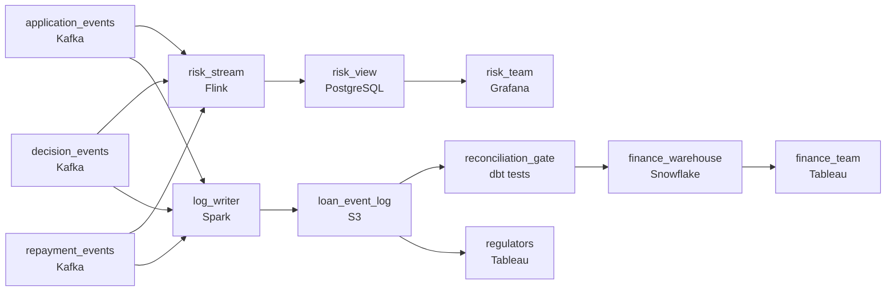

# Risk Models on Week-Old Data
_Loan approved. Loan denied. Every decision is an event._

- **Domain:** pipeline_architecture
- **Difficulty:** Medium
- **Est. time:** 10 min
- **URL:** https://datadriven.io/problems/risk_models_on_week_old_data

## Problem

We operate a small business lending platform that processes thousands of loan applications per day, with credit decisions made in real time and repayment events streaming in continuously. Our risk team currently runs models on week-old data because there is no reliable near-real-time pipeline. Design a Kafka-based pipeline that delivers loan application events, credit decisions, and repayment data to the risk analytics layer within minutes of occurrence.

**Concepts tested:** `paBroadcastJoin`, `paCdc`, `paDataQuality`, `paDeadLetterQueue`, `paDeduplication`, `paDependencyMgmt`, `paDistributedPrimitives`, `paEventDriven`, `paEventPlatforms`, `paIdempotency`, `paLateData`, `paMedallion`, `paMemoryManagement`, `paMicroBatchVsTrue`, `paMonitoring`, `paPartitioning`, `paRetryHandling`, `paSchemaEvolution`, `paStreamProcessing`

## Requirements

- Risk managers can't act on a sharp shift in approval rate when they're working from week-old data.
- The daily sum of repayments has to reconcile against the loan management system's ledger; finance can't sign off if the numbers drift.
- Regulators may ask for the full lifecycle of any loan within a day of asking; every state change has to be retrievable.

## Must-have components

- Risk needs application, decision, and repayment events visible within minutes; that's the named change. Without a streaming / sub-minute path, risk stays on week-old data. Add a streaming layer or set SLA Freshness to real-time / < 1min on the processing node.
- Regulators may ask for the full lifecycle of any loan within a day; every state change has to be retrievable. Add a durable storage tier (S3, GCS, ADLS) so the immutable loan history can be retained and replayed.

**Expected stages:** `loan_application_events` → `credit_decision_events` → `repayment_events` → `risk_feature_store` → `portfolio_analytics_mart`

## Solution walkthrough

### Why this problem exists in real interviews

Risk wants minutes-fresh data; finance wants the daily total to match the ledger; regulators want any loan's full lifecycle retrievable on a day's notice. Three consumers reading the same loan events from three different angles. The trap is one streaming pipeline that satisfies risk and silently misaligns the other two.

The default shape is Kafka into a stream processor that updates a risk dashboard, with a side write to a database for finance. Risk is happy. Finance asks why the daily repayment total doesn't match the loan ledger and discovers the side write was append-only and missed retries during a connector restart. A regulator asks for the lifecycle of a loan from six months ago and the team can reconstruct most events but not all because nothing was archiving authoritatively.

> **Trick to Solving**
>
> Stream the loan events, anchor on a durable loan log, reconcile to the ledger every day, regulator queries the log not a reconstruction.
>
> 1. Loan events ride the bus and a stream processor feeds the risk view in seconds; the same events also land in a durable, partitioned loan-event log in cold storage.
> 2. The loan log is the source of truth for both regulators (any loan's full lifecycle) and finance (daily reconciliation against the ledger).
> 3. Reconciliation against the loan management system is a daily gate: pipeline totals compared to ledger totals, drift surfaces in finance's view before it surfaces in finance's reconciliation.

---

### Walk the requirements

**Step 1: Decisions and repayments to risk in minutes**

Loan applications, credit decisions, and repayments flow through a Kafka stream processor that updates the risk view; end-to-end is sub-minute. Risk reads from a stream-fed store, not from a weekly batch. Without a streaming path the risk team stays on week-old data; whatever stream tech (Flink, Kafka Streams), the property that matters is risk seeing decisions within minutes of when they happen.

**Step 2: Daily reconciliation against the loan ledger**

Finance signs off only if the daily repayment total matches the loan management system's ledger. A reconciliation step runs daily: sum the repayments from the loan log for that day, compare to the ledger's reported total, surface any drift to finance with the per-loan diff. The reconciliation is part of the pipeline, not a manual end-of-day exercise. Without it, drift accumulates undetected and finance loses trust in the warehouse.

**Step 3: Durable loan log so regulators can replay any loan**

Every state change writes to a durable loan-event log in cold storage, partitioned by date and keyed by loan id. The log is the source of truth: when a regulator asks for a loan's lifecycle, a query against the log returns every event in order. Without a durable archive the regulator's question becomes a forensic reconstruction; with the log, the answer is a SQL query within the regulator's window.

---

### The shape that fits

| node | type | tech | details |
|---|---|---|---|
| application_events | source | Kafka | parallelism: 8 partitions |
| decision_events | source | Kafka |  |
| repayment_events | source | Kafka | parallelism: 8 partitions |
| risk_stream | transform | Flink | slaFreshness: real-time; idempotencyStrategy: upsert |
| risk_view | storage | PostgreSQL | slaFreshness: < 1min |
| log_writer | transform | Spark | slaFreshness: < 15min; backfillStrategy: partition_overwrite; idempotencyStrategy: upsert |
| loan_event_log | storage | S3 | backfillStrategy: partition_overwrite |
| reconciliation_gate | quality_gate | dbt tests | errorAction: alert; monitorAlert: Daily repayments differ from ledger |
| finance_warehouse | storage | Snowflake | slaFreshness: < 24h |
| risk_team | consumer | Grafana | slaFreshness: real-time |
| finance_team | consumer | Tableau | slaFreshness: < 24h |
| regulators | consumer | Tableau | slaFreshness: < 24h |

> **What this design gives up**
>
> A durable loan log plus a streaming risk path plus a reconciliation gate is more pieces than 'put it on Kafka.' Reconciliation halts publish on drift, which means more on-call attention than a quiet mismatch. Operational complexity is the cost; what arrives is risk that runs on minutes-fresh data, finance signoff that's automatic, and regulator replay that's a query.

> **What reviewers check**
>
> A reviewer looks at the canvas for these properties:
> - A streaming path delivers loan and repayment events to the risk view in minutes.
> - A durable loan log anchors regulatory replay for any past day, with reconciliation against the loan ledger gating the finance warehouse.

> **The mistake that ships**
>
> The shape that ships uses Kafka into a stream processor with a side write to a database for finance, and no archive. Risk is happy; finance discovers daily totals don't match the ledger because the side writes missed retries during connector restarts; a regulator asks for a loan's full history and the team has the recent slice in the database but not the older state changes. The team rebuilds with a durable loan log, in-pipeline reconciliation, and a separate archive. By the time the rebuild lands, finance has spent two close cycles reconciling by hand.

---

- **A connector restart causes some repayment events to replay. What in this design protects you from double-counting in finance, and what protects you in risk?**
  - _Tests whether the candidate sees idempotent sinks at both the loan log (upsert keyed on event id) and the risk view (upsert on the same key). Replay re-emits events; idempotent sinks merge them in cleanly. Without idempotency at both, finance double-counts and risk drifts._
- **The reconciliation gate fires because the pipeline total is over the ledger by a small amount. How do you tell whether it's a pipeline bug or a ledger bug?**
  - _Tests whether the candidate uses the per-loan diff that the gate produces: if the same loan appears multiple times in the pipeline, it's a pipeline dedup bug; if it's missing from the ledger, it's a ledger reconciliation issue at the source. The triage path is built into what the gate emits._
