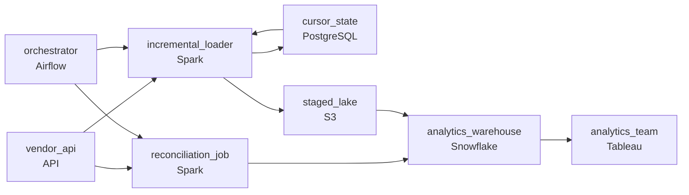

# SaaS API Connector with Incremental Sync
_The API has rate limits. You have deadlines._

- **Domain:** pipeline_architecture
- **Difficulty:** Medium
- **Est. time:** 20 min
- **URL:** https://datadriven.io/problems/saas_api_connector_with_incremental_sync

## Problem

We need to pull data from a third-party CRM into our warehouse on a continuous basis. The vendor's API has rate limits, changes schema without notice, and we need a full historical copy plus ongoing incremental updates. Design a data pipeline that reliably syncs this API source into our warehouse.

**Concepts tested:** `paApiIngestion`, `paBackfill`, `paBatchProcessing`, `paDagOrchestration`, `paDataQuality`, `paDeduplication`, `paEltVsEtl`, `paFullVsIncremental`, `paIdempotency`, `paMedallion`, `paMonitoring`, `paPartitioning`, `paRetryHandling`, `paSchemaEvolution`

## Requirements

- Analytics needs vendor data fresher than the nightly dump can deliver; one tracked dashboard requires updates within hours.
- The vendor caps the API at a fixed rate and the current dump fails on rate limits about once a week.
- When a record is deleted in the vendor system, the API simply stops returning it; the warehouse can't keep showing it as if it still exists.

## Must-have components

- The SaaS data lands in the warehouse for analytics. Without a warehouse tier there's no destination for the synced data. Add Snowflake, BigQuery, Redshift, or Databricks.
- Cursor-based incremental sync, rate-limit handling, and per-run state require an orchestration layer to schedule, retry, and persist state. Add Airflow, Dagster, Prefect, or Composer.

**Expected stages:** `api_extractor` → `raw_landing` → `schema_normalizer` → `incremental_tracker` → `warehouse_target`

## Solution walkthrough

### Why this problem exists in real interviews

Pulling from a third-party API with rate limits, schema drift, and a delete semantics gap (records just disappear) is a classic incremental-sync problem. The trap is one nightly full dump that hammers the rate limit, misses freshness, and treats deletes as 'just refresh next time' until somebody notices the warehouse still showing deleted records.

The default reach is a nightly full dump that pages through the API until done. The dump fails about once a week when the rate limit kicks in mid-run; the team retries the dump and pays the rate-limit cost again. Analytics waits until tomorrow even when one dashboard needs hours-fresh data. A record gets deleted in the vendor system; the API stops returning it; the warehouse keeps showing it because nothing's removing rows that aren't in the latest pull.

> **Trick to Solving**
>
> Cursor-based incremental sync paced under the rate limit, periodic full reconciliation that catches deletions, durable cursor state across runs.
>
> 1. Cursor-based incremental sync (`updated_at` or change-token) pulls only what changed since the last run; the cursor persists across runs in the orchestrator's state.
> 2. Requests pace under the vendor's rate limit with backoff on 429s; the orchestrator throttles rather than hammering.
> 3. Periodic full reconciliation pulls the current id set and marks warehouse records absent from it as deleted; cursor sync alone misses deletes because the API just stops returning them.
> 4. Schema drift on arrival: new fields land as additive columns in the warehouse; renamed or removed fields trigger a quarantine and an alert.

---

### Walk the requirements

**Step 1: Land vendor updates within the freshness window via incremental sync**

An orchestrator runs an incremental sync recurring on a cadence inside the staleness window: pull rows changed since the last cursor, write them to the warehouse, advance the cursor. The dashboard that needs hours-fresh data reads the warehouse and gets it. A 'nightly full dump' is the version where analytics waits until tomorrow even for the data that doesn't have to. Without orchestration there's nothing keeping the cursor or the schedule; without a warehouse the synced data has nowhere to land.

**Step 2: Pace under the rate limit, back off on rejection**

The vendor caps the API at a fixed rate. The connector paces requests under the cap and backs off on 429s with exponential backoff. The orchestrator's state captures partial progress so a backoff doesn't restart the whole run. A 'page as fast as possible' approach is the version where the dump fails once a week and somebody resets it; respecting the cap is the contract that keeps the sync running unattended.

**Step 3: Reconcile the id set periodically to catch deletes**

When a record is deleted in the vendor system, the API just stops returning it. Cursor-based sync never sees the deletion. A periodic full-id-set reconciliation (less often than incremental , daily or weekly) pulls the current id set, compares to the warehouse, and marks the missing ids as deleted. The warehouse stops showing records the source has dropped. Without the reconciliation, deleted records persist indefinitely; with it, the warehouse converges back to the source's view.

---

### The shape that fits

| node | type | tech | details |
|---|---|---|---|
| vendor_api | source | API |  |
| orchestrator | transform | Airflow | retryCount: 5; errorAction: retry; monitorAlert: Sync failure or rate-limit backoff exceeded budget; retryBackoff: exponential |
| cursor_state | storage | PostgreSQL |  |
| incremental_loader | transform | Spark | idempotencyStrategy: upsert |
| reconciliation_job | transform | Spark | idempotencyStrategy: upsert |
| staged_lake | storage | S3 | backfillStrategy: partition_overwrite |
| analytics_warehouse | storage | Snowflake | slaFreshness: < 1h; idempotencyStrategy: upsert |
| analytics_team | consumer | Tableau | slaFreshness: < 1h |

> **What this design gives up**
>
> Cursor + reconciliation is more state and more API budget than a single dump; rate-limit pacing slows initial historical backfill; the periodic reconciliation pays the API cost of pulling the full id set every cycle. Implementation cost is the price; the win is freshness inside the dashboard's window, syncs that don't fail on rate limits, and deletes that don't silently persist.

> **What reviewers check**
>
> A reviewer looks at the canvas for these properties:
> - An orchestration layer schedules incremental sync runs with cursor state persisted across runs.
> - Rate-limit-aware pacing and backoff so the API isn't hammered.
> - A periodic full reconciliation pulls the current id set and marks warehouse records absent from it as deleted.
> - The synced records land in a warehouse on a cadence that meets the freshness window.

> **The mistake that ships**
>
> What gets shipped runs a nightly full dump that hammers the API. The dump fails on rate limits weekly and somebody resets it; analytics waits until tomorrow even for data that needs hours-fresh. A vendor record gets deleted; the API stops returning it; the warehouse keeps showing it because nothing's removing absent records. The eventual rebuild adds cursor-based sync, rate-limit pacing, and periodic reconciliation , each was reachable up front if 'incremental' had been treated as the architecture rather than 'we'll add it later.'

---

- **The vendor changes a column name without notice. What does this design do, and what does the analytics team see?**
  - _Tests whether the candidate sees that the schema-drift detection at the loader catches the rename, quarantines the affected rows, and pages somebody to update the mapping. The analytics team sees the prior schema unchanged until the mapping updates; the renamed column doesn't silently overwrite the old one._
- **Initial historical backfill is going to take days under the rate limit. How does this design handle that without delaying the incremental sync from starting?**
  - _Tests whether the candidate sees the backfill running on its own job (within the same rate-limit budget but on a backfill-only path) while the incremental sync starts immediately on new updates. The cursor for the incremental sync starts at the backfill's launch time; the backfill catches up older data behind it. The two coordinate at the warehouse via upsert._
