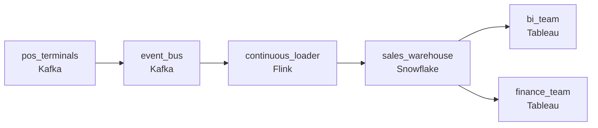

# Same-Day Sales, Every Store
_The cash register data needs to be queryable by morning._

- **Domain:** pipeline_architecture
- **Difficulty:** Medium
- **Est. time:** 20 min
- **URL:** https://datadriven.io/problems/same_day_sales_every_store

## Problem

Our retail stores run point-of-sale terminals that generate transactions all day. The business intelligence team currently gets a nightly batch of sales data but they want same-day visibility. We also have years of historical sales in our Snowflake warehouse that needs to stay consistent with whatever we build. Design a pipeline to bring POS data into Snowflake in near-real-time.

**Concepts tested:** `paApiIngestion`, `paBackfill`, `paBatchVsStreaming`, `paDagOrchestration`, `paDataQuality`, `paDeduplication`, `paEltVsEtl`, `paEventDriven`, `paFullVsIncremental`, `paIdempotency`, `paLateData`, `paMedallion`, `paMicroBatchVsTrue`, `paMonitoring`, `paPartitioning`, `paRetryHandling`, `paScdPipeline`, `paStreamProcessing`

## Requirements

- The BI team wants to see sales within roughly half an hour of the transaction; today both BI and finance wait for the nightly batch.
- Some transactions are voided or corrected the same day; finance has to see both the original and the correction, not a silent rewrite.
- Years of historical sales already live in the warehouse; the new pipeline can't rewrite or invalidate them.

## Must-have components

- POS data lands in the warehouse and BI serves from there. Without a warehouse tier there's no analytics destination. Add Snowflake, BigQuery, Redshift, or Databricks.
- BI wants sales within roughly half an hour of the transaction, not nightly; that requires a continuous or streaming ingestion path rather than a batch nightly drop. Add a streaming or micro-batch ingestion layer.

**Expected stages:** `pos_event_source` → `continuous_ingestion` → `staging_merge` → `fact_sales` → `bi_serving`

## Solution walkthrough

### Why this problem exists in real interviews

Three constraints on one pipeline: continuous ingestion for BI's half-hour view, voids and corrections that have to live alongside originals (not overwrite), and a years-old historical schema that can't change. The trap is replacing the nightly batch with a streaming pipeline that overwrites or restates the warehouse , historical reports break and finance can't see voids.

The default reach is to switch to streaming and let the warehouse upsert on transaction id. BI sees half-hour-fresh data; voids overwrite the original transaction; finance opens the day's report and sees the corrected total without the correction trail. Historical schema gets a new column added during the migration and reports against the old shape break for the prior years. The team rolls back to nightly batch.

> **Trick to Solving**
>
> Append-only ingestion to the same schema, voids as separate rows, the prior-day batch finishes the same continuous flow.
>
> 1. POS events flow through a streaming or micro-batch ingestion that appends to the warehouse using the existing schema (no column changes that would break historical reports).
> 2. Voids and corrections are separate rows referencing the original by id; finance reads both. The original transaction stays as it was.
> 3. The prior-day completion (the nightly batch's old role) is now the same continuous path catching up the last hour's events overnight; finance opens a complete prior day in the morning.

---

### Walk the requirements

**Step 1: BI sees sales within half an hour, finance gets a complete prior day**

POS terminals publish transactions onto a queue; a continuous ingestion (streaming or micro-batch) lands them in the warehouse within roughly thirty minutes. BI reads at the half-hour budget; the same path catches up overnight so finance opens a complete prior-day view in the morning. There's no separate nightly batch , the continuous path doubles as 'today's BI' and 'last night's finance close.' Without a warehouse tier the warehouse target is gone; without a continuous path the half-hour SLA is unattainable.

**Step 2: Voids and corrections as new rows, not overwrites**

When a cashier voids a transaction or rings a correction the same day, the new event writes as a separate row referencing the original transaction id. The original stays as it was, with status 'completed'; the void or correction stays as a new row with status 'voided' or 'corrected' and a pointer back. Finance reads both and reconciles with the corrections visible. Overwriting the original is the version where the day's report shows a number that differs from what the cashier actually rang and finance can't tell which.

**Step 3: Write the existing historical schema; don't rewrite history**

Years of historical sales already live in the warehouse. The new pipeline writes to the same schema; no column changes that would invalidate prior reports, no schema migrations that would force every BI workbook to update. New columns the new pipeline could add (terminal id, software version) get added in a way that's null for historical rows so old queries don't change behavior. A 'we'll just modernize the schema while we're at it' approach is the version where every existing report breaks at cutover.

---

### The shape that fits

| node | type | tech | details |
|---|---|---|---|
| pos_terminals | source | Kafka |  |
| event_bus | queue | Kafka | parallelism: 8 partitions |
| continuous_loader | transform | Flink | slaFreshness: < 1min; idempotencyStrategy: upsert |
| sales_warehouse | storage | Snowflake | slaFreshness: < 15min |
| bi_team | consumer | Tableau | slaFreshness: < 1h |
| finance_team | consumer | Tableau | slaFreshness: < 24h |

> **What this design gives up**
>
> Continuous ingestion is more compute than nightly batch and more operational machinery; voids-as-rows means consumers have to know to net them out at query time; the schema constraint limits the new pipeline's ability to capture data the historical schema didn't. Implementation cost is the price; the win is BI seeing sales within thirty minutes, finance seeing voids alongside originals, and historical reports unaffected by the migration.

> **What reviewers check**
>
> A reviewer looks at the canvas for these properties:
> - POS data flows through a continuous (streaming or micro-batch) ingestion to the warehouse within roughly half an hour for BI; the same path completes prior-day data overnight for finance.
> - Voids and corrections write as new rows referencing the original by id; the original is never modified.
> - New ingestion writes the existing historical schema; no schema changes that would invalidate years of prior reports.

> **The mistake that ships**
>
> What gets shipped streams POS into the warehouse and upserts on transaction id. BI is happy with the freshness. Voids overwrite originals; finance opens the day's report and sees a number that doesn't match the cashier's tape. Somebody adds a column to capture terminal id; existing reports against the old schema return nulls in unexpected places and finance flags it. The team backs out the schema change, reintroduces the nightly batch, and the half-hour SLA goes with it. The eventual approach keeps the schema, writes voids as new rows, and lets the continuous path serve both BI and finance.

---

- **A void arrives an hour after the original transaction. What in this design lets the void show alongside the original, and what does BI see during the hour in between?**
  - _Tests whether the candidate sees that the original lands first as a completed transaction and BI shows it as such; the void lands later as a new row referencing the original. Mid-hour BI shows the original; once the void arrives the void row makes the corrected status visible. Net-of-voids queries apply at read time._
- **A new POS terminal type emits a field the historical schema doesn't have. How does this design absorb the new field without breaking historical reports?**
  - _Tests whether the candidate sees additive evolution: the new field becomes a nullable column with a default null; existing reports that don't reference it are unaffected; new reports that want it filter to terminals that emit it. The schema constraint is preserved by addition, not replacement._
