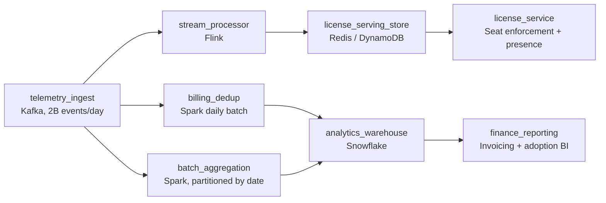

# Seconds and Months

- **Domain:** pipeline_architecture
- **Difficulty:** Medium
- **Est. time:** 30 min
- **URL:** https://datadriven.io/problems/seconds_and_months

## Problem

We run a cloud platform for design and engineering software, and every desktop and browser session emits telemetry (documents opened, features used, render jobs, license checks) at roughly 2 billion events a day. Two groups consume that one stream on very different clocks: the licensing team enforces concurrent-seat limits and shows collaboration presence within seconds, while finance bills customers monthly on metered feature usage and the product org builds adoption reports on a daily cadence. The metered-usage figures land on invoices, so each billable event has to be counted once and only once.

**Concepts tested:** `paApiIngestion`, `paBatchProcessing`, `paBatchVsStreaming`, `paCompression`, `paDagOrchestration`, `paDataQuality`, `paDeduplication`, `paEltVsEtl`, `paEventDriven`, `paEventPlatforms`, `paFullVsIncremental`, `paIdempotency`, `paLambdaArch`, `paLateData`, `paMicroBatchVsTrue`, `paMonitoring`, `paPartitioning`, `paRetryHandling`, `paSmallFiles`, `paStreamProcessing`, `paTableFormats`

## Requirements

- Licensing here. If a customer is over their concurrent-seat limit, we need to know within a few seconds, and presence in a shared document has to feel live.
- Finance here. Metered feature usage goes straight onto the monthly invoice, so a duplicated or dropped event is a billing error a customer will dispute.
- Product analytics here. We look at feature adoption day over day; we do not need it to the second, we need it correct and queryable.
- Platform here. There is one firehose of telemetry; do not stand up a second collection path just for finance.

## Must-have components

- Two billion events a day from many app sessions need a durable ingestion buffer. Add a message queue (e.g. Kafka) as the single front door both the streaming and batch paths read from.
- Concurrent-seat enforcement and collaboration presence cannot wait for a nightly job. Add a stream processor that consumes the event queue continuously.
- The licensing requirement is 'within seconds'. At least one node serving licensing must carry a sub-minute freshness tier, otherwise the requirement is unaddressed.
- Monthly billing and daily adoption reporting are batch workloads, not stream workloads. Add a batch aggregation stage so you are not streaming work that has no latency requirement.
- The whole problem is two clocks. Your canvas needs at least two distinct freshness tiers (sub-minute for licensing, daily for reporting) so each consumer is served at the cadence it actually needs.
- The licensing team reads seat counts at request time, so the stream processor must write into a low-latency serving store the licensing service queries. Connect the streaming node to a serving store.
- Adoption reports and billing extracts are queried out of a warehouse. Route the batch aggregation into a warehouse so the reporting and finance consumers have somewhere to read.

**Expected stages:** `telemetry_ingest` → `stream_processor` → `license_serving_store` → `billing_dedup` → `batch_aggregation` → `analytics_warehouse`

## Solution walkthrough

### Why this problem exists in real interviews

One firehose of telemetry, two consumers with opposite correctness budgets. Licensing wants seat counts within seconds and is happy with approximate as long as it converges; finance wants every metered event counted once and does not care if the number lands a day later. The trap is picking a single clock: stream everything and you pay streaming-scale cost for a billing job that had no latency requirement, or batch everything and licensing enforces seats on yesterday's data. The interviewer is watching whether you justify the path per consumer instead of reaching for one default.

The naive design aggregates all 2 billion daily events in one streaming job that writes a single 'usage' table both consumers read. Licensing is happy. Then a producer retries during a deploy, an offset replays, and the same billable event is summed twice; finance sends an invoice a customer disputes. Meanwhile the streaming bill is several times what it needed to be because the daily adoption report is riding the real-time path for no reason.

> **Trick to Solving**
>
> One ingest queue, two paths sized for two clocks.
>
> 1. Only licensing needs sub-minute. Give it a stream processor writing a low-latency serving store the license service queries at request time.
> 2. Billing and adoption reporting are batch. Aggregate them daily into a warehouse; exactness and queryability matter, latency does not.
> 3. Make billing exactly-once at the sink: dedup on the client-assigned `event_id` and bill on event timestamp so late flushes still count once, in the right period.

---

### Break down the requirements

**Step 1: Pin the latency budget per consumer**

Licensing is 'within seconds' and tolerates approximate-but-converging counts. Billing is monthly with daily reconciliation and demands exactness. Adoption reporting is daily and demands correctness, not freshness. Write those three budgets down before drawing anything: they decide which path each consumer lives on, and they are the justification the interviewer is grading.

**Step 2: Fan out one ingest, do not collect twice**

Both paths read the same durable queue. The stream processor consumes it continuously for licensing; the batch path reads the same topic (or its archived landing zone) on a daily schedule for finance and product. A second collection path for finance is duplicated operational surface and a place for the two consumers to silently disagree on what happened.

**Step 3: Make billing exactly-once at the sink, not in hope**

Each event carries a stable client-assigned `event_id`. The billing aggregation writes idempotently, an upsert keyed on `event_id` or a staging-table swap, so a producer retry or a replayed Kafka offset cannot double-count. Anchor the billable period to the event timestamp, not arrival time, so a desktop session that flushes hours late still bills once and into the month it actually happened.

---

### The reference architecture

| node | type | tech | details |
|---|---|---|---|
| telemetry_ingest | source | Kafka, 2B events/day | parallelism: partitioned by account_id |
| stream_processor | transform | Flink | slaFreshness: real-time |
| license_serving_store | storage | Redis / DynamoDB | slaFreshness: < 1min |
| license_service | consumer | Seat enforcement + presence | slaFreshness: real-time |
| billing_dedup | transform | Spark daily batch | idempotencyStrategy: upsert |
| batch_aggregation | transform | Spark, partitioned by date | slaFreshness: < 24h |
| analytics_warehouse | storage | Snowflake | slaFreshness: < 24h |
| finance_reporting | consumer | Invoicing + adoption BI | slaFreshness: < 24h |

The split is the whole answer: licensing gets a streaming path into a key-value serving store it queries at seat-check time, and finance plus product get a daily Spark job into the warehouse. Both read the one Kafka topic, so there is a single source of truth and a single collection cost. The billing job is the only place exactly-once machinery lives, because it is the only consumer that contractually needs it.

> **Scale + Cost**
>
> At ~2B events/day with 4x regional-morning peaks, the streaming path only has to carry the licensing aggregation, a fraction of the total fields, so it scales on partition count not on the full event width. Pushing billing and adoption onto that same stream would multiply the always-on compute for workloads whose SLA is 24h. The cost concentrates in the streaming tier, which is exactly why you keep all but one consumer off it.

| Stream everything | Path per consumer |
|---|---|
| One always-on job aggregates all 2B events for every consumer. Simple topology, but you pay real-time compute for daily reporting, and a replayed offset double-bills because there is no dedup boundary. | Streaming carries only licensing; billing and reporting run daily with an idempotent sink. More moving parts, but each consumer is served at its real cadence and billing is exactly-once by construction. |

> **Interviewers Watch For**
>
> Naming which consumers need streaming and why, instead of 'real-time is always better.' Stating the cost-latency tradeoff out loud. Putting exactly-once only where it is needed (billing) and keying it on a stable `event_id`. Recognizing that late desktop flushes mean billing must anchor to event time, not arrival time.

> **Common Pitfall**
>
> Streaming the billing aggregation 'so it is always up to date' and then discovering at the first month-end that retries and replays inflated revenue. Billing wanted exactness, not freshness; the streaming path gave it the one property it did not need and made the property it did need (count-once) harder to guarantee.

---

- **A new fraud team wants to flag impossible usage patterns (a license key active in five regions at once) within a minute. Which path does it join, and what changes?**
  - _Tests whether the candidate adds a stateful streaming consumer off the existing queue rather than rebuilding, and whether they see it as a third latency tier._
- **Event volume 10x's after a free-tier launch and the streaming serving store starts lagging at morning peak. What do you change first?**
  - _Tests capacity reasoning: repartitioning the queue, scaling the stream job, and isolating the licensing path so a volume spike does not also stall billing._
- **Finance asks for every billable event's lineage when a customer disputes an invoice. Where do you go?**
  - _Tests whether the dedup-by-`event_id` design and event-time anchoring give an auditable, replayable record rather than an irreproducible streaming snapshot._
