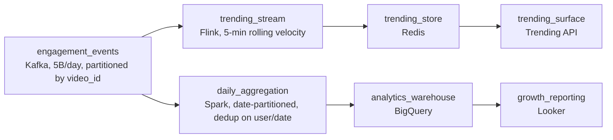

# Seconds to Trend

- **Domain:** pipeline_architecture
- **Difficulty:** Medium
- **Est. time:** 30 min
- **URL:** https://datadriven.io/problems/seconds_to_trend

## Problem

We run a short-video platform where roughly 5 billion engagement events a day (views, likes, watch-time pings) come off the apps. The trending team needs the hottest videos surfaced within seconds of a spike, while the growth team reports daily active users and 7-day retention on a T+1 cadence from the same events. Design the pipeline that serves both consumers without paying to stream everything.

**Concepts tested:** `paBatchProcessing`, `paBatchVsStreaming`, `paDagOrchestration`, `paDeduplication`, `paEventDriven`, `paEventPlatforms`, `paIdempotency`, `paLambdaArch`, `paLateData`, `paPartitioning`, `paStreamProcessing`

## Requirements

- When a video starts spiking, the trending team wants it on the surface within seconds, not on tomorrow's report.
- Growth reports daily active users and 7-day retention once a day and needs the counts to be exact.
- Finance flagged that streaming the full firehose for every consumer is expensive; only the consumers that need seconds should pay for it.

## Must-have components

- The 5B events/day land in a durable log both paths read from. Add a message queue (Kafka) as the ingestion buffer so the streaming and batch consumers can share one source of truth.
- Trending needs spikes within seconds, which a daily batch cannot deliver. Add a stream processing tier (Flink or Spark Structured Streaming) to compute rolling engagement counts.
- The trending consumer reads hot videos at low latency. Add a serving store the stream tier writes to, so the trending surface is not querying a warehouse.
- The serving store has to be fed by the streaming tier for sub-minute freshness. Wire a data_flow edge from the stream processor into the trending serving store.
- DAU and retention are batch-appropriate. Add a warehouse fed by a daily batch aggregation so the growth team gets exact T+1 numbers without inflating streaming cost.
- This is a two-speed problem: seconds for trending, T+1 for analytics. Set distinct freshness SLAs on the streaming path and the batch path so the design states both.

**Expected stages:** `Event ingestion` → `Stream processing` → `Trending serving store` → `Batch aggregation` → `Analytics warehouse`

## Solution walkthrough

### Why this problem exists in real interviews

This looks like a Kafka-and-Spark trivia question but it is really a two-speed problem hiding behind one event stream. Trending wants engagement velocity within seconds; growth wants exact DAU and retention once a day. The trap is picking a single answer for both: stream everything and you pay firehose compute to serve a daily report, or batch everything and trending is always one day stale. The skill being probed is whether you split consumers by their actual latency budget and justify the split out loud.

The default whiteboard reach is one streaming job that writes a metrics table everything reads. It feels modern, but DAU computed on a streaming aggregate is approximate (late mobile events drift the count), reporting publishes a number that wobbles, and finance gets a bill for streaming 5 billion events a day to feed a once-a-day dashboard. Meanwhile trending shares cluster headroom with the heavy daily aggregation and lags exactly when a video spikes.

> **Trick to Solving**
>
> One durable ingestion log, two consumers sized to two latency budgets.
>
> 1. Land everything in Kafka first so producers are decoupled and both paths replay the same source.
> 2. Trending rides a stream processor computing a rolling 5-minute velocity into a low-latency serving store. Approximate is fine; fresh is mandatory.
> 3. DAU and retention ride a daily batch job over the day-partitioned log into a warehouse. Exact is mandatory; T+1 is fine. Only trending pays the streaming cost.

---

### Walk the requirements

**Step 1: Buffer the firehose in one log both paths read**

5 billion events a day with 4x peak bursts means producers cannot push straight into consumers. Kafka partitioned by `video_id` absorbs the spike and gives both the stream tier and the batch tier the same replayable source. Without this buffer, a trending slowdown backpressures the apps and a batch backfill has nowhere to re-read from.

**Step 2: Put only trending on the streaming path**

Trending is engagement velocity over a rolling 5-minute window, needed within seconds. A stream processor (Flink or Spark Structured Streaming) keys by `video_id`, maintains the windowed count, and writes the hot list to a serving store the trending surface queries directly. At-least-once is acceptable here because one duplicate barely moves a velocity ranking, so you avoid the cost of exactly-once on the fast path.

**Step 3: Put DAU and retention on the batch path**

DAU and 7-day retention are T+1 and feed external reporting, so they must be exact and stable once published. A daily Spark job reads the day-partitioned log, dedups on (`user_id`, date), and lands aggregates in the warehouse. Reusing the streaming approximate counts here would publish a number that drifts as late events arrive. This is the consumer that should NOT be streamed.

**Step 4: Decide what each path does with late mobile events**

Clients buffer offline and replay events minutes late. The stream tier uses event-time watermarks and accepts that a late event may miss its trending window, which is fine for an approximate velocity metric. The batch tier sidesteps it entirely: it runs after the day closes over the date partition, so a late event that lands before the run is still counted exactly. Same data, two correctness budgets.

---

### The shape that fits

| node | type | tech | details |
|---|---|---|---|
| engagement_events | source | Kafka, 5B/day, partitioned by video_id |  |
| trending_stream | transform | Flink, 5-min rolling velocity | slaFreshness: < 1min |
| trending_store | storage | Redis | slaFreshness: < 1min |
| trending_surface | consumer | Trending API | slaFreshness: < 1min |
| daily_aggregation | transform | Spark, date-partitioned, dedup on user/date | slaFreshness: < 24h |
| analytics_warehouse | storage | BigQuery | slaFreshness: < 24h |
| growth_reporting | consumer | Looker | slaFreshness: < 24h |

> **Scale + Cost**
>
> At 5B events/day the streaming tier only carries the velocity computation for trending, so its cost is bounded by the windowed state, not by every downstream metric. The expensive full-history aggregation runs once a day on cheaper batch compute. Inverting this (streaming DAU too) roughly multiplies the streaming bill while adding zero latency value, because the report still publishes once a day.

> **Interviewers Watch For**
>
> The strong signal is a per-consumer justification: name that trending is the only consumer that needs seconds, and that DAU and retention are batch because they must be exact and only refresh daily. Mentioning at-least-once for trending versus dedup-for-exactness on the batch path shows you understand that delivery semantics follow the consumer, not the cluster.

> **Common Pitfall**
>
> Streaming everything because real-time sounds better. DAU on a streaming aggregate drifts as late mobile events arrive, so the published number is never stable, and you pay firehose compute for a daily report. The reciprocal mistake is batching trending, which makes the hot list a day late and useless. Either single-path answer fails one stakeholder.

---

- **A creator complains their video trended for a second and vanished. How would you stabilize the trending signal without making it stale?**
  - _Tests window and smoothing choices: longer or overlapping windows, decay, and minimum-volume thresholds, while keeping freshness under a minute._
- **Volume jumps 5x for a global event in 48 hours. What in this design absorbs it and what breaks first?**
  - _Tests capacity thinking: Kafka partition count and consumer parallelism scale, but windowed stream state and serving-store write throughput are the first pressure points._
