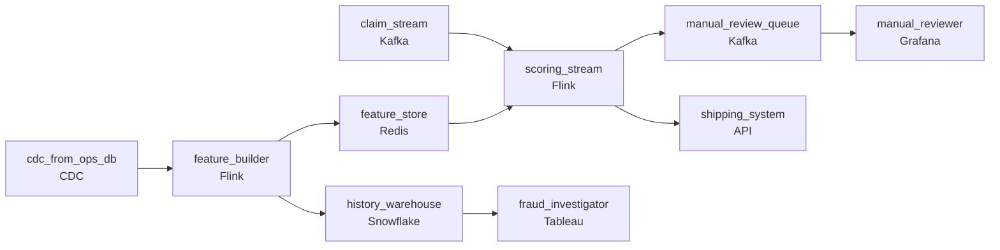

# Ship Before Fraud Finishes Checking
_The claim looks clean. The fraud model disagrees._

- **Domain:** pipeline_architecture
- **Difficulty:** Hard
- **Est. time:** 10 min
- **URL:** https://datadriven.io/problems/ship_before_fraud_finishes_checking

## Problem

We insure over 300 million devices and process tens of thousands of insurance claims per day. When a customer files a claim for a lost or broken phone, we ship a replacement within hours - but that means our fraud detection must complete before the device ships, not after. Our current warehouse is a nightly batch job and the fraud team is working from yesterday's data. Design a pipeline that supports real-time fraud scoring at claim submission time.

**Concepts tested:** `paApiIngestion`, `paBackfill`, `paBatchVsStreaming`, `paCdc`, `paDagOrchestration`, `paDataQuality`, `paDeadLetterQueue`, `paDeduplication`, `paDependencyMgmt`, `paEventDriven`, `paEventPlatforms`, `paFullVsIncremental`, `paIdempotency`, `paLambdaArch`, `paLateData`, `paMonitoring`, `paRetryHandling`, `paScdPipeline`, `paSchemaEvolution`, `paStreamProcessing`

## Requirements

- We ship a replacement device within hours of a claim; fraud has to decide before the package leaves, not after.
- A device passes through multiple owners and plans, and fraud needs to see the whole chain to spot the same device claimed under different plans.
- Hundreds of millions of device records can't be looked up live during the request; that would crush the operational system.
- If fraud scoring is unavailable, customers can't wait forever; the business chose to route those claims to manual review rather than block them.

## Must-have components

- Replacements ship within hours, so fraud has to decide before the package leaves. Without a streaming / sub-minute path, scoring is too late. Add a streaming layer on the claim path or set SLA Freshness to real-time / < 1min on the scoring node.
- Fraud needs the full chain of owners and plans for any device, retained for years. Without a warehouse tier (or lakehouse with warehouse capability) there's nowhere to store and query device history at the rates fraud and audit need.

**Expected stages:** `device_lifecycle` → `claims` → `fraud_signals` → `replacement_eligibility`

## Solution walkthrough

### What this really is

This is a feature-serving problem dressed up as insurance fraud. The skill is splitting device history into two tiers: an online store the scorer reads in milliseconds, fed by CDC, and a warehouse that keeps every owner, plan and repair with effective dates. You also decide in advance what happens when scoring fails. Anyone can draw a stream. **The trap is a scorer that reaches back into the operational database** for history. Tens of thousands of claims a day become tens of thousands of lookups against a 300-million-device system, and operations throttles it. Then the day the scorer times out, someone adds auto-approve and ineligible replacements start shipping.

> **Score from a copy, never from the source**
>
> CDC turns the operational DB into a stream you own. One stream job folds it into two places. `feature_store` holds the current per-device features, and `history_warehouse` holds the full chain. The scorer only ever touches the first one. Because of that, the live DB's load does not depend on claim volume at all.

### Walk the requirements

**Step 1: Put scoring on a sub-minute path**

The claim lands on Kafka, and `scoring_stream` (Flink, 'real-time') joins it to features and emits a decision in seconds. Shipping waits on that decision. Any design where fraud reads last night's warehouse fails the one requirement the business actually named.

**Step 2: Keep the chain with effective dates**

Model device history as a slowly changing dimension keyed on (`device_id`, `valid_from`, `valid_to`), with one row per ownership transfer, plan switch or repair. 'Same device claimed under two plans' is then an as-of join. A table that stores only the latest state per device erases the exact evidence fraud is looking for.

**Step 3: Feed features off CDC, not live reads**

`cdc_from_ops_db` streams changes into `feature_builder`, which upserts device-keyed rows into `feature_store`. The upsert is idempotent, so a replay after a restart cannot double-count repairs. The operational DB sees zero traffic from scoring.

**Step 4: Make manual review a designed path**

When the scorer errors or feature lag crosses its budget, `scoring_stream` routes the claim to `manual_review_queue` and alerts. It does not approve the claim and it does not hold it. The business already chose this trade, so the canvas should draw it.

### The reference design

| node | type | tech | details |
|---|---|---|---|
| claim_stream | source | Kafka |  |
| cdc_from_ops_db | source | CDC |  |
| feature_builder | transform | Flink |  |
| feature_store | storage | Redis |  |
| history_warehouse | storage | Snowflake |  |
| scoring_stream | transform | Flink |  |
| manual_review_queue | queue | Kafka |  |
| shipping_system | consumer | API |  |
| manual_reviewer | consumer | Grafana |  |
| fraud_investigator | consumer | Tableau |  |

| Live lookup at scoring time | CDC-fed online store |
|---|---|
| `scoring_stream` queries the ops DB per claim. Its load scales with claim volume, latency depends on someone else's system, and an ops outage blocks every claim. | `scoring_stream` reads `feature_store` by `device_id`. Ops load comes from change volume only, lookups take milliseconds, and staleness is a number you can measure and route on. |

> **A cache is not a feature store**
>
> Candidates who sense the DB-load problem often put a read-through cache in front of the ops DB. A miss still hits production, and TTL expiry means scores quietly run on stale ownership. Only a CDC-driven store knows when it is behind, which is what lets you fail over to manual review honestly.

> **The fallback edge separates seniors**
>
> Everyone draws claim to scorer to shipping. The candidate who also draws the `scoring_stream` to `manual_review_queue` edge, and says it fires on lag as well as on errors, has run a system like this before.

- **An investigator asks who owned a device when claim X was filed. Which store answers, and what makes it correct?**
  - _The as-of join on `valid_from` / `valid_to` in `history_warehouse`; `feature_store` holds current state only._
- **CDC falls an hour behind. What changes for scoring?**
  - _A freshness budget on `feature_store` that routes claims to manual review instead of scoring on stale features._
