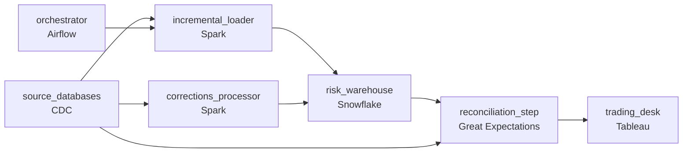

# Six Hours to Miss a Deadline
_The rebuild works. It just doesn't finish in time._

- **Domain:** pipeline_architecture
- **Difficulty:** Medium
- **Est. time:** 25 min
- **URL:** https://datadriven.io/problems/six_hours_to_miss_a_deadline

## Problem

We process financial data for credit risk models and regulatory reporting. Our current warehouse pipeline runs nightly full refreshes that take over six hours and frequently miss the 5am SLA. The data engineering team has been asked to redesign the pipeline using an incremental strategy, but there are concerns about correctness for slowly changing source data. Design the pipeline.

**Concepts tested:** `paBackfill`, `paBatchProcessing`, `paCdc`, `paDagOrchestration`, `paDataQuality`, `paDeduplication`, `paDependencyMgmt`, `paFullVsIncremental`, `paIdempotency`, `paLateData`, `paMonitoring`, `paPartitioning`, `paRetryHandling`, `paScdPipeline`, `paSchemaEvolution`

## Requirements

- The trading desk reads the morning risk reports at 5am every business day; today's six-hour rebuild misses the deadline.
- An incremental loader can quietly miss records and the warehouse drifts from the source without an error; the team needs a routine reconciliation that catches drift first.
- Source systems sometimes restate historical credit ratings; we have to apply those corrections without rebuilding the full history.

## Must-have components

- The morning risk reports run from the warehouse; without a warehouse tier there's no analytics destination. Add Snowflake, BigQuery, Redshift, or Databricks.
- Going from full nightly refresh to incremental within the 5am SLA requires log-based CDC for high-change tables (the source DBA team has rejected polling and full refresh is too slow). Add a CDC capture mechanism.

**Expected stages:** `Source Systems` → `Change Detection Layer` → `Incremental Loader` → `Warehouse Tables` → `Reporting Layer`

## Solution walkthrough

### Why this problem exists in real interviews

Three properties pulling at one pipeline: incremental loading to hit the 5am SLA, a reconciliation that catches drift before risk reads stale data, and back-dated corrections that don't force a six-hour rebuild. The trap is incremental-by-default and trusting that nothing drifts, or running full refresh on every back-dated correction and busting the SLA.

The default reach is to swap full refresh for incremental and call it done. The 5am SLA is met for a few weeks. The incremental loader misses some events during a connector hiccup; warehouse and source drift silently and the trading desk reads stale credit ratings before anyone notices. A back-dated correction comes in for last quarter; the team triggers a full refresh which takes six hours and the next morning's report is late.

> **Trick to Solving**
>
> Log-based CDC for the incremental load, daily reconciliation that catches drift, partition-overwrite for back-dated corrections.
>
> 1. Log-based CDC pulls only changes since the last run; the daily window is small enough to land before 5am.
> 2. A daily reconciliation step compares warehouse counts (and aggregates) to source counts and surfaces drift before the trading desk reads. Drift caught here is fixed before it reaches reports.
> 3. Back-dated corrections target the affected partition: a partition-overwrite of the corrected period rebuilds only that slice.
> 4. An orchestrator gates the 5am SLA with sensors and alerts before the deadline.

---

### Walk the requirements

**Step 1: Land the warehouse before 5am via incremental CDC**

Log-based CDC reads only changes since the last run; the daily window is the day's worth of changes, not the full table. The orchestrator runs the load and quality checks with sensors firing before 5am if any stage is at risk. The 5am SLA becomes attainable because the work scales with change volume, not table size. Without CDC the load is full-refresh-or-polling , both fail the SLA.

**Step 2: Reconcile against the source on a schedule, not when somebody complains**

Incremental loaders quietly miss records under various failure modes (connector hiccup, replication slot lag, an event-shape edge case). A daily reconciliation step compares warehouse counts and key aggregates to the source's; drift past tolerance fires an alert and gates the morning publish. Without the reconciliation, drift stays silent until a downstream consumer flags it; with it, the team catches drift before the trading desk reads.

**Step 3: Back-dated corrections recompute only the affected partition**

When a source restates a historical credit rating, the corrected window is small , last quarter, last year. The corrections processor reads the source's correction, identifies the affected partition (date or period range), and partition-overwrites only that slice. The rest of the warehouse doesn't move. A 'full refresh on every correction' approach is the version that pushes the next morning past 5am every time a correction comes in; targeted partition-overwrite keeps the SLA intact.

---

### The shape that fits

| node | type | tech | details |
|---|---|---|---|
| source_databases | source | CDC |  |
| orchestrator | transform | Airflow | errorAction: alert; monitorAlert: Stage at risk vs 5am SLA or reconciliation drift past tolerance |
| incremental_loader | transform | Spark | backfillStrategy: partition_overwrite; idempotencyStrategy: upsert |
| risk_warehouse | storage | Snowflake | slaFreshness: < 24h; backfillStrategy: partition_overwrite |
| reconciliation_step | quality_gate | Great Expectations | errorAction: alert |
| corrections_processor | transform | Spark | backfillStrategy: partition_overwrite; idempotencyStrategy: staging_table |
| trading_desk | consumer | Tableau | slaFreshness: < 24h |

> **What this design gives up**
>
> CDC + reconciliation + targeted overwrite is more pieces than full refresh; the reconciliation step pays a daily compute cost for the comparison; partition-overwrite needs the source's correction to clearly identify the affected period. Implementation cost is the price; the win is hitting the 5am SLA, drift caught before reports show it, and corrections that don't take a six-hour bite of the next morning's window.

> **What reviewers check**
>
> A reviewer looks at the canvas for these properties:
> - Log-based CDC pulls only changes since the last run, landing the warehouse before the 5am SLA.
> - A scheduled reconciliation between warehouse and source surfaces drift on a routine cadence.
> - Back-dated corrections recompute only the affected historical partitions rather than the full warehouse.
> - An orchestration layer schedules the runs with alerting before the 5am deadline.

> **The mistake that ships**
>
> What gets shipped swaps full refresh for incremental and trusts that nothing drifts. The 5am SLA holds for a few weeks. A connector hiccup misses some events; the warehouse silently drifts and the trading desk reads stale credit ratings before anyone notices. A back-dated correction triggers a full refresh and the next morning is late. The eventual rebuild is CDC plus reconciliation plus targeted overwrite , each was reachable up front if 'we'll add reconciliation later' had been treated as something that catches the failure mode the requirement names.

---

- **Reconciliation flags drift on a Tuesday morning. What does the design do, and what does the trading desk see?**
  - _Tests whether the candidate sees the reconciliation alert blocking the morning publish (or surfacing a 'drift detected' flag on the report) so the trading desk doesn't act on stale data; on-call investigates the drift cause (missed events, a deduplication issue) and the publish goes when the reconciliation passes. Without the gate, the trading desk reads drifted data unaware._
- **Multiple back-dated corrections arrive across overlapping periods. What in this design lets them apply correctly without conflicting?**
  - _Tests whether the candidate sees that the corrections processor handles overlapping periods deterministically (apply in event-time order, partition-overwrite the union of affected periods) so the warehouse converges to the same final state regardless of arrival order. The processor is the boundary; the partition-overwrite is the contract._
