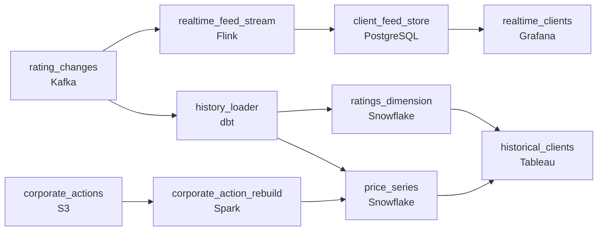

# Six Hours to Refresh Every Number
_Ratings change. The incremental model has to keep pace._

- **Domain:** pipeline_architecture
- **Difficulty:** Medium
- **Est. time:** 10 min
- **URL:** https://datadriven.io/problems/six_hours_to_refresh_every_number

## Problem

We publish credit ratings and financial data to thousands of institutional clients who pay for real-time feeds and historical databases. Our dbt transformation layer has become a bottleneck - full refreshes take 6 hours and we can't meet our real-time client SLAs, but incremental models are giving us stale data when a company's historical prices need retroactive adjustment after a stock split or merger. Design a transformation pipeline that handles both real-time feed delivery and retroactive historical corrections.

**Concepts tested:** `paBackfill`, `paBatchProcessing`, `paBatchVsStreaming`, `paDagOrchestration`, `paDataQuality`, `paFullVsIncremental`, `paIdempotency`, `paLateData`, `paMedallion`, `paPartitioning`, `paScdPipeline`, `paStreamProcessing`, `paTableFormats`

## Requirements

- Investment banks pay for a real-time ratings feed with a contractual 15-second deliver; today's rebuild blocks delivery and the SLA is at risk.
- Historical queries asking for a rating as of a specific past date have to return the rating that was in effect then, not today's.
- When a stock splits, decades of history for that security need to be retroactively adjusted; rebuilding the full history each time is not viable.

## Must-have components

- The real-time client feed has a contractual 15-second SLA while the analytical layer needs heavier rebuilds for retroactive corrections. Without two distinct freshness tiers, either the client feed misses its SLA or retroactive corrections never land. Show at least one streaming path and one batch path.
- The analytical layer with point-in-time historical queries lives in a warehouse; without a warehouse tier there's nowhere for the historical price series, ratings dimension, or analytical models to live.

**Expected stages:** `ratings_history` → `price_series_adjusted` → `corporate_actions` → `client_feed_delivery`

## Solution walkthrough

### Why this problem exists in real interviews

Two contradictory pressures on one transformation layer. The real-time feed has a 15-second SLA. The analytical layer has retroactive corrections that scope across decades. The trap is choosing one strategy: full rebuilds (kill the SLA) or incremental models (silently wrong after a stock split). The right answer is two layers, two strategies, and a partition-overwrite scope that makes corporate actions cheap.

The default move is to keep dbt for both and pick incremental everywhere because the full rebuild takes too long. The streaming feed gets blocked behind the dbt run; clients miss the contractual SLA. A stock split arrives and the incremental model never reprocesses the affected security's history; the price series is wrong from then on but nobody knows. Some weeks later, an analyst notices a price discontinuity, the team rebuilds the entire price history (which takes 6 hours), and the SLA is again at risk during the rebuild.

> **Trick to Solving**
>
> Real-time feed off the streaming path, retroactive corrections by partition-overwrite on the affected security's date ranges, point-in-time history with as-of joins.
>
> 1. The real-time feed comes off a streaming path that doesn't wait for any dbt rebuild. A rating change publishes within seconds.
> 2. Historical ratings and prices are slowly-changing dimensions keyed on (`security_id`, `valid_from`, `valid_to`). Point-in-time queries do an as-of join, not 'pick the latest.'
> 3. Corporate actions trigger a partition-overwrite of the affected security's date range only, not the full series. The transformation runs on a slice, not the world.

---

### Walk the requirements

**Step 1: Real-time feed within 15 seconds, off a streaming path**

Rating changes flow through a streaming path: the source emits the change, a stream processor publishes it to the client feed within seconds. The path doesn't depend on the dbt rebuild; the analytical warehouse is a separate consumer. Without a streaming tier the feed has no way to hit the 15-second SLA; without a separate path it gets blocked behind whatever the analytical layer is doing.

**Step 2: Point-in-time historical queries with an as-of join**

Historical queries ask 'what was the rating on this date.' Model ratings as a slowly-changing dimension keyed on (`security_id`, `valid_from`, `valid_to`) and join on `query_date BETWEEN valid_from AND valid_to`. The same query at different times gives the rating that was in effect then. A 'pick the latest' approach silently rewrites history every time a rating changes; slowly-changing dimension with as-of joins is the version that survives the audit.

**Step 3: Corporate actions rebuild only the affected security's range**

When a stock splits, only that security's history is affected. The transformation reads the corporate action, identifies the affected security and date range, and partition-overwrites just that slice. The transformation has scope; the rest of the price series doesn't move. A 'full rebuild on every corporate action' approach is the version that takes 6 hours every time; a 'never rebuild' approach is the version that's silently wrong after the first split.

---

### The shape that fits

| node | type | tech | details |
|---|---|---|---|
| rating_changes | source | Kafka |  |
| corporate_actions | source | S3 |  |
| realtime_feed_stream | transform | Flink | slaFreshness: real-time; idempotencyStrategy: upsert |
| client_feed_store | storage | PostgreSQL | slaFreshness: real-time |
| history_loader | transform | dbt | slaFreshness: < 1h; idempotencyStrategy: upsert |
| corporate_action_rebuild | transform | Spark | backfillStrategy: partition_overwrite |
| ratings_dimension | storage | Snowflake | slaFreshness: < 1h; backfillStrategy: partition_overwrite |
| price_series | storage | Snowflake | slaFreshness: < 1h; backfillStrategy: partition_overwrite |
| realtime_clients | consumer | Grafana | slaFreshness: real-time |
| historical_clients | consumer | Tableau | slaFreshness: < 1h |

> **What this design gives up**
>
> Two paths into the warehouse means two transformation layers to operate. slowly-changing dimension plus as-of joins are more expensive than equi-joins. Targeted partition-overwrite needs the metadata to know what to overwrite. The single dbt path is the simpler design; what arrives is a real-time feed that hits its SLA, historical queries that show what was actually said, and corporate actions that don't force 6-hour rebuilds.

> **What reviewers check**
>
> A reviewer looks at the canvas for these properties:
> - A streaming path delivers ratings to clients within seconds; a batch path builds the historical warehouse on a slower cadence.
> - The ratings dimension and price series are modelled for point-in-time queries, with corporate actions applied via partition-overwrite to the affected security's date ranges.

> **The mistake that ships**
>
> What ends up in production keeps everything in dbt and runs incremental models. The streaming feed is blocked behind dbt and misses the 15-second SLA; clients invoke the contractual penalty. A stock split arrives and the incremental model never picks up the affected dates; the price series is wrong but nobody notices for weeks. When somebody finally does, the team rebuilds the full series for 6 hours and the SLA is at risk again. The rebuild is two paths plus an slowly-changing dimension plus targeted overwrite. The clients have already cited the contract; the trust takes longer than the fix to come back.

---

- **A rating change goes out on the real-time feed but the analytical warehouse hasn't loaded it yet; a client queries 'as of now' and gets the old rating. What's wrong, and how do you fix it?**
  - _Tests whether the candidate sees that the as-of-now query has to be served from the streaming-fed store, not the warehouse, or that the warehouse load has to keep pace with the feed for current queries. Mixing the two without a clear ownership rule produces inconsistencies._
- **Two corporate actions arrive for the same security on the same day. What does the partition-overwrite do, and how do you make it deterministic?**
  - _Tests whether the candidate sees that the rebuild must be deterministic on the order in which it applies corporate actions; the trick is to apply them in event-time order to the affected partition, not in arrival order, so the same two actions always produce the same end state._
