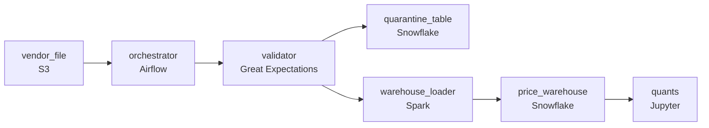

# Six Million Rows Before the Market Opens
_One massive CSV. Millions of timestamps._

- **Domain:** pipeline_architecture
- **Difficulty:** Medium
- **Est. time:** 20 min
- **URL:** https://datadriven.io/problems/six_million_rows_before_the_market_opens

## Problem

A third-party vendor drops a CSV of 6 million time series price rows over SFTP at 6am each morning, and the quant team's pre-market models run at 8am, so the load has to be queryable in the warehouse by 7:30 with an alert raised if the run looks like it will miss that window. The vendor's file is dirty, carrying duplicate rows, null prices, and malformed timestamps that can't be allowed to reach the models, and the morning load is occasionally rerun on the same file, which must never leave duplicate rows behind. Design the ingestion architecture from the vendor drop through to the quant query surface.

**Concepts tested:** `paBatchProcessing`, `paDagOrchestration`, `paDataLake`, `paDataQuality`, `paDeduplication`, `paEltVsEtl`, `paFileIngestion`, `paFullVsIncremental`, `paIdempotency`, `paMedallion`, `paMonitoring`, `paPartitioning`, `paRetryHandling`, `paTableFormats`

## Requirements

- The vendor file lands at 6am and quant pre-market models run at 8am; data has to be queryable by 7:30 with a buffer, and a run that is failing or running late has to raise an alert in time to react.
- Some vendor rows are duplicates, have null prices, or have malformed timestamps; bad rows can't enter the warehouse where they would corrupt model output, so they must be split off to a separate location.
- If the morning load has to be rerun, the same file can't produce duplicate rows in the warehouse, so the load needs one controlled step, fed from staged data, that replaces the day rather than appending.

## Must-have components

- Quants read pre-market data from the warehouse; without a warehouse tier there's no destination for the daily file. Add Snowflake, BigQuery, Redshift, or Databricks.
- The 6am file lands and has to be loaded, validated, and queryable by 7:30am with rerun safety; without an orchestration layer there's nothing to enforce the deadline or coordinate the load. Add Airflow, Dagster, Prefect, or Composer.

**Expected stages:** `download_scheduler` → `landing_zone` → `validation_transform` → `clean_zone` → `warehouse_load`

## Solution walkthrough

### Why this problem exists in real interviews

A morning load of 6M rows with a 7:30 deadline (8am models), bad rows that can't enter the warehouse, and reruns that can't double-load. The trap is loading the file directly and trusting downstream cleanup, or appending on rerun.

The default reach is to load the CSV into the warehouse and clean up downstream. Bad rows enter and corrupt model output. The team reruns the load and the warehouse has duplicate rows because the load was append. Quants notice at 8am that yesterday's file has both clean and duplicate copies.

> **Trick to Solving**
>
> Validation before the warehouse with quarantine, partition-overwrite by `load_date` so reruns are idempotent, orchestrator owns the 7:30 deadline.
>
> 1. Validation runs before the warehouse load; bad rows route to a quarantine; clean rows continue.
> 2. The warehouse load uses partition-overwrite keyed on `load_date` so a rerun replaces the day rather than appending.
> 3. An orchestrator runs the daily DAG with sensors firing before 7:30 if any stage is at risk.

---

### Walk the requirements

**Step 1: Land clean rows by 7:30, alert before**

The orchestrator runs the daily DAG: file arrives at 6am, validation runs, the warehouse load runs, sensors fire before 7:30 if anything is at risk. Quants query at 8am with a buffer. Without the orchestration the deadline isn't owned; without the warehouse the loaded data has nowhere to land.

**Step 2: Quarantine bad rows so the warehouse holds only validated data**

Validation routes duplicates, null prices, and malformed timestamps to a quarantine table with the rejection reason; the rest of the file flows into the warehouse. The team triages quarantine on its own cadence. A 'load and clean later' approach is the version where bad rows corrupt model output before the cleanup runs; the gate before the warehouse keeps it out.

**Step 3: Reruns are idempotent via partition-overwrite by `load_date`**

The warehouse load writes via partition-overwrite keyed on `load_date`. A rerun for the same day replaces the prior load's rows rather than appending. Whatever stage failed in the original run, restarting produces the same warehouse state. An append-style load is what produces the named duplicate-on-rerun problem; partition-overwrite is the contract.

---

### The shape that fits

| node | type | tech | details |
|---|---|---|---|
| vendor_file | source | S3 |  |
| orchestrator | transform | Airflow |  |
| validator | quality_gate | Great Expectations |  |
| quarantine_table | storage | Snowflake |  |
| warehouse_loader | transform | Spark |  |
| price_warehouse | storage | Snowflake | slaFreshness: < 24h |
| quants | consumer | Jupyter | slaFreshness: < 24h |

> **What this design gives up**
>
> Validation in front of the warehouse adds a step and a quarantine surface; partition-overwrite costs more than appends; the orchestrator's per-stage SLA is configuration to maintain. Implementation cost is the price; the win is the warehouse holding only clean rows, reruns that don't duplicate, and the 7:30 deadline owned by the orchestrator.

> **What reviewers check**
>
> A reviewer looks at the canvas for these properties:
> - An orchestration layer schedules the daily load with sensors firing before 7:30am.
> - Validation routes bad rows (duplicates, null prices, malformed timestamps) to a quarantine before the warehouse load.
> - Partition-overwrite by `load_date` so reruns produce the same warehouse state.
> - The warehouse anchors the quant query surface.

> **The mistake that ships**
>
> What gets shipped loads the file directly and cleans up downstream. Bad rows enter and corrupt model output. Reruns append and the warehouse has duplicates. Quants notice at 8am. The eventual rebuild adds the validator, the quarantine, and partition-overwrite by `load_date`.

---

- **A vendor file has more bad rows than expected. What does this design do, and at what point does the team intervene?**
  - _Tests whether the candidate sees a quarantine threshold: above an expected baseline, the orchestrator alerts and gates the publish so the team can inspect the file before partial data lands. Below the threshold, the load proceeds and the team triages quarantine on schedule._
- **An old day's load needs to be corrected because a vendor restated. What does the design do?**
  - _Tests whether the candidate sees partition-overwrite by `load_date` as the contract for restatements: rerun the load against the corrected file with `load_date` set to the affected day; that day's partition replaces with the corrected rows; other days are unaffected._
