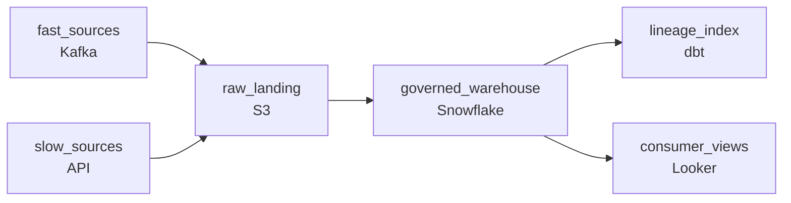

# Six Sources, One Platform
_ADF orchestrates. Unity Catalog governs. Nothing leaks._

- **Domain:** pipeline_architecture
- **Difficulty:** Medium
- **Est. time:** 10 min
- **URL:** https://datadriven.io/problems/six_sources_one_platform

## Problem

We're building a greenfield analytics platform. We have six source systems that need to be ingested on very different schedules and have different governance requirements: finance teams need access to the data without seeing customer PII, and when a finance dashboard number is questioned, the platform team has to be able to point to the source records that produced it. Design the end-to-end pipeline architecture: how each source flows in, how the warehouse exposes the right views to each team, and how lineage is captured.

**Concepts tested:** `paApiIngestion`, `paBackfill`, `paBatchProcessing`, `paBatchVsStreaming`, `paCdc`, `paDagOrchestration`, `paDataLake`, `paDataQuality`, `paDeduplication`, `paDependencyMgmt`, `paEltVsEtl`, `paEnvironmentMgmt`, `paFileIngestion`, `paFullVsIncremental`, `paIdempotency`, `paLateData`, `paMedallion`, `paMicroBatchVsTrue`, `paMonitoring`, `paPartitioning`, `paRetryHandling`, `paScdPipeline`, `paSchemaEvolution`, `paStreamProcessing`, `paTableFormats`

## Requirements

- Six source systems have very different freshness needs, from continuous streams to weekly reference exports; pinning them all to one shared cadence under-serves the fast ones or over-spends on the slow ones.
- Finance teams need access to the data without seeing customer email, phone, or names, so all access has to funnel through one governed layer rather than each dashboard configuring its own permissions.
- When a finance dashboard number is questioned, the platform team has to be able to point to the source records that produced it.

## Must-have components

- Six sources have very different freshness needs, from continuous IoT streams to weekly reference exports. Routing all six through one cadence either under-serves the fast sources or over-spends on the slow ones. Show at least one streaming path AND at least one batch path.
- Finance dashboards and lineage queries read from a governed warehouse; without a warehouse tier the platform has no place to enforce column-level masking or expose lineage end to end. Add a warehouse (Snowflake, BigQuery, Redshift, Synapse, or a lakehouse like Delta/Iceberg).

**Expected stages:** `fast_sources` → `slow_sources` → `raw_landing` → `governed_warehouse` → `lineage_index` → `consumer_views`

## Solution walkthrough

### Why this problem exists in real interviews

Six source systems with completely different cadences, finance teams that need the data without customer PII, and a lineage requirement that has to be answerable when a number gets challenged. The interesting pressure is that any one of these is easy in isolation; together they kill 'one nightly orchestration that loads everything into one warehouse with permissions in BI.'

First instinct is one nightly DAG that hits all six sources, normalises into a warehouse, and applies row-level security in the BI tool. Fast sources go stale because the schedule was set by the slowest one, sensitive columns leak into dashboards because BI permissions are configured per-dashboard and the seventh dashboard forgets, and when an audit asks 'where did this number come from?' someone opens a PR diff in their head and reconstructs it. None of those failures are exotic, they're the default outcome of letting the orchestration schedule and the access boundary live in the wrong layers.

> **Trick to Solving**
>
> If the source's clock is different from yours, give it its own pipeline. If the dashboard's clock is different from the source's, give it its own view. Sharing schedules is what makes pipelines feel slow and expensive at the same time.
>
> 1. Each source on its own clock. A weekly reference export shouldn't share a schedule with a continuous IoT stream.
> 2. Access lives at the platform layer. Column-level masking applied where the data is queried, not in each dashboard.
> 3. Lineage is queryable, not reconstructable. When finance asks where a number came from, the answer should be a query, not a code review.

---

### Walk the requirements

**Step 1: Run each source on its own cadence**

When a continuous source and a weekly export share a schedule, one is wasting compute and the other is silently stale. Give each source its own cadence on the way in: a streaming path (Kafka, Event Hubs) carrying a real-time SLA for high-frequency feeds, a daily ingest for transactional extracts, a weekly load for reference data. They can still land in a shared raw zone, but each arrives on its own clock, and the downstream layer reads that zone on its own schedule.

**Step 2: Enforce sensitive-column visibility at the platform, not in each dashboard**

Finance teams need the dataset without seeing customer email and phone. The right place to enforce that is in the catalog or warehouse, masked for finance, unmasked for data owners, in something like Snowflake column masking, BigQuery policy tags, or Unity Catalog, so it doesn't matter which dashboard finance opens. The wrong place is BI, because the boundary then depends on someone configuring every new dashboard correctly. That's where the next leak comes from.

**Step 3: Capture lineage from source through to each dashboard column**

When finance points at a number and asks 'where did this come from?', the answer should be a click. That requires lineage at the column level, attached to the warehouse, populated as part of the load, dbt's lineage graph, OpenLineage, or a vendor catalog all do this, not a wiki page someone writes after the fact. The litmus test: take any column in any dashboard, can you walk back to the source rows that produced it without reading any code?

---

### The shape that fits

| node | type | tech | details |
|---|---|---|---|
| fast_sources | source | Kafka | slaFreshness: real-time |
| slow_sources | source | API | slaFreshness: < 24h |
| raw_landing | storage | S3 |  |
| governed_warehouse | storage | Snowflake | slaFreshness: < 1h |
| lineage_index | transform | dbt |  |
| consumer_views | consumer | Looker |  |

> **What this design gives up**
>
> Per-source pipelines cost you orchestration complexity. Six pipelines instead of one means six places to monitor, six places to alert, and six places to update when the data team changes a convention. The reason it's worth it: the alternative is permanently slow on the fast sources, permanently over-spending on the slow ones, and permanently behind on lineage and access control.

> **What reviewers check**
>
> A reviewer looks at the canvas for these properties:
> - Six sources have very different freshness needs, from continuous IoT streams to weekly reference exports, so the fast sources carry a streaming SLA and the slow ones carry a batch SLA.
> - Finance dashboards and lineage queries read from a governed warehouse; without a warehouse tier the platform has no place to enforce column-level masking or expose lineage end to end.

> **The mistake that ships**
>
> The version that ships runs all six sources on a single nightly DAG, applies row-level security in the BI tool's dashboard config, and treats the lineage diagram as a Confluence page someone draws once. Six months later: the fastest source is hours stale because the DAG is sized for the slowest one, finance sees customer email in a dashboard a colleague built without remembering the security config, and when a number on the finance dashboard is questioned, the answer is a Slack thread with three different reconstructions. None of these are bugs in any specific component, they're the consequence of putting schedule, access, and lineage in the wrong layers.

---

- **If a finance number is challenged, what would a finance analyst click on to answer where it came from without asking the data team?**
  - _Tests whether lineage is genuinely queryable and self-serve, or whether it still requires a data engineer to interpret._
- **How would you onboard a seventh source without writing new pipeline code?**
  - _Tests whether the pattern is config-driven (declare a source, get a pipeline) or whether each source is bespoke._
