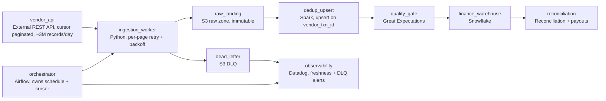

# Someone Else's Server

- **Domain:** pipeline_architecture
- **Difficulty:** Hard
- **Est. time:** 30 min
- **URL:** https://datadriven.io/problems/someone_else_s_server

## Problem

We run a live shopping marketplace and settle every order through an external payments vendor that exposes its records over a paginated REST API we do not control. Build the business-critical pipeline that pulls this data on a schedule and picks up from the last page it landed when a run dies partway, keeps ingesting when the vendor rate-limits or returns errors on some pages, and only lets clean, deduplicated records reach the finance warehouse that reconciliation and payouts read from. The vendor occasionally resends the same record, and its daily volume runs into the low millions.

**Concepts tested:** `paApiIngestion`, `paBatchProcessing`, `paDagOrchestration`, `paDataLake`, `paDataQuality`, `paDeadLetterQueue`, `paDeduplication`, `paEltVsEtl`, `paFullVsIncremental`, `paIdempotency`, `paMedallion`, `paMonitoring`, `paRetryHandling`

## Requirements

- When the vendor rate-limits us or an instance dies halfway through a pull, I don't want to re-read everything or lose the middle. Pick up where we left off.
- The vendor resends the same transaction sometimes. If a payout counts it twice, that is real money out the door.
- I would rather hold a suspicious batch than let a null amount or a garbage currency flow into reconciliation.
- One bad page from the vendor should not blind finance for the whole day.
- If the data is late or the vendor is down, I need to know before reconciliation does.

## Must-have components

- The pull runs on a schedule and must own a resumable cursor, so a run that dies mid-vendor resumes instead of re-reading from zero. Add an orchestration layer that owns the schedule, the watermark, and the freshness deadline.
- Land raw vendor responses immutably before you transform them, so a bad parse or a downstream bug can be replayed without re-pulling from a vendor you do not control. Add a raw landing zone.
- A page that keeps failing after retries cannot halt the whole pull. Add a retry and dead-letter stage so exhausted-retry pages are parked for later triage while the main job keeps draining and finance still gets the rest of the day.
- Settlement data feeds payouts, so a null amount or a row-count collapse cannot flow straight through. Add a validation gate that checks schema, nulls, and volume before promotion.
- Reconciliation and payouts read from a warehouse. Add the warehouse tier that serves the validated records.
- Only clean, deduplicated records may reach the finance warehouse. Wire the warehouse to read from the quality gate, not directly from the raw landing zone, so unvalidated rows never reach reconciliation.
- A business-critical pull needs eyes on freshness, failure rate, and dead-letter depth. Add an observability and alerting stage that fires when the run misses its deadline or the dead-letter store grows.

**Expected stages:** `Scheduled ingestion with cursor checkpoint` → `Raw landing zone` → `Retry and dead-letter handling` → `Data quality validation` → `Warehouse promotion` → `Observability and alerting`

## Solution walkthrough

### Why this problem exists in real interviews

This looks like an ingestion problem but it is really a trust problem: you are building on a server you do not control, that rate-limits you, drops the occasional page, and resends the same settlement record more than once, and the output feeds payouts. The trap is the tidy daily pull: schedule a job, page through the vendor API, write to the warehouse, done. That design is correct only on the days the vendor behaves. The day it 429s in the middle of a run, your job either restarts from zero and hammers the vendor or resumes blindly and skips the middle, and the day it resends a batch, finance pays a seller twice. At the low-millions-a-day volume here, a duplicate rate of even a fraction of a percent is thousands of double payments.

So the real skill being probed is designing for at-least-once delivery from an unreliable external source: resumable ingestion, idempotent landing on a stable key, a quality gate before the money-critical consumer, and a dead-letter path so one bad page never blinds finance for the whole day. Every requirement traces back to the single fact that you do not own the other end of the wire.

---

### Break down the requirements

**Step 1: Pin the delivery contract before anything else**

Ask how the vendor paginates, how it fails, and whether it delivers at least once. The answers here (cursor pagination, 429s and 5xx per page, duplicate ids, a stable `vendor_txn_id`) decide the entire design. If you skip this, you design for a clean feed that does not exist.

**Step 2: Make the pull resumable, not restartable**

The orchestrator owns a cursor or watermark that advances only on a page fully landed. When a run dies at page 400 of 900, the next run resumes at 400. Per-page retry with exponential backoff absorbs the transient 429s and 5xx; a page that still fails after N attempts goes to the dead-letter store so the run does not stall on it.

**Step 3: Land raw, then dedup on the stable id**

Write the raw vendor payload immutably first, so any downstream bug is replayable without touching the vendor again. Then upsert into the deduplicated table keyed on `vendor_txn_id`, latest `updated_at` wins. This one decision is what turns at-least-once delivery into effectively-once state, and it is where duplicate payouts are prevented.

**Step 4: Gate on quality before the warehouse, not after**

Amount non-null and non-negative, currency in the allowed set, row count within a band of the trailing average. Failing rows are quarantined and a batch that fails the volume check does not promote. The warehouse reads from the gate, never from the raw zone, so reconciliation only ever sees validated data.

---

### The reference architecture

An orchestrator schedules the pull and owns the cursor. An ingestion worker pages the vendor API with per-page retry and backoff, writing raw responses to an immutable landing zone and shipping exhausted-retry pages to a dead-letter store. A dedup/upsert step keyed on `vendor_txn_id` produces the effectively-once table. A quality gate validates schema, nulls, and volume, quarantining failures, and only its output is promoted to the finance warehouse that reconciliation and payouts read. Observability watches freshness against the deadline, failure rate, and dead-letter depth, and alerts the team before finance notices.

| node | type | tech | details |
|---|---|---|---|
| vendor_api | source | External REST API, cursor paginated, ~3M records/day |  |
| orchestrator | transform | Airflow, owns schedule + cursor | monitorAlert: Run past freshness deadline |
| ingestion_worker | transform | Python, per-page retry + backoff | errorAction: dlq |
| raw_landing | storage | S3 raw zone, immutable | backfillStrategy: partition_overwrite |
| dead_letter | storage | S3 DLQ | monitorAlert: DLQ depth above baseline |
| dedup_upsert | transform | Spark, upsert on vendor_txn_id | idempotencyStrategy: upsert |
| quality_gate | quality_gate | Great Expectations | errorAction: quarantine |
| finance_warehouse | storage | Snowflake | slaFreshness: < 24h |
| reconciliation | consumer | Reconciliation + payouts |  |
| observability | consumer | Datadog, freshness + DLQ alerts |  |

> **Trick to Solving**
>
> The whole problem collapses onto one line: the feed is at-least-once, so make landing idempotent on the stable id and everything else falls out. Resumable cursor handles interruption, per-page retry handles transient failure, dead-letter handles permanent failure, dedup-on-id handles resends. Name that one fact and the design writes itself.

> **Interviewers Watch For**
>
> A strong candidate asks for the delivery semantics and the stable key before drawing anything, keeps an immutable raw zone separate from the deduplicated table, and refuses to let the warehouse read anything the quality gate has not blessed. Weak candidates draw pull-to-warehouse and only add retries when prompted.

> **Common Pitfall**
>
> Treating retries as the whole answer. Retries fix the transient page but do nothing about the vendor resending yesterday's batch, and without idempotent landing on `vendor_txn_id` those resends flow straight into payouts. The other classic miss is a job that restarts from cursor zero on failure, which turns a vendor blip into a self-inflicted rate-limit storm.

> **Scale + Cost**
>
> At ~3M records and ~5 GB a day the compute is trivial; the cost and risk concentrate in correctness, not throughput. The bottleneck is the vendor's rate limit, so concurrency has to be bounded and backoff-aware rather than maximal. The expensive failure mode is not slowness, it is a duplicate payout, which is why the dedup key earns more design attention than the cluster size.

---

- **The vendor announces they are deprecating the cursor API and switching to a webhook push next quarter. What changes and what stays?**
  - _Tests whether the candidate sees that the raw landing, dedup-on-id, quality gate, and warehouse are ingestion-mode-agnostic, and only the pull-and-cursor front end is replaced by a webhook receiver with the same idempotency contract._
- **Reconciliation finds a systematic error in how you parsed a field three weeks ago. How do you correct history without re-pulling from the vendor?**
  - _Tests whether the immutable raw landing zone is actually used for replay: reprocess raw through a fixed transform and re-upsert, rather than asking a vendor you do not control for three-week-old data._
