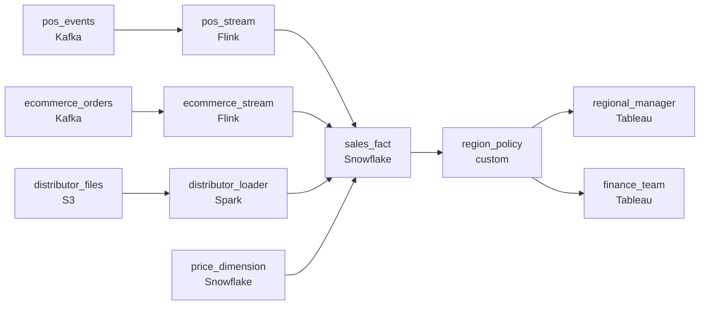

# Store, Site, and Distributor
_Sales data is piling up. Someone has to make sense of it._

- **Domain:** pipeline_architecture
- **Difficulty:** Medium
- **Est. time:** 20 min
- **URL:** https://datadriven.io/problems/store_site_and_distributor

## Problem

We're a consumer goods company with retail stores, e-commerce, and distribution partners. Leadership wants a unified view of sales performance across all channels. Design a data pipeline for handling large volumes of sales data.

**Concepts tested:** `paApiIngestion`, `paBackfill`, `paBatchProcessing`, `paCompression`, `paDagOrchestration`, `paDataLake`, `paDataQuality`, `paDeduplication`, `paDependencyMgmt`, `paEltVsEtl`, `paFileIngestion`, `paFullVsIncremental`, `paIdempotency`, `paMedallion`, `paMonitoring`, `paPartitioning`, `paRetryHandling`, `paSchemaEvolution`, `paSmallFiles`, `paTableFormats`

## Requirements

- The VP of Sales wants one view of performance across stores, the website, and distributors; today the three are reported separately.
- Prices change monthly; revenue from last March has to be reported using the price the customer actually paid then, not today's.
- Regional managers see only their region's sales; finance sees everything; the rule has to be enforced no matter how a query is written.

## Must-have components

- Leadership wants a unified sales view across stores, the website, and distributors; that lands in a warehouse. Without a warehouse tier the fact and dimension tables have nowhere to live. Add Snowflake, BigQuery, Redshift, or Databricks.
- Stores stream POS events, e-commerce sends real-time orders, and distributors send weekly files. One shared cadence either over-spends on the slow source or under-serves the fast ones. Show at least one streaming path and at least one batch path.

**Expected stages:** `sales_sources` → `raw_landing` → `transform_clean` → `warehouse_star` → `bi_serving`

## Solution walkthrough

### Why this problem exists in real interviews

Three sales channels arriving on three different clocks have to converge into one unified view that survives the questions leadership actually asks: 'how did we do last March,' which uses last March's prices, and 'how did our region do,' which only the regional manager should see for their own region. The trap is forcing all three channels onto one schedule, and forcing all readers onto one view.

The default shape is one nightly job that pulls all three channels, joins to the current price book, and writes one big sales table that everyone queries. Stores and the website don't get visibility until the next morning. A query on last March's revenue uses today's prices, and the number disagrees with what was actually charged. A regional manager runs a query and pulls every region's sales because nothing enforces the row-level filter.

> **Trick to Solving**
>
> Per-channel cadence into one warehouse, point-in-time price lookup at fact time, row-level security enforced by the platform.
>
> 1. Each channel runs on its own cadence: streaming for stores and e-commerce, batch for distributor files. They converge in a unified sales fact, not in a shared ingest schedule.
> 2. Prices are a slowly-changing dimension. Sales join on `sale_date BETWEEN price_valid_from AND price_valid_to`, so historical revenue uses the price actually paid.
> 3. Region visibility is a row-level security policy on the warehouse; the policy follows the user, not the query.

---

### Walk the requirements

**Step 1: Per-channel cadence into one unified sales fact**

Stores stream POS events, e-commerce sends real-time orders, distributors drop weekly files. Each channel has its own ingest path: streaming writers for stores and e-commerce, a batch loader for distributor files. All three write to the same unified sales fact keyed on (`sale_id`, channel). Leadership reads from the unified fact, not from three separate channel reports. Without a warehouse tier the unified fact has nowhere to live; without per-channel cadence either the slow channel holds up the fast ones or the fast channels run on a schedule that wastes their freshness.

**Step 2: Price as a slowly-changing dimension, joined point-in-time**

Prices change monthly. Model the price book as a slowly-changing dimension keyed on (`product_id`, `valid_from`, `valid_to`) and join sales on `sale_date BETWEEN valid_from AND valid_to`. Last March's sale picks up last March's price; today's sale picks up today's. The version that joins on 'current price' silently rewrites history every time the price book changes, and finance discovers it the first time a quarter has to be restated.

**Step 3: Row-level security policy, not a WHERE clause in BI**

Regional managers see their region; finance sees everything. The warehouse owns the policy: when a regional manager queries the unified fact, the warehouse appends the row filter automatically based on who they are, no matter how the query is written. A 'we'll filter in Tableau' approach is one forgotten filter away from a regional manager seeing another region's numbers, and that's the kind of thing that travels to leadership.

---

### The shape that fits

| node | type | tech | details |
|---|---|---|---|
| pos_events | source | Kafka |  |
| ecommerce_orders | source | Kafka |  |
| distributor_files | source | S3 |  |
| pos_stream | transform | Flink | slaFreshness: real-time; idempotencyStrategy: upsert |
| ecommerce_stream | transform | Flink | slaFreshness: real-time; idempotencyStrategy: upsert |
| distributor_loader | transform | Spark | slaFreshness: < 24h; idempotencyStrategy: staging_table |
| sales_fact | storage | Snowflake | backfillStrategy: partition_overwrite |
| price_dimension | storage | Snowflake |  |
| region_policy | quality_gate | custom | errorAction: alert |
| regional_manager | consumer | Tableau | slaFreshness: < 1h |
| finance_team | consumer | Tableau | slaFreshness: < 1h |

> **What this design gives up**
>
> Per-channel ingest means three loaders to operate instead of one nightly job. The point-in-time price join scans a date range and is more expensive than an equi-join. Row-level security has to be configured per role and per table. The simple nightly batch goes; what arrives is sales numbers that match what was charged, channels visible on their own cadence, and a region boundary that survives any query a manager writes.

> **What reviewers check**
>
> A reviewer looks at the canvas for these properties:
> - Each channel ingests on its own cadence and converges in a unified sales fact.
> - Sales join the price book as a slowly-changing dimension at sale-time.
> - Row-level security on the unified fact enforces region visibility regardless of how the query is written.

> **The mistake that ships**
>
> What ends up in production does one nightly job over all three channels, joins to today's price book, and serves everyone from one Tableau workbook. By month two, stores complain they can't see today's sales until tomorrow. Finance restates a quarter because revenue calculations used current prices instead of historical. A regional manager exports a CSV and discovers another region's numbers were in the data the whole time. The team rebuilds with per-channel cadence, an as-of price join, and warehouse-enforced row security. The eventual fix lives in three layers, ingest cadence, dimension modeling, and warehouse policy, that the simple-nightly version skipped.

---

- **A distributor sends a corrected file replacing last week's. What in this design ensures the corrected revenue replaces the old without leaving stale rows?**
  - _Tests whether the candidate sees the distributor loader as idempotent on a stable file boundary: the corrected load is partition-overwrite or staging-table on the distributor's slice of the fact, so the old rows are replaced cleanly rather than appended next to the new ones._
- **A regional manager moves to corporate and needs visibility across all regions. What changes in this design, and where?**
  - _Tests whether the candidate sees row-level security as a property of the user's role, not of the query. Changing the role flips visibility platform-wide; no query rewrites, no exports to redistribute._
