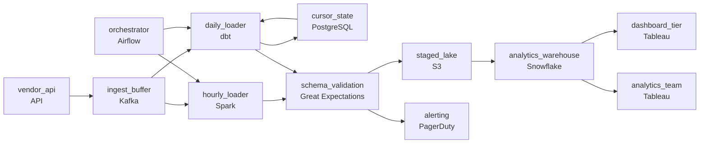

# The API Drip Feed
_The API gives you 100 records at a time. You need millions._

- **Domain:** pipeline_architecture
- **Difficulty:** Medium
- **Est. time:** 20 min
- **URL:** https://datadriven.io/problems/the_api_drip_feed

## Problem

We pull tasks, users, and projects from a third-party project management SaaS API into our analytics warehouse, but the API only serves small rate-limited pages and bursts unevenly, so ingestion has to absorb those bursts without dropping records. The rate limit won't cover pulling every table fresh each hour, so only the one tracked dashboard's task updates can ride a within-the-hour path while the rest of the tables stay on a once-a-day refresh. The vendor reshapes the API's fields every few weeks, so schema changes have to be caught before they reach the warehouse and surfaced to the team instead of silently corrupting the tables.

**Concepts tested:** `paApiIngestion`, `paBatchProcessing`, `paBatchVsStreaming`, `paCdc`, `paDagOrchestration`, `paDataQuality`, `paDeadLetterQueue`, `paDeduplication`, `paFullVsIncremental`, `paIdempotency`, `paLambdaArch`, `paMonitoring`, `paRetryHandling`, `paSchemaEvolution`, `paStreamProcessing`

## Requirements

- The rate limit won't cover pulling every table fresh each hour, so only the one tracked dashboard's task updates can ride a within-the-hour path while the rest of the tables stay on a once-a-day refresh.
- The API only serves small rate-limited pages and bursts unevenly; ingestion has to absorb those bursts without dropping records.
- The vendor reshapes the API's fields every few weeks, so schema changes have to be caught before they reach the warehouse and surfaced to the team rather than silently corrupting the tables.

## Must-have components

- The synced data lands in the warehouse for analytics; without a warehouse tier there's no destination. Add Snowflake, BigQuery, Redshift, or Databricks.
- The design runs on two schedules, a within-the-hour task refresh and a once-a-day refresh for the rest, and something has to trigger those runs and pace them against the rate limit. Add a scheduler such as Airflow, Dagster, or Prefect.

**Expected stages:** `api_client` → `ingest_buffer` → `cursor_state_store` → `hourly_task_loader` → `daily_batch_loader` → `schema_validation_gate` → `analytics_warehouse`

## Solution walkthrough

### What this problem is really testing

Underneath the project-management vocabulary this is change capture by polling against a hostile API, and the warehouse load has to stay correct while three unrelated stressors push on it at once: the source serves small rate-limited pages that burst unevenly, different consumers need different freshness, and the field shapes drift every few weeks. Anyone can draw a straight line from the API to the warehouse. The separating move is refusing to let any one of those three stressors reach the tables: a burst has to be absorbed, the fast consumer has to be served on its own cadence, and a renamed field has to be stopped and surfaced before it lands. Skip any one and you drop records on a burst, miss the dashboard's window, or silently corrupt a table when a column quietly changes name.

> **Trick to solving**
>
> The three requirements look like one ingestion job, but they fail for different reasons and need different parts of the canvas. Put a queue right behind the API so bursts and backoff never drop a page. Run two loader cadences off that queue, hourly for the tracked dashboard and daily for everything else, because the rate limit can't afford to pull every table hourly. Sit a validation gate in front of the warehouse so a drifted schema is caught and routed to an alert instead of written through.

---

### Walk the requirements

**Step 1: Buffer the API before anything reads it**

The vendor serves small rate-limited pages and bursts unevenly. A loader that reads the API directly has to either keep up with a burst or drop pages when it backs off. A queue between the source and the loaders decouples fetch rate from load rate: the fetcher writes pages as they arrive, the loaders drain at their own pace, and a 429 backoff stalls a consumer without losing data already buffered.

**Step 2: Split the load into two cadences**

Most tables tolerate a daily refresh; one tracked dashboard needs task updates inside the hour. One cadence for everything is the wrong trade either way: the rate limit won't cover pulling every table hourly, and a daily-only design misses the dashboard's window. Two loaders off the same buffer, a small hourly task path and a daily batch path for the rest, let each consumer tier get exactly the freshness it needs within the request budget.

**Step 3: Validate the schema before the warehouse, not after**

The vendor reshapes fields every few weeks, and a rename is silent. If the loader writes whatever it receives, a renamed column lands as nulls in the old column and the table is quietly wrong. A validation gate ahead of the warehouse checks the incoming shape, lets a clean batch through to staging, and routes a mismatch to an alert so the team fixes the mapping once instead of discovering it in a broken report.

---

### The shape that fits

| node | type | tech | details |
|---|---|---|---|
| vendor_api | source | API |  |
| ingest_buffer | queue | Kafka |  |
| orchestrator | transform | Airflow |  |
| cursor_state | storage | PostgreSQL |  |
| hourly_loader | transform | Spark | slaFreshness: < 1h |
| daily_loader | transform | dbt | slaFreshness: < 24h |
| schema_validation | quality_gate | Great Expectations |  |
| staged_lake | storage | S3 |  |
| analytics_warehouse | storage | Snowflake |  |
| dashboard_tier | consumer | Tableau | slaFreshness: < 1h |
| analytics_team | consumer | Tableau | slaFreshness: < 24h |
| alerting | consumer | PagerDuty |  |

> **What this costs**
>
> Two loaders and a queue are more moving parts than a single straight pull: two schedules to operate, a buffer to size and monitor, and a validation gate that can block a load when the vendor changes shape. That blocking is the point. The alternative is a cheaper pipe that silently drops burst records and writes drifted columns, and you pay for it later in reconciliation.

> **What reviewers look for**
>
> A reviewer reads the canvas for these properties:
> - A buffering stage sits between the rate-limited API and the loaders so bursts and backoff do not drop records.
> - Two freshness paths: a sub-hour tier for the tracked dashboard and a roughly daily tier for everything else.
> - Schema validation sits in front of the warehouse and a mismatch routes to an alert, not into the tables.
> - The synced data lands in a warehouse for analytics.

> **The version that ships**
>
> The common build is one linear job: poll the API, load straight into the warehouse, schedule it daily. It demos clean and passes the happy path. Then a burst overruns the fetch and pages go missing, the dashboard owner asks why the number is a day stale, and a silent field rename fills a column with nulls for a week before anyone notices. The rebuild adds the buffer, the second cadence, and the validation gate that should have been there from the start.

---

- **The same connector now has to serve forty customer tenants, each with their own credentials and rate limit. What changes so one tenant's throttling or auth failure does not stall the others?**
  - _Tests whether the candidate moves to per-tenant runs with isolated cursors and rate-limit budgets rather than one shared pull._
- **The API never exposes hard-deleted records, but about two percent of tasks are deleted each month with no signal. How would you keep the warehouse from carrying ghosts?**
  - _Tests whether the candidate reaches for periodic full reconciliation against the live id set, since incremental polling alone can never observe a hard delete._
