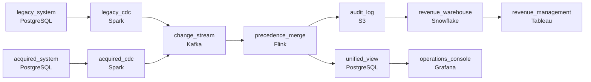

# The Acquisition Still Taking Bookings
_Two systems, two schemas. One truth._

- **Domain:** pipeline_architecture
- **Difficulty:** Hard
- **Est. time:** 30 min
- **URL:** https://datadriven.io/problems/the_acquisition_still_taking_bookings

## Problem

We acquired a hotel chain that runs on a completely different reservation system than ours, and both systems stay live and take bookings for an overlapping set of hotels while their data changes constantly. Operations needs a single unified view of all inventory across both systems that stays current within minutes of any change, reconciled into one count when the two systems disagree. Revenue management separately needs to trace any past inventory count back to the source update that produced it, so the pipeline also has to keep a durable, queryable history of every change.

**Concepts tested:** `paBackfill`, `paCdc`, `paDataQuality`, `paDeadLetterQueue`, `paDeduplication`, `paEventDriven`, `paFullVsIncremental`, `paIdempotency`, `paLateData`, `paRetryHandling`, `paSchemaEvolution`, `paStreamProcessing`

## Requirements

- Operations needs one unified view of inventory across both reservation systems, current within minutes of any change; today it's a silo per system.
- The two systems overlap on some hotels and can disagree on availability, so the pipeline must reconcile them into one consistent count instead of writing two.
- Revenue management needs to inspect any past inventory count and trace which source update produced it, so the pipeline must retain a durable, queryable history of every change.

## Must-have components

- Both reservation systems are live and changing constantly, and operations needs the unified view current within minutes of any change. Add a streaming capture or processing stage, or set SLA Freshness to real-time, < 1min or < 15min on the path that feeds the unified view.
- Revenue management has to inspect any past inventory count and tell which source update produced it. Without a durable audit log layer (S3, GCS, ADLS, or equivalent) the queryable history has nowhere to live.

**Expected stages:** `source_a_cdc` → `source_b_cdc` → `schema_mapping` → `conflict_resolver` → `unified_view`

## Solution walkthrough

### Why this problem exists in real interviews

An acquisition pipeline is a temporary architecture with permanent properties. Operations needs the unified view today; revenue management needs to audit it; the acquired system is being turned off in nine months and that has to be a config change, not a rebuild. The trap is making the architecture love the two-source state and bake it in, then finding out at month eight that 'remove the acquired source' touches every layer.

The default draw is a custom pipeline whose merge logic knows about both systems, with conflict-handling code branching on source name. Operations is happy, revenue management gets a 'current value' table, and the team moves on. Nine months later, turning off the acquired system means rewriting the merge layer, the conflict logic, and the audit layout. The migration becomes a six-week project to remove what should have been a config change.

> **Trick to Solving**
>
> CDC each source into a generic merge with a precedence rule as config, log every state change immutably, removing a source is deleting one connector.
>
> 1. Each source captured by CDC into a single change stream. The merge step is a generic n-source merge driven by a configurable precedence rule, not source-name-aware code.
> 2. Two consumer paths: a streaming path to the unified view for operations, a batch path to a warehouse for revenue management.
> 3. Every state change writes a row to an append-only audit log (room id, source, value, time). Revenue management queries the log for any past state.
> 4. Removing a source is deleting its CDC connector and updating the precedence config. Nothing else changes.

---

### Walk the requirements

**Step 1: Both sources stream into the unified view; revenue management reads slower**

CDC connectors on both reservation systems emit changes onto a single stream; the merge writes to the unified view in tens of seconds for operations. The same change stream also feeds a batch loader that updates a warehouse table on a slower cadence for revenue management. One stream, two consumer paths sized to the consumer. Without a streaming/sub-minute path the unified view is built on whatever cadence polling allows, which doesn't match operations' need.

**Step 2: Legacy wins on the overlapping hotels, by a precedence rule that's config**

The business has chosen the legacy system as the system of record for conflicts on the overlapping hotels. The merge step applies that precedence as configuration, not as branching code: a config table maps (`hotel_id`, property) to the winning source. The same conflict resolved at any time produces the same result. A 'last-write-wins' shortcut violates the requirement on day one; hard-coding the rule into the merge logic violates it the day the business changes its mind.

**Step 3: Append-only audit log so revenue management can ask 'what produced this'**

Every state change writes a row to an append-only audit log in cold storage: room id, source, source value, winning value, rule applied, timestamp. Revenue management's question 'what was inventory at 2pm yesterday and which source's update set it' is a query on the log, not a forensic reconstruction. Without a durable audit log the queryable history has nowhere to live; with it, the answer is a SQL query.

**Step 4: Removing the old system is config, not a rebuild**

When the acquired system is turned off, remove its CDC connector and update the precedence config to reference only the remaining source. The merge step is generic across sources, so it keeps running; the audit log keeps recording from one source instead of two; the unified view doesn't notice. A merge step that knows the names of the two systems is a merge step that has to be rewritten on day-of-cutover; a config-driven merge is a one-line change.

---

### The shape that fits

| node | type | tech | details |
|---|---|---|---|
| legacy_system | source | PostgreSQL |  |
| acquired_system | source | PostgreSQL |  |
| legacy_cdc | transform | Spark | errorAction: alert; monitorAlert: Legacy CDC lag past threshold |
| acquired_cdc | transform | Spark | errorAction: alert; monitorAlert: Acquired CDC lag past threshold |
| change_stream | queue | Kafka | parallelism: 8 partitions |
| precedence_merge | transform | Flink | slaFreshness: real-time; idempotencyStrategy: upsert |
| unified_view | storage | PostgreSQL | slaFreshness: real-time |
| audit_log | storage | S3 | backfillStrategy: incremental |
| revenue_warehouse | storage | Snowflake | slaFreshness: < 1h |
| operations_console | consumer | Grafana | slaFreshness: real-time |
| revenue_management | consumer | Tableau | slaFreshness: < 1h |

> **What this design gives up**
>
> A generic n-source merge with config-driven precedence is more abstract than a hard-coded two-source merger; the team has to reason about a general rule instead of a specific one. The audit log adds storage cost on every change. Source-aware code is simpler to read; in return for the abstraction, turning off the acquired system stays a routine config change rather than a project.

> **What reviewers check**
>
> A reviewer looks at the canvas for these properties:
> - A change-data-capture path off each source feeds the unified view in seconds; revenue management reads the warehouse on a slower cadence.
> - An audit log holds every state change with the source attributable per row.

> **The mistake that ships**
>
> The build that ships hard-codes the merge to know about both systems and writes only the current value to the unified view. Operations is happy. Revenue management asks 'what was inventory at 2pm yesterday' and the answer is 'whatever the table said then,' which is unrecoverable. Nine months later, removing the acquired source is a six-week project that touches the merge code, the conflict layer, and the consumer queries. The team rebuilds with a generic merge, an audit log, and config-driven precedence. By month-of-cutover, the team is rewriting the merge code under pressure rather than flipping a config flag.

---

- **A third reservation source is added six months in for a smaller acquisition. What changes in this design?**
  - _Tests whether the candidate sees that adding a source is a CDC connector plus a precedence-config update, with no merge-step rewrite. The audit log already supports n sources; the merge step already takes a config; the unified view already keys on room id._
- **Revenue management asks: for an overlapping hotel, show every time the legacy and acquired systems disagreed last quarter. What's the query, and against which store?**
  - _Tests whether the candidate sees the audit log as the source of truth for conflict history, queryable by hotel id and timestamp, with both source values present in each row. The unified view doesn't have this; only the log does._
