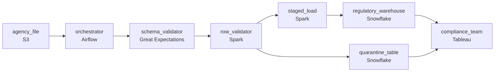

# The Agency That Changes the Columns
_The schema changed overnight. Again._

- **Domain:** pipeline_architecture
- **Difficulty:** Medium
- **Est. time:** 20 min
- **URL:** https://datadriven.io/problems/the_agency_that_changes_the_columns

## Problem

We receive data files from a government agency every week. The files contain regulatory reporting data that we need in our warehouse, but the agency changes the file format without warning. Sometimes columns are added, sometimes renamed, sometimes the whole layout shifts. Design an ETL pipeline that can handle these file structure changes dynamically.

**Concepts tested:** `paBackfill`, `paBatchProcessing`, `paDataLake`, `paDataQuality`, `paDeadLetterQueue`, `paDeduplication`, `paEltVsEtl`, `paFileIngestion`, `paFullVsIncremental`, `paIdempotency`, `paMonitoring`, `paPartitioning`, `paRetryHandling`, `paSchemaEvolution`

## Requirements

- The compliance team runs the regulatory review at 9am Monday; the weekly file has to be loaded and validated before then.
- The agency changes the file format whenever they feel like it and incorrect data triggers regulatory penalties; we can't find out after we've loaded it.
- The agency occasionally sends a corrected file the next day; the warehouse needs the corrected version, not duplicates of both.
- Files contain rows with missing required fields; compliance reviews them rather than have the pipeline silently drop them.

## Must-have components

- Cleaned regulatory data lands in the warehouse for compliance review; without a warehouse tier there's nowhere for it to land. Add Snowflake, BigQuery, Redshift, or Databricks.
- Files arrive weekly with a Monday 9am SLA, sometimes need re-loading after a corrected file, and bad rows route to a review queue. Without an orchestration layer none of that sequencing is owned. Add Airflow, Dagster, Prefect, or Composer.

**Expected stages:** `file_landing` → `schema_detector` → `transform_mapper` → `validation_gate` → `warehouse_load`

## Solution walkthrough

### The trap beneath the moving schema

This is schema-drift management dressed up as regulatory reporting. The real skill: can you detect when the agency's file stops matching what you expect and stop cold, instead of adapting silently? Anyone can write an ETL that infers the schema and appends. Inference is exactly the wrong instinct here, rename a column and the job happily loads the new name, the old column reads empty, and compliance files a regulatory report with half the data missing. Get it wrong and the penalties are the agency's, not a re-run.

> **Halt on drift, quarantine bad rows, overwrite corrections**
>
> Validate the incoming file against an **expected schema** in config and halt loudly on any drift; route rows with missing required fields to a quarantine table compliance reviews; write corrections with `partition_overwrite` keyed on the reporting period so a resend replaces rather than appends; and let an orchestrator own the Monday 9am SLA with alerts before the deadline.

---

### Walk the requirements

**Step 1: Land and validate before Monday 9am**

An orchestrator runs the weekly DAG: a file sensor waits for arrival, then validation, load, and quality checks. Each stage carries its own SLA and alerts fire before 9am Monday if anything is at risk, so on-call has hours, not minutes. Without orchestration nothing owns the deadline; without a warehouse target the cleaned data has nowhere to land.

**Step 2: Detect a format change on arrival and stop**

An expected schema (column names, types, order) lives in pipeline config. On arrival the validator compares the incoming structure against it; any drift, an added column, a rename, a shifted layout, halts the load and pages on-call before a row touches the warehouse. Humans triage: update the schema, replay, or escalate to the agency. **Adapt automatically** corrupts downstream on the first rename; log a warning and continue is the same failure with paperwork.

**Step 3: Corrections replace the original by period**

When a corrected file arrives for a period already loaded, the load uses `partition_overwrite` keyed on the reporting period, so corrected rows atomically replace the originals. The correction runs the same DAG and the same validation against the same partition. An append-style load duplicates rows and turns reconciliation into a week-over-week diff.

**Step 4: Bad rows quarantine for compliance**

Files routinely carry rows with missing required fields. Validation routes those to a quarantine table with a rejection reason while the rest of the file keeps moving. Compliance reviews quarantine on its own schedule and replays. Silently dropping bad rows loses count of how often this happens; failing the whole load on the first bad row blocks compliance over rows they would have ignored.

---

### The shape that fits

| node | type | tech | details |
|---|---|---|---|
| agency_file | source | S3 |  |
| orchestrator | transform | Airflow | errorAction: alert; monitorAlert: File late or stage at risk vs Monday 9am |
| schema_validator | quality_gate | Great Expectations | errorAction: alert; monitorAlert: Incoming schema differs from expected |
| row_validator | transform | Spark | errorAction: dlq |
| quarantine_table | storage | Snowflake |  |
| staged_load | transform | Spark | backfillStrategy: partition_overwrite; idempotencyStrategy: staging_table |
| regulatory_warehouse | storage | Snowflake | slaFreshness: < 24h; backfillStrategy: partition_overwrite |
| compliance_team | consumer | Tableau | slaFreshness: < 24h |

> **What this design trades away**
>
> Halting on drift means more `failed` runs to triage instead of a pipeline that quietly absorbs everything. `partition_overwrite` costs more than a plain append, and the quarantine table needs a triage workflow compliance actually uses. What you give up is the self-adapting pipeline; what you get is one that never corrupts regulatory data and shows compliance exactly what the agency sent.

> **The two things a reviewer scans for**
>
> First, an orchestrator sequencing the weekly DAG with a file sensor and alerts before the Monday 9am SLA. Second, cleaned data landing in the warehouse with corrections written by `partition_overwrite` on the reporting period, not appended alongside the originals.

> **The append-and-infer design that ships**
>
> It infers the schema per file, drops invalid rows, and appends. Add a column and the warehouse grows it silently but queries miss it; rename one and half the report is empty; resend a correction and the period duplicates. Compliance catches it two reviews later and the team rebuilds weeks of warehouse state. The fix, an expected-schema check plus `partition_overwrite` plus a quarantine table, is what you should have built first.

---

- **The agency adds a column compliance actually wants. What's the path from arrival to publish?**
  - _Tests whether the candidate treats the validator as a forcing function, not an obstacle: the drift halt fires, on-call updates the expected schema after compliance signs off, the load replays, and the column lands with full review. The pipeline never auto-learns; humans approve._
- **A corrected file arrives where only some rows differ from the original. How does the design avoid loading both copies of the unchanged rows?**
  - _Tests whether the candidate sees `partition_overwrite` is by period, not by row: the corrected file replaces every row for that period in one transaction. Per-row dedup against the original is a more complex path, only worth it if the file is huge and mostly identical._
