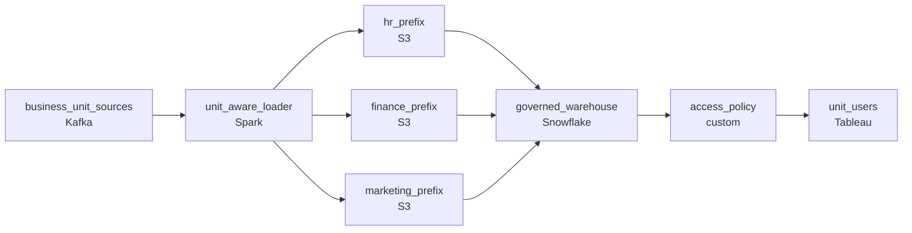

# The Analyst Who Saw the Salary Data
_Two incidents. One shared lake. The access model was never designed, just assumed._

- **Domain:** pipeline_architecture
- **Difficulty:** Hard
- **Est. time:** 30 min
- **URL:** https://datadriven.io/problems/the_analyst_who_saw_the_salary_data

## Problem

We run a multi-tenant data lake shared by five business units with very different sensitivity levels, and everything currently sits in one flat store behind a single shared reader role. Two incidents have already leaked one unit's data to another: an analyst read another unit's files directly, and a misconfigured pipeline wrote into the wrong unit's area. Redesign the lake so each unit gets its own isolated store fed by its own write path, and the few pre-approved cross-unit reads (marketing needs only the customer-dimension columns from finance, not the whole store) are served through a governed query engine sitting between the stores and the analysts that hands back just the approved columns, never blanket access to another unit's store.

**Concepts tested:** `paBatchProcessing`, `paDagOrchestration`, `paDataLake`, `paEnvironmentMgmt`, `paFileIngestion`, `paIdempotency`, `paMonitoring`, `paPartitioning`, `paRetryHandling`, `paTableFormats`

## Requirements

- Two prior incidents already exposed one business unit's data to another, including someone in marketing pulling salary records; the storage layout itself has to keep the units apart, not a single shared lake.
- Marketing legitimately needs the customer dimension and operations needs finance order data; broad direct access for those cases is what failed before, so a governed query engine has to sit between the stores and the consumers and hand back only the approved columns.
- One incident was caused by a pipeline writing into the HR area by mistake; writes have to land only in the unit store they are meant for, so each unit store is fed by its own write path.

## Must-have components

- Application-layer filtering already failed twice; the storage itself has to enforce per-unit access via prefixes / buckets. Without a cold-storage tier there's no surface for file-level access boundaries. Add S3, GCS, or ADLS.
- The pre-approved cross-unit reads need only specific columns, and that column-level visibility has to be enforced at a governed query engine sitting between the stores and the analysts; without a warehouse / governed engine there's nowhere to express that. Add Snowflake, BigQuery, Redshift, Databricks, or equivalent with column-level access controls.

**Expected stages:** `Data Sources` → `Per-Unit Ingestion` → `Isolated Per-Unit Stores` → `Governed Query Engine` → `Analyst & BI Consumers`

## Solution walkthrough

### Why this problem exists in real interviews

Five business units sharing a lake with different sensitivity levels and two prior cross-tenant exposure incidents. The trap is bolting on application-layer filtering after the data is already commingled; what's needed is per-unit storage isolation and write-permission boundaries from ingest.

The default reach is to put everything in one bucket and rely on a single shared reader role plus query-layer filters to keep teams apart. Engineers find ways to read across boundaries via direct API calls; a marketing analyst pulls a salary file because nothing prevents it. A misconfigured pipeline writes into the HR area because the writer credentials had broad permissions.

> **Trick to Solving**
>
> Per-unit prefixes / buckets with read-and-write IAM, mixed-table column policies in the engine, write-scoped pipeline credentials.
>
> 1. Each business unit has its own prefix or bucket; storage-layer policies enforce read access regardless of which path is used.
> 2. Cross-unit legitimate access (marketing reading customer dimension, operations reading finance orders) goes through explicitly granted column-level views in the warehouse rather than blanket prefix access.
> 3. Pipeline credentials are write-scoped to their target prefix; a misconfigured pipeline can't write outside its boundary because the IAM role denies it.

---

### Walk the requirements

**Step 1: Storage-layer isolation prevents cross-unit reads**

Each business unit's data lives in its own prefix or bucket; IAM policies tied to roles enforce read access at the storage layer. A direct API call from a marketing engineer to the HR prefix fails because the storage policy denies it, not because the query engine filtered it. Without a cold-storage tier with per-unit boundaries the access policy lives only in the query layer, which the prior incidents already bypassed.

**Step 2: Mixed legitimate access via column-level views in the warehouse**

Marketing legitimately needs the customer dimension and operations needs finance order data; granting them broad read access on the unit's prefix is what failed before. Instead, the warehouse exposes column-level views with the legitimate columns visible to the cross-unit role; the underlying tables stay restricted. The view limits exposure to exactly what the cross-unit consumer needs. Without a governed query engine the column-level boundary has nowhere to live.

**Step 3: Write-scoped pipeline credentials prevent misconfigured writes**

Each pipeline has writer credentials scoped to the specific prefix it's supposed to write to. A misconfigured pipeline configured to write into another unit's area fails at the IAM boundary, not at code review. Without write-scoped credentials, a one-line config error puts data in the wrong unit's space; with them, the IAM denial catches the mistake before any data lands.

---

### The shape that fits

| node | type | tech | details |
|---|---|---|---|
| business_unit_sources | source | Kafka |  |
| unit_aware_loader | transform | Spark |  |
| hr_prefix | storage | S3 |  |
| finance_prefix | storage | S3 |  |
| marketing_prefix | storage | S3 |  |
| governed_warehouse | storage | Snowflake |  |
| access_policy | quality_gate | custom |  |
| unit_users | consumer | Tableau |  |

> **What this design gives up**
>
> Per-unit prefixes / buckets multiply the storage layout and IAM configuration; column-level views require the cross-unit access patterns to be enumerated and reviewed; write-scoped credentials mean every pipeline has to declare its target prefix and any cross-prefix legitimate write needs explicit grants. Implementation cost is the price; the win is access boundaries that survive direct API calls, mixed legitimate access without broad permissions, and pipeline misconfigurations caught at IAM rather than after data lands.

> **What reviewers check**
>
> A reviewer looks at the canvas for these properties:
> - Per-unit prefixes / buckets with file-level access policies enforce read isolation regardless of path.
> - Cross-unit legitimate access uses column-level policies on shared tables in the warehouse rather than broad prefix access.
> - Pipeline writers have credentials scoped to their target prefix so a misconfigured write can't leak into another unit's area.

> **The mistake that ships**
>
> What gets shipped puts everything in one bucket with a shared reader role and trusts query-layer filtering. A marketing analyst reads salary data via a direct API call because the bucket policy didn't deny them. A pipeline misconfiguration writes into the HR area because the writer's credentials had broad permissions. The eventual rebuild adds per-unit prefixes, column-level views, and write-scoped credentials, each reachable up front if the prior incidents had been treated as 'application-layer filtering doesn't hold.'

---

- **Marketing's legitimate access to the customer dimension needs to expand to include a new column. What in this design lets that happen, and where?**
  - _Tests whether the candidate sees the column-level view as the surface: a new column added to the cross-unit view exposes it to marketing without granting prefix access. The underlying table and the storage prefix don't change; the view does._
- **A new business unit is added. What changes in this design, and what doesn't?**
  - _Tests whether the candidate sees the new unit as a new prefix with new IAM, a new write-scoped pipeline, and any cross-unit legitimate views added. The shared warehouse, the per-unit IAM model, and the write-scoping pattern don't change._
