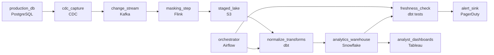

# The Analysts Cannot Touch Production
_Production is the source. Analytics needs its own copy._

- **Domain:** pipeline_architecture
- **Difficulty:** Medium
- **Est. time:** 20 min
- **URL:** https://datadriven.io/problems/the_analysts_cannot_touch_production

## Problem

Our product runs on a transactional database under constant write pressure, and the team that owns it will not allow analytics queries to run against it, so we need a separate warehouse that keeps up with every insert, update, and delete without those reads ever landing on the live database. The source is messy, with the same records spread across several tables under mismatched keys, and raw customer email and phone numbers cannot sit in the warehouse, so everything has to be normalized, combined, and masked before analysts can trust a report. Analysts open their dashboards at 4am, so an orchestrated overnight refresh has to finish before that window and raise an alert if any stage falls behind.

**Concepts tested:** `paBatchProcessing`, `paBatchVsStreaming`, `paCdc`, `paDagOrchestration`, `paDataLake`, `paDataQuality`, `paDeduplication`, `paDependencyMgmt`, `paEltVsEtl`, `paIdempotency`, `paMedallion`, `paMonitoring`, `paSchemaEvolution`

## Requirements

- The product team has refused to let analytics queries hit production; whatever copies the data over can't itself add read load.
- Analysts open dashboards at 4am; the overnight pipeline has to finish before then, so a missed or lagging stage has to page someone, not fail silently.
- Production holds raw customer email and phone; we can't fail a privacy audit on what's stored in the analytics warehouse.

## Must-have components

- Analytics is moving off production onto a separate analytics system; without a warehouse tier, analysts still have nowhere to query. Add a warehouse (Snowflake, BigQuery, Redshift, Databricks).
- The product team has refused to let analytics queries hit production, so replication has to capture changes continuously off the change log without adding read or query load. Add a streaming capture path such as a real-time source (Kafka, Kinesis, or a CDC connector) or a Flink stream that reads changes as they happen.

**Expected stages:** `change_capture` → `raw_staging` → `normalize_and_mask` → `analytics_warehouse` → `bi_dashboards`

## Solution walkthrough

### What this really is

This is continuous change capture dressed up as 'give analytics its own warehouse.' The skill being probed: can you get every insert, update and delete out of a busy transactional database without adding a single read to it? Everyone draws a warehouse and a dashboard. What separates candidates is the arrow on the far left. A scheduled extract that SELECTs from production is still a query, and queries are exactly what the owning team refused. Get that arrow wrong and the DBA blocks the data team at 2am, the extract slides past 4am so analysts open empty dashboards, and a privacy review finds raw email in the warehouse because masking was bolted onto the BI layer.

| Nightly extract | Log-based capture |
|---|---|
| A scheduled job runs `SELECT *` against every table. It is read load by definition, it cannot see a hard-deleted row because the row is gone, and its runtime grows with table size until it no longer fits before 4am. | A connector tails the WAL the database already writes for replication. Zero queries, every insert, update and delete arrives as an event, and the volume tracks the day's changes rather than the 500M-row table. |

### Walk the requirements

**Step 1: Capture changes off the log, not the tables**

The database already writes a change log for its own replicas. A CDC connector reads that log as a separate process and publishes each change to a stream, so the only thing touching production is a log reader the DBA already runs for replication. This is also the only path that carries deletes: a canceled order hard-deleted from `customer_orders` shows up as a delete event instead of silently vanishing.

**Step 2: Mask before anything is stored**

Strip or hash email and phone in the stream consumer before anything is written down. Emails become a stable hash so analysts can still count unique customers; phones become null or last four. If raw values land even in staging, the audit covers them, so the boundary sits upstream of every storage tier.

**Step 3: Stage raw, then normalize and combine**

Masked change events land in a staging lake that is never rewritten. A separate transform then reconciles the mess: collapse the two order tables on `external_order_id`, map `product_sku` onto `product_catalog`, and coerce three date encodings into one. Keeping staging intact means a bad transform is rerun from staging, not re-captured from production.

**Step 4: Orchestrate the build and page on a miss**

The orchestrator sequences the build and a freshness check runs after the warehouse load. If the check fails or a task overruns, it pages on-call hours before 4am, not when an analyst files a ticket. Without that edge into an alerting consumer, a late load looks exactly like a healthy one until someone opens a dashboard.

### The reference design

| node | type | tech | details |
|---|---|---|---|
| production_db | source | PostgreSQL |  |
| cdc_capture | source | CDC |  |
| change_stream | queue | Kafka |  |
| masking_step | transform | Flink |  |
| staged_lake | storage | S3 |  |
| orchestrator | transform | Airflow |  |
| normalize_transforms | transform | dbt |  |
| analytics_warehouse | storage | Snowflake |  |
| freshness_check | quality_gate | dbt tests |  |
| analyst_dashboards | consumer | Tableau |  |
| alert_sink | consumer | PagerDuty |  |

> **The log is already being written**
>
> Production already writes its WAL so replicas can follow along. Reading that log costs the database nothing it is not already spending, which is why it is the only capture that satisfies a team that said no queries at all.

> **Masking at the dashboard is not masking**
>
> Candidates who mask in Tableau leave raw email in a Snowflake table any analyst can reach with a SQL client. The audit covers what is stored, not what is displayed, so masking in the BI tool fixes nothing.

> **The edge out of production is the tell**
>
> Interviewers look first at every edge leaving `production_db`. If anything besides a log reader connects to it, the rest of the design barely matters. The second look is whether any storage tier upstream of the masking step could hold raw PII.

> **The cost is a slot to babysit**
>
> Log-based capture means operating a connector and a replication slot; an unconsumed slot makes the WAL grow on production disk, so connector lag needs its own alert. Hashing email is one-way, so the warehouse can never recover a raw value. For 1M inserts and 200K updates a day the stream is small, and the nightly build reads a day of changes instead of 500M rows.

- **A NOT NULL column appears on a production table with no warning. What does the connector do, and what breaks downstream?**
  - _Tests whether additive columns flow into `staged_lake` untouched and whether `normalize_transforms` is written to tolerate them instead of failing the 4am build._
- **`customer_orders_legacy` stops receiving rows and is later dropped. How do historical legacy-only orders survive?**
  - _Tests whether the candidate leans on the preserved staging tier as the permanent record rather than the source table._
- **An analyst needs a raw email to debug one customer. Where do they go?**
  - _Tests whether the privacy boundary holds: the lookup goes through an audited path to production, never the warehouse._
