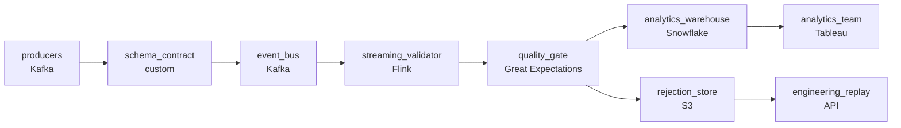

# The Bad Row That Broke the Dashboard
_Bad records cannot reach the warehouse._

- **Domain:** pipeline_architecture
- **Difficulty:** Medium
- **Est. time:** 20 min
- **URL:** https://datadriven.io/problems/the_bad_row_that_broke_the_dashboard

## Problem

We run a high-volume application event stream that has to reach Snowflake for analytics within about a minute of arrival, and past releases have let bad records into production tables and broken dashboards, so quality has to be enforced in-flight before anything lands. Records that fail validation can't be silently dropped: they need to be held aside with enough context for engineering to trace the root cause and replay them once it's fixed. Product teams reshape their event fields most weeks, so an incompatible producer change has to be rejected against a registered schema contract right at the source, before it enters the pipeline, rather than allowed to crash it or corrupt downstream tables. Design the streaming pipeline.

**Concepts tested:** `paBatchVsStreaming`, `paDataQuality`, `paDeadLetterQueue`, `paEventDriven`, `paEventPlatforms`, `paIdempotency`, `paMonitoring`, `paRetryHandling`, `paStreamProcessing`

## Requirements

- Past releases let bad records into production tables and broke dashboards; validation has to happen before anything lands.
- Records that fail validation must be held aside for engineering to fix and replay, not silently dropped.
- Streaming events have to reach the warehouse within about a minute of arrival, with the quality decision made in the same window.
- Product teams reshape event fields about every week; a producer change can't crash the pipeline or corrupt downstream tables.

## Must-have components

- Bad records can't reach production tables; validation has to be enforced before promotion. Without a quality-check tier (Great Expectations, dbt tests, Soda, Monte Carlo) there's no place to enforce that contract. Add a quality-gate node before the warehouse load.
- Events have to land in the warehouse within roughly a minute, validated; that's a streaming workload, not a slow batch. Add a streaming layer or set SLA Freshness to real-time / < 1min on the validator.

**Expected stages:** `kafka_ingestion` → `schema_registry` → `spark_stream_processor` → `validation_layer` → `quarantine_store` → `snowflake_sink`

## Solution walkthrough

### Why this problem exists in real interviews

Streaming quality enforcement with four properties that have to fit together: validation before promotion, recoverable rejection so engineering can replay, sub-minute end-to-end, and a producer contract that catches schema changes upstream. The trap is letting bad records through 'just to keep the pipeline moving' or letting validation block all events on a single bad row.

The default reach is a streaming load that writes everything and 'fixes' bad rows in a downstream cleanup. The first malformed event corrupts a dashboard; the team adds a parser fix; another field changes a week later and the same thing happens. Rejected records get logged to a file nobody reads. Producers ship a breaking schema change because the wiki page about discipline didn't catch it.

> **Trick to Solving**
>
> Validate in-stream before promotion, route failures to a recoverable store, enforce the schema contract at publish, do all of it inside the minute.
>
> 1. An in-stream quality gate validates each record (schema, types, business rules) before any write to the production warehouse; failures route to a recoverable store with the original payload and failure reason.
> 2. The producer publishes through a schema contract; an incompatible change is rejected at publish, before consumers see it.
> 3. End-to-end stays inside the minute: streaming consumer, validator, warehouse load all run in a continuous flow.
> 4. An orchestrator monitors validation pass-rate and rejection backlog; sustained spikes alert before they pile up.

---

### Walk the requirements

**Step 1: Validate before promotion; bad records never reach the warehouse**

An in-stream quality gate runs schema, type, and business-rule checks on each record before the warehouse load. Records that pass write to the production table; records that fail route to a rejection store with the failure reason. Dashboards read only from validated rows. Without a quality-check tier the validation has no place to live; without a streaming tier the validation can't keep up with sub-minute events.

**Step 2: Rejected records stay recoverable for replay**

Each rejection writes the original payload and the failure reason to a rejection store keyed on event id and timestamp. Engineering queries the store to find rejected records, traces the root cause (parser bug, producer change, business-rule mismatch), fixes upstream, and replays the affected events back through the pipeline. Logging rejections to a file is the version where they disappear into ops; the rejection store is what makes recovery a workflow.

**Step 3: Sub-minute end-to-end including validation**

Events flow through a streaming consumer, the validator, and into the warehouse within the minute. The validator is part of the streaming path, not a downstream batch; the warehouse load reads only validated rows. A 'load first, validate later' design is the version where bad data is briefly in production and downstream consumers see it. In-stream validation is what closes the gap.

**Step 4: Schema contract at the bus catches producer changes at publish**

Product teams add and remove fields weekly. The bus's schema-contract layer rejects publishes that don't conform to the contract; producers find out at publish time, not when consumers crash at midnight. An additive change (new optional field) is allowed through compatibility rules; a breaking change is rejected. Without the contract every producer release is a coordination tax on every consumer.

---

### The shape that fits

| node | type | tech | details |
|---|---|---|---|
| producers | source | Kafka |  |
| schema_contract | quality_gate | custom |  |
| event_bus | queue | Kafka |  |
| streaming_validator | transform | Flink |  |
| quality_gate | quality_gate | Great Expectations |  |
| rejection_store | storage | S3 |  |
| analytics_warehouse | storage | Snowflake |  |
| analytics_team | consumer | Tableau |  |
| engineering_replay | consumer | API |  |

> **What this design gives up**
>
> An in-stream quality gate runs validation on every record, which costs CPU; the rejection store grows with the failure rate; the schema contract requires producers to integrate with the registry. Implementation cost is the price; the win is dashboards that don't break, rejected records engineering can replay, and producer changes that don't surprise consumers.

> **What reviewers check**
>
> A reviewer looks at the canvas for these properties:
> - An in-stream quality gate validates each record before promotion to the production warehouse.
> - Rejected records preserve the original payload and the failure reason in a recoverable store that supports replay.
> - A streaming pipeline lands records and decisions inside the minute.
> - A schema-contract layer at the bus rejects incompatible producer changes at publish time.

> **The mistake that ships**
>
> What gets shipped writes everything to the warehouse and runs a downstream cleanup for bad rows. The first dashboard breaks within a week. Rejection logs go to a file nobody reads. Producers ship a breaking schema change and downstream consumers crash at midnight. The eventual rebuild adds in-stream validation, a recoverable rejection store, and the schema contract, each was reachable up front if 'we won't have quality issues again' had been treated as a contract rather than a hope.

---

- **A new business rule has to validate one new field; the rest of the pipeline can't change. What in this design lets the rule ship safely?**
  - _Tests whether the candidate sees the quality gate as the extension point: a new validation rule deploys to the gate, runs against new and recent records, and the rejection store flags any failures. The schema contract, the streaming consumer, and the warehouse don't change. The rule can also run in shadow mode (logging without rejecting) before going live._
- **Engineering replays a batch of rejected records after fixing the root cause. What does the design do to ensure the warehouse doesn't end up with duplicates or stale rows?**
  - _Tests whether the candidate sees that the warehouse's load is idempotent on event id; the replay re-emits records and the upsert merges them in cleanly. The rejection store records the resolution so the same record isn't replayed twice. The dedup contract is at the warehouse, not 'whatever the replay tool remembers.'_
