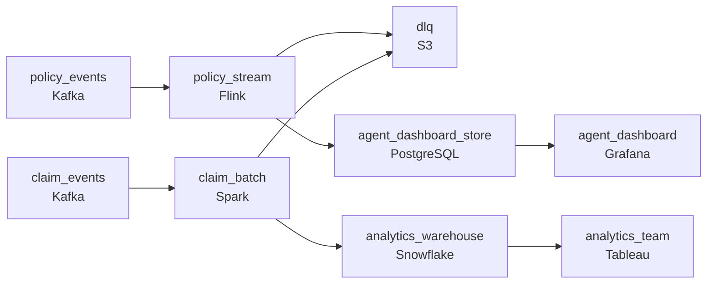

# The Binding and the Claim
_Policies are instant. Claims take their time._

- **Domain:** pipeline_architecture
- **Difficulty:** Medium
- **Est. time:** 20 min
- **URL:** https://datadriven.io/problems/the_binding_and_the_claim

## Problem

Our insurance platform generates two classes of events: synchronous policy transactions (bindings, endorsements, cancellations) that need immediate confirmation, and asynchronous claim events that are processed in the background. Right now both go through the same database tables and the analytics team can't query them without hitting production. Design an event-driven pipeline that handles both correctly.

**Concepts tested:** `paBatchProcessing`, `paBatchVsStreaming`, `paDagOrchestration`, `paDeadLetterQueue`, `paDeduplication`, `paEventDriven`, `paEventPlatforms`, `paIdempotency`, `paLambdaArch`, `paLateData`, `paMedallion`, `paMonitoring`, `paPartitioning`, `paRetryHandling`, `paStreamProcessing`

## Requirements

- Agents check live policy counts on their dashboard and need bindings or cancellations to show up within minutes; claims analytics tolerates more.
- State regulators want the moment a policy was bound to be the timestamp on the record, not when our pipeline got around to processing it.
- A small share of legacy claim events arrive malformed and each one is a real customer claim we can't lose.

## Must-have components

- The architecture is event-driven by name; synchronous policy events and asynchronous claim events flow through queues to consumers. Without a message queue / log tier there's no event backbone. Add Kafka, Kinesis, Pub/Sub, or an equivalent event bus.
- Policy events need to land in agent dashboards within minutes; claim events tolerate longer. Show at least one streaming path and one batch path so each event class flows on the right cadence.

**Expected stages:** `policy_event_stream` → `claim_event_queue` → `stream_processor` → `staging_area` → `analytics_warehouse`

## Solution walkthrough

### Why this problem exists in real interviews

Two event classes with different latency budgets going through the same database tables is the named problem. The trap is treating it as 'just split into two streams.' The harder questions are time semantics (regulators want the application's timestamp, not the pipeline's) and recovery (a malformed claim is a real customer claim that can't be lost). Both invalidate naive solutions.

Most candidates put both event classes on Kafka and have a stream processor write everything into a warehouse. Agents see policy events fast; claim events go through the same fast path and pay for streaming compute they don't need. The pipeline stamps every record with `processed_at`, which is what the warehouse uses for queries; a regulator asks 'when was this binding effective' and the answer is the pipeline's clock, not the agent's. A malformed claim hits the consumer, the consumer fails, and either the topic backs up or the bad event gets dropped.

> **Trick to Solving**
>
> Two event classes, two paths sized to the consumer; carry the event time through; bad events go to a DLQ for replay, never to the floor.
>
> 1. Two paths off one event bus: a streaming path for policy events, a batch path for claim events. The bus is the source of truth; consumers replay from it.
> 2. Every event carries the application's `event_time`; the pipeline preserves it on every hop. The warehouse partitions and queries on `event_time`, never on processing time.
> 3. Malformed events go to a DLQ with the rejection reason. The good events keep moving; a separate triage process replays the DLQ when the upstream is fixed.

---

### Walk the requirements

**Step 1: Two paths off one event bus, sized for two consumers**

Policy events (binding, endorsement, cancellation) flow through a streaming consumer that updates the agent dashboard within minutes. Claim events flow through a batch consumer that lands in the warehouse on a slower cadence. Both come off the same bus; the bus is the source of truth. Without the bus there's no fan-out point, and analytics is back to querying production. Without two cadences either claims pay streaming prices or policy events sit in the batch queue.

**Step 2: Carry `event_time` through every hop**

Each event is stamped with the application's `event_time` at the source. The pipeline preserves `event_time` end-to-end and the warehouse partitions and queries on `event_time`, not on the timestamp the row landed. A regulator asking 'when was this policy bound' gets the agent's clock, which is what the regulator means. Replacing `event_time` with `processed_at` corrupts every audit and every after-the-fact analysis; the fix is in the pipeline contract, not in trying to reconstruct it later.

**Step 3: Malformed events to a DLQ, replayable independently**

A small share of legacy claim events arrive malformed and each one is a real customer claim. The consumer routes those events to a dead-letter queue with the rejection reason; the rest of the file or topic continues. A separate triage process examines the DLQ on its own schedule, fixes the upstream issue or the parser, and replays only the affected events. Letting a malformed event halt the consumer is the version that backs up the topic; silently dropping it is the version that loses claims.

---

### The shape that fits

| node | type | tech | details |
|---|---|---|---|
| policy_events | source | Kafka | parallelism: 8 partitions |
| claim_events | source | Kafka | parallelism: 8 partitions |
| policy_stream | transform | Flink | errorAction: dlq; slaFreshness: real-time; idempotencyStrategy: upsert |
| claim_batch | transform | Spark | errorAction: dlq; slaFreshness: < 1h |
| dlq | storage | S3 | monitorAlert: DLQ depth above expected baseline |
| agent_dashboard_store | storage | PostgreSQL | slaFreshness: < 1min |
| analytics_warehouse | storage | Snowflake | slaFreshness: < 1h; backfillStrategy: partition_overwrite |
| agent_dashboard | consumer | Grafana | slaFreshness: < 1min |
| analytics_team | consumer | Tableau | slaFreshness: < 1h |

> **What this design gives up**
>
> Two consumer paths means two pieces of operational machinery instead of one big consumer. Carrying `event_time` through every hop is a contract that has to be enforced (and tested) on every transform. A DLQ adds a triage workflow somebody has to actually run. Pipeline simplicity is what gets sacrificed; in return, two latency budgets sized correctly, time semantics regulators recognize, and a recovery path for the events that the original pipeline silently loses.

> **What reviewers check**
>
> A reviewer looks at the canvas for these properties:
> - An event bus sits between producers and the two consumer paths, decoupling them.
> - A streaming path serves the agent dashboard within a minute; a batch path serves analytics on a slower cadence.

> **The mistake that ships**
>
> The shape that ships puts both event classes on one stream into one consumer that writes to one warehouse, with `processed_at` as the canonical timestamp. Agents are happy. A state regulator asks for the binding time on a policy and the warehouse returns the pipeline's clock; the audit answer is wrong by minutes that matter. A malformed claim halts the consumer; the team's quick fix drops the bad event and a customer's claim disappears. The team rebuilds with two paths, `event_time` preservation, and a DLQ. The customer's claim is gone, the regulator's audit has a discrepancy, and the team is rebuilding the contract for `event_time` end-to-end.

---

- **An event arrives with an `event_time` from a year ago because of a clock skew on the source. What does this design do, and what should it do?**
  - _Tests whether the candidate sees event-time validation at ingest: timestamps wildly outside the expected window go to the DLQ for review rather than being trusted. The pipeline preserves `event_time`, but the validator can refuse to write a row with an implausible one._
- **A DLQ replay produces an event that's already in the warehouse from a successful prior load. What protects you from double-writing?**
  - _Tests whether the candidate's downstream sinks are idempotent on a stable event id. Replay re-emits events; idempotent upsert sinks merge them in cleanly without duplicating, which is why the dedup contract has to be at the sink and not 'whatever the consumer remembers.'_
