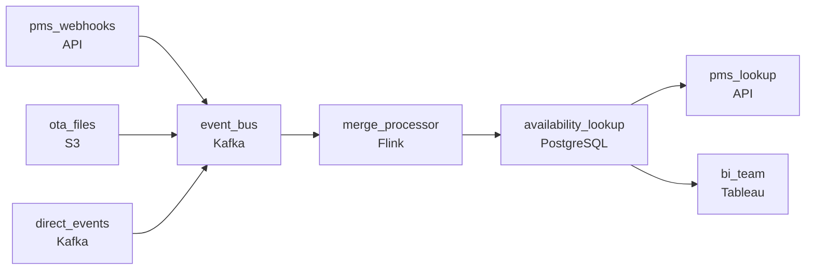

# The Booking That Came Three Ways
_PMS, OTA, and website all think they took the reservation first._

- **Domain:** pipeline_architecture
- **Difficulty:** Hard
- **Est. time:** 30 min
- **URL:** https://datadriven.io/problems/the_booking_that_came_three_ways

## Problem

Your hospitality platform receives booking events from three distinct source systems, each with different delivery mechanisms, update frequencies, and data formats. All events must land in a low-latency lookup store queryable by property and date. Design the ingestion, normalization, and write strategy.

**Concepts tested:** `paApiIngestion`, `paBackfill`, `paBatchProcessing`, `paBatchVsStreaming`, `paCompression`, `paDagOrchestration`, `paDataLake`, `paDataQuality`, `paDeduplication`, `paDependencyMgmt`, `paEltVsEtl`, `paEventDriven`, `paEventPlatforms`, `paFileIngestion`, `paFullVsIncremental`, `paIdempotency`, `paLateData`, `paMedallion`, `paMonitoring`, `paPartitioning`, `paRetryHandling`, `paScdPipeline`, `paSchemaEvolution`, `paSmallFiles`, `paStreamProcessing`, `paTableFormats`

## Requirements

- When a hotel's PMS confirms a booking, availability has to update right away or the next customer can book the same room.
- Concurrent writes for the same property and date can't result in two bookings winning the same room.

## Must-have components

- PMS confirmations have to reach the lookup store in under a minute so the next customer doesn't book an already-taken room. Add a streaming processing stage on that path, or set SLA Freshness to real-time or < 1min on the processing node.
- Three sources (PMS webhooks, OTA files, direct events) feed a shared lookup; without a queue or log tier in the middle there's no buffer or fan-in point for ordered processing. Add Kafka, Kinesis, Pub/Sub, or equivalent.

**Expected stages:** `Source Layer` → `Ingestion Layer` → `Processing Layer` → `Storage Layer` → `Serving Layer`

## Solution walkthrough

### Why this problem exists in real interviews

Three sources feeding one availability lookup, with a sub-second latency budget for PMS confirmations and a concurrency-resolution rule that has to keep two customers from booking the same room. The trap is treating it as a fan-in problem and discovering that the lookup serves BI's range queries plus the PMS's point queries, which want different layouts.

The default reach is a queue that fans in all three sources and writes them to a shared lookup keyed on (property, date). Two concurrent writes for the same key both succeed and the next BI report shows two bookings for the same room. Range queries from BI scan through every property's data because the layout was sized for point lookups. PMS confirmations take seconds to update because the writes are batched.

> **Trick to Solving**
>
> Streaming PMS path with sub-second writes, concurrency control on the same key, layout that serves both point and range queries.
>
> 1. PMS confirmations ride a streaming path with sub-second end-to-end; the lookup updates within hundreds of milliseconds.
> 2. Concurrency resolution on the same (property, date) key uses a deterministic merge or single-writer-per-key contract; concurrent writes don't both win.
> 3. The lookup store partitions by property and clusters by date so range queries scan a slice while point lookups hit the right partition fast.
> 4. A queue between sources and the lookup buffers fan-in and orders writes per key.

---

### Walk the requirements

**Step 1: PMS confirmations update availability within hundreds of milliseconds**

PMS webhooks ride a streaming path through a queue into a stream processor that updates the availability lookup. End-to-end stays under the budget so the next customer attempting the same room sees the updated availability. Without a streaming tier the path can't make that budget; without a queue between PMS and the lookup there's no buffer for bursts and no fan-in point for the other two sources.

**Step 2: Concurrent writes resolve deterministically per (property, date)**

Two sources can write the same property-and-date concurrently. The processor partitions on the (property, date) key so writes for the same room serialize on one worker; the merge applies a deterministic rule (PMS authoritative on confirmations, OTA authoritative on cancellations, etc.) so concurrent writes resolve to one winner. A 'last-write-wins' shortcut is the version where two customers both think they have the room; per-key serialization plus precedence is the contract.

**Step 3: Layout serves point lookups and BI range queries**

The PMS reads point lookups (one property, one date) at sub-second latency; BI reads ranges (one property over a date range, or a region over a quarter). The lookup store partitions by property and clusters by date so point lookups land in one partition and ranges scan a clustered slice. A 'one big table' layout is the version where range queries scan everything as the dataset grows; partition + cluster keeps both query shapes fast.

---

### The shape that fits

| node | type | tech | details |
|---|---|---|---|
| pms_webhooks | source | API |  |
| ota_files | source | S3 |  |
| direct_events | source | Kafka |  |
| event_bus | queue | Kafka | parallelism: 16 partitions |
| merge_processor | transform | Flink | parallelism: 16 partitions; slaFreshness: real-time; idempotencyStrategy: upsert |
| availability_lookup | storage | PostgreSQL | slaFreshness: < 1min |
| pms_lookup | consumer | API | slaFreshness: real-time |
| bi_team | consumer | Tableau | slaFreshness: < 1h |

> **What this design gives up**
>
> Per-key serialization caps the throughput per partition; the precedence rule between sources is configuration that has to be reviewed when business semantics change; the partition + cluster layout commits the table to a query pattern. Implementation cost is the price; the win is no double-bookings, sub-second PMS confirmations, and BI ranges that don't degrade as the dataset grows.

> **What reviewers check**
>
> A reviewer looks at the canvas for these properties:
> - A streaming path takes PMS confirmations to the availability lookup within hundreds of milliseconds.
> - Concurrent writes to the same property and date resolve deterministically; no two bookings can win the same room.
> - The lookup store's layout serves BI range queries and PMS point queries efficiently.
> - A queue / log fans in the three sources with ordered processing per key.

> **The mistake that ships**
>
> What gets shipped fans the three sources into a shared write path with last-write-wins on the (property, date) key. Concurrent writes both succeed and two customers think they have the same room. PMS confirmations batch through a slow loader and the next customer's check returns stale availability. Range queries from BI degrade as the dataset grows. The eventual rebuild adds streaming, per-key serialization with precedence, and the partition + cluster layout.

---

- **A property's PMS goes offline and OTA continues sending bookings. What does this design do, and what does the BI team see?**
  - _Tests whether the candidate sees the precedence rule still applying: OTA's bookings continue to land per the rule, but PMS-only confirmations stall during the outage. BI sees the OTA-side data and a freshness flag on the PMS-side. The merge doesn't accept OTA writes that would conflict with absent PMS confirmations beyond a tolerance._
- **BI wants a quarter's worth of bookings across all properties in one query. What in this design supports that, and where?**
  - _Tests whether the candidate sees that range queries scan across partitions; the cluster on date keeps the bytes scanned bounded; very wide queries may need a separate analytics warehouse fed from the lookup or the archive. The lookup is sized for point lookups and per-property ranges, not the entire dataset._
