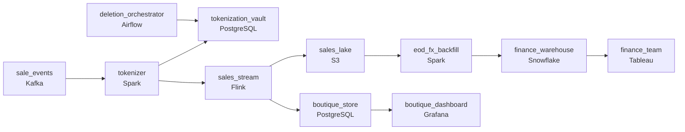

# The Boutique That Sold in Six Currencies
_Every sale is real. The rate it was converted at depends on who is asking._

- **Domain:** pipeline_architecture
- **Difficulty:** Hard
- **Est. time:** 30 min
- **URL:** https://datadriven.io/problems/the_boutique_that_sold_in_six_currencies

## Problem

Your luxury marketplace processes sales events from thousands of seller boutiques across multiple countries and currencies. Each sale must be attributed to the selling boutique in real time, normalized to a common currency, and stored in a compliant data lake that protects buyer identity. Design the pipeline.

**Concepts tested:** `paApiIngestion`, `paBatchVsStreaming`, `paBroadcastJoin`, `paColumnarVsRow`, `paCompression`, `paCostOptimization`, `paDagOrchestration`, `paDataQuality`, `paDeduplication`, `paDistributedPrimitives`, `paEltVsEtl`, `paEventDriven`, `paEventPlatforms`, `paIdempotency`, `paLateData`, `paMedallion`, `paMonitoring`, `paPartitioning`, `paRetryHandling`, `paSchemaEvolution`, `paStreamProcessing`

## Requirements

- Boutique owners watch their revenue in real time during the day; a sale has to show up within roughly a minute.
- The dashboard uses live FX rates while finance reconciles using end-of-day official rates; each sale has to carry both so neither consumer reprocesses history.
- Buyer identity is regulated; deletion has to complete within the regulatory window, but historical sale amounts and boutique attribution should remain.

## Must-have components

- Boutique owners watch their revenue in real time during the day; a sale has to show up within roughly a minute. Add a streaming layer on the sale path or set SLA Freshness to real-time / < 1min on the boutique-attribution stage.
- Finance reconciles overnight with end-of-day FX rates from a warehouse; without a warehouse tier there's nowhere for the reconciled fact. Add Snowflake, BigQuery, Redshift, or Databricks.

**Expected stages:** `Source Layer` → `Ingestion Layer` → `Processing Layer` → `Storage Layer` → `Serving Layer`

## Solution walkthrough

### Why this problem exists in real interviews

A real-time boutique dashboard plus finance reconciliation plus regulated buyer-identity deletion that has to leave sale and attribution intact. The trap is one FX rate carried per row that one consumer or the other always has to reprocess, or storing buyer identity in a way deletion can't reach without taking the whole row with it.

The default reach is one stream that converts each sale to USD using the live rate and writes one row. Boutique owners get fresh revenue. Finance reconciles end-of-month and the numbers diverge from the official-rate report; the team backfills the official rate in a downstream view. A buyer deletion request lands and the team realizes it has to remove the buyer's identity from rows that finance still needs for reconciliation; the design didn't separate the two.

> **Trick to Solving**
>
> Carry both live and official FX on the row; tokenize the buyer identifier separately from the sale; deletion removes the identifier without removing the sale.
>
> 1. Each sale row carries the original currency, the live FX rate at sale-time, and an empty official-rate column the end-of-day batch backfills. Both consumers read what they need without reprocessing history.
> 2. Buyer identity is a token on the sale row; the mapping from token to buyer lives in a separate restricted store with its own retention.
> 3. Deletion removes the buyer's row from the mapping store; the sale row keeps the token, the boutique attribution, and the amounts intact.

---

### Walk the requirements

**Step 1: Boutique sales appear within a minute**

Sales flow through a streaming consumer that lands them in the boutique-dashboard store within a minute. Boutiques read fresh revenue. Without a streaming tier the dashboard is too slow; without a warehouse anchor finance has nowhere to reconcile.

**Step 2: Both FX rates on the row, no reprocessing**

Each sale row stores the original-currency amount, the live FX rate at sale-time (for the dashboard's USD conversion), and the end-of-day official rate (filled in by the end-of-day batch). The dashboard reads live; finance reads official; neither has to reprocess history when the other consumer's rate changes. Carrying one rate is the version where the other consumer always disagrees by enough to matter; carrying both is the contract that makes both views correct.

**Step 3: Buyer deletion removes the identity, not the sale**

Buyer identity tokenizes at ingest; the mapping from buyer to token lives in a restricted store with its own retention and access. The sale row carries the token, the boutique attribution, and the amounts. Deletion within the regulatory window removes the buyer's mapping; the sale row stays intact for finance and boutique reporting because it never held the buyer's identifying values. A 'delete the row entirely' approach is the version where finance loses its reconciliation history every time a deletion arrives.

---

### The shape that fits

| node | type | tech | details |
|---|---|---|---|
| sale_events | source | Kafka |  |
| tokenizer | transform | Spark | errorAction: alert |
| tokenization_vault | storage | PostgreSQL |  |
| sales_stream | transform | Flink | slaFreshness: real-time; idempotencyStrategy: upsert |
| boutique_store | storage | PostgreSQL | slaFreshness: < 1min |
| sales_lake | storage | S3 | backfillStrategy: partition_overwrite |
| eod_fx_backfill | transform | Spark | slaFreshness: < 24h |
| finance_warehouse | storage | Snowflake | slaFreshness: < 24h |
| deletion_orchestrator | transform | Airflow | errorAction: alert; monitorAlert: Buyer deletion past regulatory window |
| boutique_dashboard | consumer | Grafana | slaFreshness: < 1min |
| finance_team | consumer | Tableau | slaFreshness: < 24h |

> **What this design gives up**
>
> Carrying two FX rates per row roughly doubles the financial column width; the tokenization mapping is a separate restricted store to operate; the deletion path runs against the mapping rather than the sale fact. Implementation cost is the price; the win is real-time boutique revenue, finance reconciliation that doesn't reprocess history, and deletion that doesn't take attribution with it.

> **What reviewers check**
>
> A reviewer looks at the canvas for these properties:
> - A streaming path lands sales in the boutique dashboard within roughly a minute.
> - Each sale row carries both the live FX rate and the end-of-day official FX rate; neither consumer has to reprocess history.
> - Buyer identity is tokenized; deletion removes the buyer-to-token mapping while sale and attribution rows stay intact.
> - A warehouse anchors finance reconciliation against end-of-day official rates.

> **The mistake that ships**
>
> What gets shipped converts sales to USD with one live rate and writes the buyer identifier on the row. Finance reconciles end-of-month and disagrees with the official-rate report; the team backfills the official rate downstream every reconciliation. A buyer deletion request lands and the team realizes the sale rows hold buyer identifying data finance still needs for reconciliation. The eventual rebuild adds dual FX on the row, tokenization at ingest, and a separate deletion path against the vault.

---

- **End-of-day FX rates restate retroactively (a settlement correction). What in this design lets finance pick up the correction without reprocessing?**
  - _Tests whether the candidate sees that the FX rate's restate updates the rate table; finance's view joins sale rows to the rate table by date and the corrected rate flows through. The sale rows themselves don't change; the rate table is the variable._
- **A buyer's deletion is requested but they have an open dispute on a recent sale. What does this design do, and how is the audit answered?**
  - _Tests whether the candidate sees that deletion is bounded by legal hold: the mapping stays in the vault for the dispute's lifecycle, with the regulatory deletion window paused. The sale row continues to exist with the token; the audit response shows the open hold._
