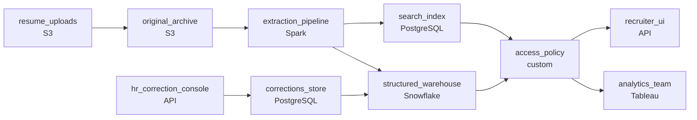

# The Bucket Full of Resumes
_A thousand resumes. Structured data inside each one._

- **Domain:** pipeline_architecture
- **Difficulty:** Medium
- **Est. time:** 20 min
- **URL:** https://datadriven.io/problems/the_bucket_full_of_resumes

## Problem

Our HR platform receives thousands of resumes monthly as PDFs and scanned images. Right now they sit in an S3 bucket and searching them means opening files manually. We need a pipeline that extracts structured information from every document - candidate name, skills, work history, education - and makes it queryable. Design the end-to-end ingestion and extraction pipeline.

**Concepts tested:** `paBatchProcessing`, `paDagOrchestration`, `paDataLake`, `paDataQuality`, `paDeduplication`, `paEventDriven`, `paFileIngestion`, `paIdempotency`, `paMonitoring`, `paPartitioning`, `paRetryHandling`, `paScdPipeline`, `paSchemaEvolution`, `paTableFormats`

## Requirements

- Today every resume is on a shared drive and finding anything means opening files manually; recruiters need search.
- Recruiters filter by specific skills, by years of experience, and by highest degree; full-text search alone doesn't let them filter on those structured fields.
- When HR corrects a wrongly-extracted field, that correction has to stick; a future reprocessing run can't quietly overwrite it.
- Resumes contain personal data; only authorized HR users may see PII, and analytics on skills must work without exposing it.

## Must-have components

- The original PDFs and scans have to be preserved alongside the extracted text. Without a cold-storage / blob layer for the raw documents there's nowhere to keep them. Add S3, GCS, ADLS, or equivalent.
- Recruiters filter by skills, experience, and degree alongside full-text search; that needs a structured store, not just an unstructured archive. Add a warehouse / structured-DB tier so structured queries work alongside search.

**Expected stages:** `document_ingestion` → `ocr_extraction` → `nlp_structuring` → `candidate_index` → `search_serving`

## Solution walkthrough

### What this really is

This is a reprocessing problem dressed up as resume search. Anyone can draw OCR feeding a search index. The real question is what happens on the **second** extraction run. The model will improve, every resume will be re-extracted, and a pipeline that writes straight over its last output silently erases every field HR fixed by hand. The same one-store reflex breaks the other two asks. Recruiters cannot filter on 'five plus years' over raw text, and analysts querying that store pull names along with skills.

> **Only extraction is allowed to be wrong**
>
> Split the system by who owns the truth. The originals are immutable and live in cold storage. Extraction is a disposable, rerunnable layer computed from them. HR corrections are a separate store that always outranks extraction. Once those three are separate, reprocessing becomes safe by construction.

### Walk the requirements

**Step 1: Archive originals before extracting anything**

Uploads land in `original_archive` on S3 and are never mutated. Extraction reads from the archive, so a better model means a rerun, not a re-upload. Failed parses go to a dead letter path instead of blocking the batch, which keeps recruiters within hours of upload.

**Step 2: Emit text and typed fields from one pass**

Each resume yields full text for the search index and typed rows for the warehouse: skills as a list, experience as a number, degree as an enum, all keyed on `resume_id`. The recruiter API combines index hits with warehouse filters. Without typed fields, 'five years of experience' turns into a regex.

**Step 3: Overlay corrections, never overwrite**

HR edits write to `corrections_store`, keyed on (`resume_id`, field). The served view coalesces correction over extraction. A rerun replaces extraction output idempotently through a staging table, leaves corrections untouched, and the corrected value still wins.

**Step 4: Enforce PII at the platform**

Role policies on the warehouse grant recruiters the PII columns. Analytics reads a de-identified view that exposes only skills, experience and degree. The boundary holds no matter how a query is written.

### The reference design

| node | type | tech | details |
|---|---|---|---|
| resume_uploads | source | S3 |  |
| original_archive | storage | S3 | backfillStrategy: incremental |
| extraction_pipeline | transform | Spark | errorAction: dlq; idempotencyStrategy: staging_table |
| search_index | storage | PostgreSQL | slaFreshness: < 1h |
| structured_warehouse | storage | Snowflake | slaFreshness: < 1h |
| corrections_store | storage | PostgreSQL |  |
| access_policy | quality_gate | custom | errorAction: alert |
| recruiter_ui | consumer | API | slaFreshness: < 1h |
| hr_correction_console | consumer | API |  |
| analytics_team | consumer | Tableau | slaFreshness: < 24h |

| Overwrite on rerun | Overlay corrections |
|---|---|
| Extraction writes its output straight into the served table. HR fixes a skill, the model reruns, and the fix is gone. Nobody notices until a recruiter does. | Extraction and corrections live apart. The served value is `COALESCE(correction, extracted)`. Reruns are free to replace extraction output because they never touch `corrections_store`. |

> **Search-only ships first, then gets rebuilt**
>
> The version that ships first OCRs once, discards the PDFs and dumps text into an index. Six months later the team bolts on the archive, the typed warehouse, the correction layer and the PII view, each under pressure. All four were visible in the prompt on day one.

> **Say the precedence rule out loud**
>
> Strong candidates state who wins when a correction and a rerun disagree before anyone asks. Weak candidates draw a corrections table and leave the merge unspecified, which is the whole problem.

- **A new model now agrees with an HR correction. What does the recruiter see, and should the correction be kept?**
  - _Tests the precedence layer: the value is unchanged, and pruning redundant corrections is optional cleanup._
- **Analytics wants a count of candidates with one skill in one small city. What stops re-identification?**
  - _Tests de-identification beyond dropping names: a minimum cohort size on the analytics view._
