# The Carrier Moving to Azure
_Claims arrive messy. The medallion cleans them up._

- **Domain:** pipeline_architecture
- **Difficulty:** Medium
- **Est. time:** 10 min
- **URL:** https://datadriven.io/problems/the_carrier_moving_to_azure

## Problem

We are an insurance carrier migrating our claims and policy data platform to Azure Databricks. We have three source systems feeding claims, policy, and premium data into our warehouse, and we need a governed medallion architecture with proper access controls for actuarial, finance, and regulatory teams. Design the platform architecture including how you would configure the storage layers and enforce access policies.

**Concepts tested:** `paDagOrchestration`, `paDataQuality`, `paEltVsEtl`, `paFullVsIncremental`, `paIdempotency`, `paMedallion`, `paMonitoring`, `paPartitioning`, `paScdPipeline`

## Requirements

- Actuarial sees loss ratios but never claimant identifiers, finance sees premium aggregates without claim detail, regulators see statutory fields, and adjusters see only their own queue.
- Actuarial works on prior-day data, finance reconciles by 9am, the claims dashboard refreshes within minutes, and a high-severity claim has to alert quickly.
- Once a quarterly statutory filing has gone in, the underlying data can't quietly change; corrections have to be amendments, not overwrites.

## Must-have components

- The medallion architecture for actuarial, finance, and regulatory consumers lives in a governed warehouse / lakehouse; without a warehouse tier there's nowhere to enforce per-team access or host the gold layers. Add Databricks (with Delta), Snowflake, or equivalent.
- The claims dashboard refreshes within minutes and a high-severity claim has to alert quickly while actuarial runs prior-day; one shared cadence under-serves the fast paths. Show at least one streaming path and at least one batch path.

**Expected stages:** `bronze_claims_raw` → `bronze_policy_raw` → `silver_claims_normalized` → `silver_policy_current` → `gold_actuarial_mart`

## Solution walkthrough

### What this really is

This is an access-control problem dressed up as a cloud migration. Anyone can draw bronze, silver and gold boxes on Databricks. The design is judged on two other things. The first is whether the boundary between actuarial, finance and regulators lives in the platform or in each team's dashboard filters. The second is whether a filed number can still move after it has been submitted. Get the boundary wrong and one unfiltered query hands claimant identifiers to actuarial. Let the gold table double as the filing and the next correction silently rewrites what the regulator already holds.

The default shape is one nightly load into one shared gold table, with each team's filter defined in the BI tool. Every consumer gets the same cadence, so it is too slow for claims and wasted on actuarial. The visibility rule holds only as long as nobody writes their own SQL.

### Walk the design

**Step 1: Land raw, validate, then normalize**

Claims arrive through CDC into an EventHub topic, `claims_events`, and land append-only in `bronze_claims_raw`. Policy and premium land in `bronze_policy_raw`. A quality gate sits between bronze and `silver_claims_normalized`, so malformed claims never reach gold. `silver_policy_current` is kept as SCD2, which lets each claim join to the policy version that was in force on its loss date.

**Step 2: Split freshness at the queue**

`severity_detector` reads `claims_events` directly and pages within a minute, so the fastest path never waits on a table write. The claims dashboard reads silver on a sub-15-minute cadence. Gold is rebuilt nightly: `nightly_orchestrator` triggers `gold_build`, which MERGEs by key so a rerun cannot double-count premium.

**Step 3: Make the platform own visibility**

Every governed read passes through `unity_catalog_access_policies`. Column masks hide claimant identifiers from actuarial, and finance gets premium aggregates with no claim grain. No consumer edge bypasses the gate, so a badly written query returns less data, never someone else's data.

**Step 4: Freeze filings, append amendments**

At filing time, the statutory columns are copied into `statutory_filing_snapshots`, which is append-only. A later correction is a new row that carries an `amends_filing_id` pointing at the original. Regulators read the snapshot. They need no daily feed, only a version of the data that never changes.

### The reference design

```mermaid
flowchart LR
    claims_system["claims_system<br/>CDC"]
    policy_system["policy_system<br/>PostgreSQL"]
    premium_system["premium_system<br/>PostgreSQL"]
    claims_events["claims_events<br/>EventHub"]
    bronze_claims_raw["bronze_claims_raw<br/>Delta Lake"]
    bronze_policy_raw["bronze_policy_raw<br/>Delta Lake"]
    claims_quality_checks["claims_quality_checks<br/>Great Expectations"]
    silver_claims_normalized["silver_claims_normalized<br/>Delta Lake"]
    silver_policy_current["silver_policy_current<br/>Delta Lake"]
    severity_detector["severity_detector<br/>Databricks"]
    severity_pager["severity_pager<br/>PagerDuty"]
    nightly_orchestrator["nightly_orchestrator<br/>Airflow"]
    gold_build["gold_build<br/>dbt"]
    gold_actuarial_mart["gold_actuarial_mart<br/>Databricks"]
    gold_finance_mart["gold_finance_mart<br/>Databricks"]
    unity_catalog_access_policies["unity_catalog_access_policies<br/>custom"]
    claims_dashboard["claims_dashboard<br/>Power BI"]
    actuarial_team["actuarial_team<br/>Power BI"]
    finance_team["finance_team<br/>Power BI"]
    statutory_filing_snapshots["statutory_filing_snapshots<br/>Delta Lake"]
    regulators["regulators<br/>API"]
    claims_system --> claims_events
    claims_events --> bronze_claims_raw
    claims_events --> severity_detector
    severity_detector --> severity_pager
    policy_system --> bronze_policy_raw
    premium_system --> bronze_policy_raw
    bronze_claims_raw --> claims_quality_checks
    claims_quality_checks --> silver_claims_normalized
    bronze_policy_raw --> silver_policy_current
    silver_claims_normalized --> gold_build
    silver_policy_current --> gold_build
    nightly_orchestrator --> gold_build
    gold_build --> gold_actuarial_mart
    gold_build --> gold_finance_mart
    silver_claims_normalized --> unity_catalog_access_policies
    gold_actuarial_mart --> unity_catalog_access_policies
    gold_finance_mart --> unity_catalog_access_policies
    unity_catalog_access_policies --> claims_dashboard
    unity_catalog_access_policies --> actuarial_team
    unity_catalog_access_policies --> finance_team
    gold_actuarial_mart --> statutory_filing_snapshots
    gold_finance_mart --> statutory_filing_snapshots
    statutory_filing_snapshots --> regulators
```

| node | type | tech | details |
|---|---|---|---|
| claims_system | source | CDC |  |
| policy_system | source | PostgreSQL |  |
| premium_system | source | PostgreSQL |  |
| claims_events | queue | EventHub |  |
| bronze_claims_raw | storage | Delta Lake |  |
| bronze_policy_raw | storage | Delta Lake |  |
| claims_quality_checks | quality_gate | Great Expectations |  |
| silver_claims_normalized | storage | Delta Lake | slaFreshness: < 15min; backfillStrategy: partition_overwrite |
| silver_policy_current | storage | Delta Lake |  |
| severity_detector | transform | Databricks | slaFreshness: real-time |
| severity_pager | consumer | PagerDuty | slaFreshness: real-time |
| nightly_orchestrator | transform | Airflow | slaFreshness: < 24h |
| gold_build | transform | dbt | slaFreshness: < 24h; idempotencyStrategy: upsert |
| gold_actuarial_mart | storage | Databricks | slaFreshness: < 24h |
| gold_finance_mart | storage | Databricks | slaFreshness: < 24h |
| unity_catalog_access_policies | quality_gate | custom |  |
| claims_dashboard | consumer | Power BI | slaFreshness: < 15min |
| actuarial_team | consumer | Power BI | slaFreshness: < 24h |
| finance_team | consumer | Power BI | slaFreshness: < 24h |
| statutory_filing_snapshots | storage | Delta Lake |  |
| regulators | consumer | API |  |

> **A dashboard filter is not a permission**
>
> Candidates draw one gold table with three Power BI reports on top and call it access control. The first analyst who opens a notebook can read every claimant name. The policy has to sit on the table, as a column mask or row filter, not in the report.

> **The loss date picks the policy version**
>
> Ask how a claim joins to its policy. A senior candidate says `silver_policy_current` is SCD2 and the join is on loss date between `valid_from` and `valid_to`. Joining to today's policy row reprices last year's losses.

| Overwrite the gold row | Append an amendment |
|---|---|
| A correction runs `UPDATE` on gold. The quarter's total changes, and nothing records what was filed. | The original snapshot row is never touched. The correction is a new row whose `amends_filing_id` points at it, so both the filed and the amended numbers stay queryable. |

> **Time travel is not an archive**
>
> Delta time travel looks like free immutability until `VACUUM` removes old files after the default 7-day retention. A filing has to outlive that by years, so it gets its own append-only snapshot table.

- **An adjuster is promoted to supervisor and must see her team's claim queue. What changes?**
  - _Only the row filter's group mapping in `unity_catalog_access_policies` changes. No query is rewritten._
- **`severity_detector` falls behind. How does anyone find out before a claim is missed?**
  - _Tests lag monitoring on `claims_events` and a fallback alert path._
