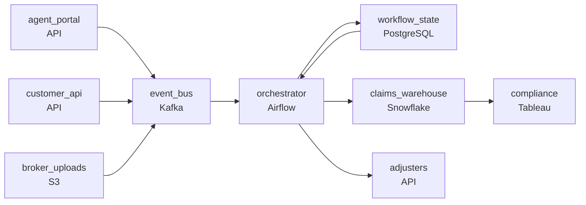

# The Claim That Picks Its Own Lane
_Three entry points. Different workflows. All must route correctly._

- **Domain:** pipeline_architecture
- **Difficulty:** Medium
- **Est. time:** 25 min
- **URL:** https://datadriven.io/problems/the_claim_that_picks_its_own_lane

## Problem

We process insurance claims submitted through multiple channels: agent portals, direct customer APIs, and bulk file uploads from partner brokers. Each claim goes through a series of processing steps - validation, fraud screening, adjuster assignment, and payment authorization - some automated and some manual. Design an event-driven pipeline that orchestrates this multi-step claims workflow.

**Concepts tested:** `paApiIngestion`, `paBatchVsStreaming`, `paDagOrchestration`, `paDataQuality`, `paDeadLetterQueue`, `paDeduplication`, `paEventDriven`, `paEventPlatforms`, `paFileIngestion`, `paIdempotency`, `paMonitoring`, `paPartitioning`, `paRetryHandling`, `paStreamProcessing`

## Requirements

- Claims arrive through agent portals, customer APIs, and broker bulk uploads; the downstream processing has to be the same regardless of how the claim came in.

## Must-have components

- Three intake channels converge on a shared event-driven workflow with stateless steps and replayable retries. Without a queue/log tier between intake and processing there's no event backbone. Add Kafka, Kinesis, SQS, or Pub/Sub.
- The workflow mixes automated steps with manual ones that can hold a claim for a long time. Without an orchestration layer there's nothing to hold the claim's place in the multi-step workflow and resume it when the manual step finishes. Add Airflow, Dagster, Prefect, or a workflow engine.

**Expected stages:** `Claim Sources` → `Ingestion Gateway` → `Event Bus` → `Processing Services` → `Claims Warehouse`

## Solution walkthrough

### Why this problem exists in real interviews

An insurance claim workflow has to look the same regardless of which channel created it, has to pause for human steps that take days, and has to surface the regulatory clock before it breaches. The trap is per-channel pipelines that diverge or treating adjuster review as a pause that the system forgets is happening.

The default reach is per-channel handlers that each implement validation, fraud screening, assignment, and payment. The portal pipeline ships a fix; the API pipeline doesn't get it for two weeks; broker bulk uploads run a different path entirely. Adjuster review is a synchronous wait that times out the workflow on long claims. Regulatory windows are tracked manually; some breach before anybody notices.

> **Trick to Solving**
>
> One canonical claim event off any channel, durable workflow that survives long pauses, regulatory-clock alerting before breach.
>
> 1. All channels publish a canonical claim event onto one bus; downstream processing reads one shape regardless of the channel.
> 2. An orchestrator owns the workflow with durable state; an adjuster-review step pauses the workflow and resumes on the adjuster's decision event.
> 3. Regulatory windows live as timers per claim; the orchestrator alerts before each window's breach with the claim id and the time remaining.

---

### Walk the requirements

**Step 1: Canonical claim events off any channel; downstream processing is the same**

Each channel publishes a canonical claim event onto the bus; downstream processing reads one shape and the same workflow runs regardless of channel. A bug fix in the workflow lands once for everyone. A 'per-channel pipeline' design is the version where the portal pipeline ships a fix and the API pipeline drifts; canonical-up-front is what keeps them aligned.

**Step 2: Workflow pauses for adjuster review and resumes on decision**

The orchestrator runs the multi-step workflow with durable state. When a claim enters adjuster review, the workflow pauses; the orchestrator holds the state and waits for the adjuster's decision event. The decision arrives minutes later or days later; the workflow resumes from where it paused. A synchronous wait would time out long claims; durable pause-and-resume is what makes the human step part of the architecture.

**Step 3: Regulatory-window timers fire before breach**

Each claim has a regulatory acknowledgment window and a decision window. The orchestrator runs a per-claim timer that fires an alert before the window's breach with the claim id and the time remaining. On-call sees claims approaching breach and acts. Tracking the windows in a spreadsheet is the version that misses breaches; per-claim timers in the orchestrator catch them before the regulator does.

---

### The shape that fits

| node | type | tech | details |
|---|---|---|---|
| agent_portal | source | API |  |
| customer_api | source | API |  |
| broker_uploads | source | S3 |  |
| event_bus | queue | Kafka | parallelism: 8 partitions |
| orchestrator | transform | Airflow | errorAction: alert; monitorAlert: Claim approaching regulatory window breach |
| workflow_state | storage | PostgreSQL |  |
| claims_warehouse | storage | Snowflake | slaFreshness: < 1h |
| adjusters | consumer | API |  |
| compliance | consumer | Tableau | slaFreshness: < 24h |

> **What this design gives up**
>
> Canonical events require all channels to publish through the same contract; durable workflow state grows with concurrent in-flight claims; regulatory timers add per-claim state the orchestrator carries. Implementation cost is the price; the win is consistent processing across channels, long human pauses without timeouts, and regulatory windows surfaced before they breach.

> **What reviewers check**
>
> A reviewer looks at the canvas for these properties:
> - An event bus carries canonical claim events from all three channels.
> - An orchestration layer runs the multi-step workflow with durable state across human pauses.
> - Regulatory-window timers per claim alert before breach.

> **The mistake that ships**
>
> What gets shipped runs per-channel pipelines and tracks regulatory windows in a spreadsheet. The portal's bug fix doesn't make it to the API pipeline for two weeks. Adjuster review times out long claims because the workflow doesn't durable-pause. Some claims breach the regulatory window because the spreadsheet missed them. The eventual rebuild adds canonical events, durable workflow state, and per-claim regulatory timers.

---

- **An adjuster takes a week to decide on a claim. What in this design lets the workflow stay paused without timing out?**
  - _Tests whether the candidate sees the orchestrator's durable state holding the workflow's pause; the next step waits for the adjuster's decision event regardless of how long it takes. The state survives orchestrator restarts. A workflow-engine timeout is the failure mode; durable state is the contract._
- **A new state regulator changes the decision window from one number to another. What changes in the design, and where?**
  - _Tests whether the candidate sees the regulatory timer as configuration: a new threshold per state updates the timer's window, and the orchestrator picks it up on the next claim. The workflow steps don't change; the timer does._
