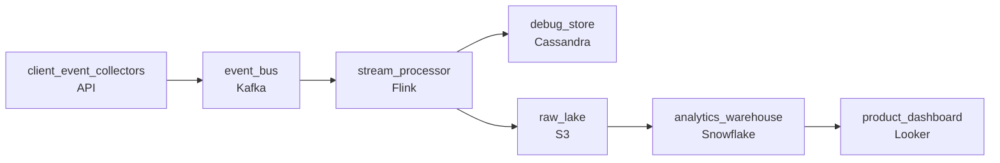

# The Clicks We Throw Away
_Every tap, swipe, and scroll. At scale._

- **Domain:** pipeline_architecture
- **Difficulty:** Hard
- **Est. time:** 30 min
- **URL:** https://datadriven.io/problems/the_clicks_we_throw_away

## Problem

Our apps emit a constant stream of user interaction events that today land in a server log file and get thrown away. We want a clickstream pipeline that collects every event once and then serves two very different readers: the product team running funnel and feature-adoption analysis across months of history, and on-call engineers who need to pull a single device's last few hours of activity within minutes of a bug report. Design the clickstream data processing pipeline.

**Concepts tested:** `paApiIngestion`, `paBackfill`, `paBatchProcessing`, `paBatchVsStreaming`, `paColumnarVsRow`, `paCompression`, `paDagOrchestration`, `paDataLake`, `paDataQuality`, `paDeadLetterQueue`, `paDeduplication`, `paDependencyMgmt`, `paEltVsEtl`, `paEnvironmentMgmt`, `paEventDriven`, `paEventPlatforms`, `paFullVsIncremental`, `paIdempotency`, `paKappaArch`, `paLateData`, `paMonitoring`, `paPartitioning`, `paRetryHandling`, `paSchemaEvolution`, `paStreamProcessing`

## Requirements

- Every event from every app has to be captured once into one place before anyone reads it. Today they scatter into log files and vanish.
- The product team runs funnel and feature-adoption analysis over months of history. Give them a store built for wide historical scans.
- On-call engineers must pull a single device's last few hours of events within minutes of a bug report.

## Must-have components

- The design is missing stages. A working clickstream pipeline needs collection, a shared bus, processing, and two separate serving stores for the analytics and debug readers.
- There is no shared event bus. Every event should land once on a durable log or queue that both the analytics path and the debug path read from, instead of each reader collecting events separately.
- There is no near-real-time processing path. The debug reader needs a single device's activity available within minutes, which a purely daily batch job cannot deliver.
- There is no analytics store built for wide historical scans. The product team's funnel and adoption analysis over months of history needs a warehouse-class store.
- There is no low-latency store keyed for single-device lookups. Pointing on-call engineers at the date-partitioned warehouse scans the wrong axis and is too slow, so the debug pull needs its own serving store.
- Every serving surface sits on the same freshness tier. The debug store must be near-real-time while the analytics warehouse can be batch, so the design should show at least two distinct freshness tiers.

**Expected stages:** `client_event_collectors` → `event_bus` → `stream_processor` → `analytics_warehouse` → `debug_store`

## Solution walkthrough

### What this problem actually is

This is two incompatible query patterns wearing one clickstream costume. Product analytics wants wide scans across months, grouped by date and event type, and a columnar warehouse partitioned by day is perfect for that. On-call debugging wants the opposite shape: every event for one device in the last few hours, a needle and not a haystack. The trap is landing everything in a single date-partitioned warehouse and pointing both readers at it. Do that and the device-history lookup scans the wrong axis, times out or hits a row cap, and on-call quietly goes back to grepping S3 logs, which is the exact workflow this pipeline was supposed to kill.

### The two readers, side by side

| Product analytics | On-call debug |
|---|---|
| Access pattern: wide scans over months, grouped by day, screen, event type. Cares about aggregates, not individual rows. Store: warehouse-class, columnar, partitioned by date. Freshness: hourly batch loads are fine. | Access pattern: all events for one `device_id` in the last few hours. Cares about individual rows in order, not aggregates. Store: low-latency serving store keyed by `device_id` plus a time bucket. Freshness: queryable within minutes of receipt. |

Notice the two rows disagree on every axis: partition key, storage format, freshness. That is the whole reason one store cannot serve both. The mistake is not that people forget the debug reader exists, it is that they assume a fast warehouse can answer a single-device question. Date partitioning means one device's four hours are smeared across every partition, so the query fans out over the entire table.

### The one move that cracks it

> **Fan out from one bus, not one store**
>
> Collect every event exactly once onto a durable log. The stream processor then writes the SAME enriched event into two sinks shaped for two questions: a device-keyed store for debug and a date-partitioned warehouse for analytics. You duplicate storage, never collection. One capture, two layouts.

| node | type | tech | details |
|---|---|---|---|
| client_event_collectors | source | API |  |
| event_bus | queue | Kafka |  |
| stream_processor | transform | Flink |  |
| debug_store | storage | Cassandra |  |
| raw_lake | storage | S3 |  |
| analytics_warehouse | storage | Snowflake |  |
| product_dashboard | consumer | Looker |  |

**Step 1: Collect once at the edge**

The collectors are the ingestion boundary. This is where you drop opted-out users, deduplicate on the client-generated `event_id`, and enforce a canonical schema so iOS 'tapped', Android 'clicked', and web '`click_event`' all become one normalized action. Everything downstream trusts that the bus holds clean, deduplicated, schema-valid events. Skip this and both readers inherit the mess.

**Step 2: Put a durable log in the middle**

The event bus is the single source of truth every reader subscribes to. Because it is a replayable log, you can rebuild either serving store from it, add a third reader later without touching collection, and absorb a burst on Monday morning without dropping events. This is the piece that turns 'two pipelines' into 'one pipeline, two sinks'.

**Step 3: Write the debug store keyed by device**

The stream processor upserts each enriched event into a store partitioned by `device_id` and bucketed by time. A single-device pull then touches one partition and returns in milliseconds. Give it a short retention window (a few days) since nobody debugs last quarter's crash from here. This is the near-real-time freshness tier.

**Step 4: Land raw, then batch into the warehouse**

The same stream also lands raw events in the lake, and an hourly job compacts and loads them into date-partitioned, columnar warehouse tables for funnels and adoption. Hourly is the right cadence: the product dashboard refreshes every few minutes off pre-computed aggregates, and deeper historical analysis tolerates the batch lag. This is the batch freshness tier.

> **Do not key the debug store by date**
>
> If you partition the debug store the same way as the warehouse, you have built the warehouse twice and the single-device pull is just as slow. The debug store earns its existence only when its partition key matches its query key: `device_id`. Everything else is a copy of the analytics path.

> **The tell of a senior design**
>
> Interviewers watch whether you keep two serving stores while still collecting once. Weak candidates either collect twice (two SDKs, two pipelines that drift apart) or serve both readers from one store. The senior move is a single durable bus with dual sinks, and naming out loud that the split exists because the two access patterns disagree on partition key and freshness.

> **Why this stays cheap at 300M events/day**
>
> At roughly 600 bytes each, 300M events/day is about 180 GB/day landing in cheap columnar storage in the lake and warehouse. The debug store only holds a few days of hot data keyed by device, so it stays small and fast. The expensive Splunk-everything approach is replaced by hot-for-debug, cold-for-analytics, and the same enriched record feeds both.

### Where interviewers push next

- **iOS buffers events and flushes late, so pre-crash events arrive after the crash event. How do you let on-call see the 2 minutes before a crash?**
  - _Tests late/out-of-order data handling: event-time windows with a watermark and allowed lateness in the stream processor, or a query-time join in the debug store on `session_id` and timestamp._
- **Product teams add event fields weekly and old app versions omit them. How does the pipeline not break?**
  - _Tests schema evolution: a schema registry with backward-compatible rules so missing fields are nullable rather than fatal._
- **Client SDKs retry on network failure. How do you keep the 2 percent duplicates from double-counting funnels?**
  - _Tests idempotency: dedup on the client-generated `event_id` at the collector, and idempotent upserts into both stores._
- **A user is anonymous, then logs in mid-session. How do you attribute the earlier events?**
  - _Tests session stitching: define a session by the 30-minute gap rule and back-fill the `user_id` onto anonymous events in the same session._
