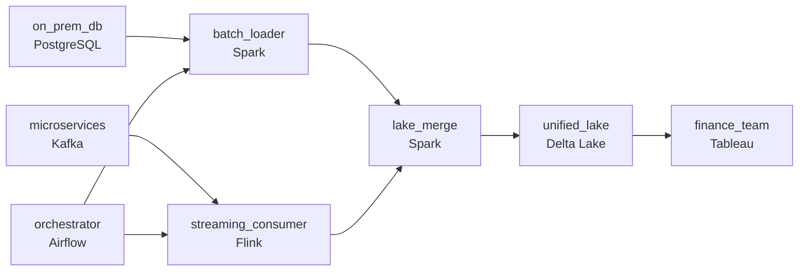

# The Clock That Runs Two Ways
_Nightly batch and live events. One dashboard._

- **Domain:** pipeline_architecture
- **Difficulty:** Hard
- **Est. time:** 30 min
- **URL:** https://datadriven.io/problems/the_clock_that_runs_two_ways

## Problem

Your team maintains two separate pipelines feeding the same data lake: a nightly extract from an on-premises transactional database, and a real-time event stream from a microservices layer. Leadership wants a unified orchestration layer with a single SLA dashboard and consistent failure alerting. Design the architecture.

**Concepts tested:** `paBackfill`, `paBatchProcessing`, `paBatchVsStreaming`, `paDagOrchestration`, `paDataLake`, `paDataQuality`, `paDeadLetterQueue`, `paDeduplication`, `paEventDriven`, `paEventPlatforms`, `paFullVsIncremental`, `paIdempotency`, `paLambdaArch`, `paMedallion`, `paMonitoring`, `paPartitioning`, `paRetryHandling`, `paStreamProcessing`, `paTableFormats`

## Requirements

- Finance reconciles every business day from the landing zone at 6am UTC; missing it is a P1 incident, and the on-prem network drops once a month.
- The streaming path covers the same business entities as the batch and consumer lag has to stay short during business hours; today there's no shared view.
- The same order can arrive on both the batch and streaming paths; the unified dataset has to merge them deterministically with the streaming record winning when both exist.

## Must-have components

- The unified SLA dashboard, cross-path dependency at the merge layer, and partial-failure handling all live in the orchestrator. Add Airflow, Dagster, Prefect, or Composer.
- The architecture has a nightly batch path and a continuous streaming path; that's two distinct freshness tiers. Show at least one streaming path and at least one batch path.

**Expected stages:** `Source Layer` → `Ingestion Layer` → `Processing Layer` → `Storage Layer` → `Serving Layer`

## Solution walkthrough

### Why this problem exists in real interviews

Two pipelines (nightly batch + real-time stream) feeding the same lake under one orchestrator with one SLA dashboard. Both can deliver the same order, the on-prem network drops once a month, and finance hits a 6am UTC SLA. The trap is treating the two pipelines as independent and discovering on a network-drop morning that nothing knows the batch failed until finance opens the dashboard.

The default reach is to keep the two pipelines as they are with separate alerting. The on-prem network drops on a Sunday; the batch fails silently and finance opens an empty dashboard at 6am UTC Monday. Streaming consumer lag piles up during a busy hour without anyone noticing. The same order arrives on both paths and the lake holds two versions because there's no merge rule.

> **Trick to Solving**
>
> One orchestrator owns both paths' SLAs, two cadences with the streaming record winning the merge, alerting before the morning deadline.
>
> 1. One orchestrator schedules and monitors both the on-prem batch and the streaming consumer; SLA alerts fire on either path before they breach.
> 2. When the same order arrives on both paths, the merge resolves with the streaming record winning (a documented precedence) and the lake converges.
> 3. The 6am UTC finance SLA gates on the batch's completion; sensors fire ahead of the deadline if the batch is at risk so on-call has hours to recover from a network drop.

---

### Walk the requirements

**Step 1: Finance reads from the landing zone before 6am UTC**

An orchestrator schedules both the on-prem nightly extract and the streaming consumer with one SLA view. The 6am UTC sensor fires if the batch is at risk; on-call has hours to recover from the monthly network drop, not minutes after finance opens the dashboard. Without orchestration there's nothing watching the deadline across both paths.

**Step 2: One unified dataset merges the two paths deterministically**

The same order arrives on both the batch and streaming paths. The lake's merge applies a precedence rule: the streaming record wins when both exist (it's authoritative, it's fresher), and the batch fills in entities the streaming path misses. The lake converges to one shape regardless of which path saw the order first. A 'last-write-wins' shortcut is the version where the lake oscillates between the two records; deterministic precedence is what makes the merge stable.

**Step 3: Streaming lag stays short and visible**

The streaming path has its own SLA inside the orchestrator; consumer lag past tolerance fires an alert during business hours. The unified SLA dashboard shows both paths' health; on-call sees lag building before downstream consumers do. Two pipelines with separate alerting is the version where one path's problem stays invisible until somebody complains; one orchestrator with shared visibility surfaces it sooner.

---

### The shape that fits

| node | type | tech | details |
|---|---|---|---|
| on_prem_db | source | PostgreSQL |  |
| microservices | source | Kafka |  |
| orchestrator | transform | Airflow | errorAction: alert; monitorAlert: Batch at risk vs 6am UTC or streaming lag past tolerance |
| batch_loader | transform | Spark | slaFreshness: < 24h; idempotencyStrategy: staging_table |
| streaming_consumer | transform | Flink | slaFreshness: real-time; idempotencyStrategy: upsert |
| lake_merge | transform | Spark | idempotencyStrategy: upsert |
| unified_lake | storage | Delta Lake | slaFreshness: < 24h; backfillStrategy: partition_overwrite |
| finance_team | consumer | Tableau | slaFreshness: < 24h |

> **What this design gives up**
>
> One orchestrator across two paths is more configuration than independent schedulers; the merge precedence has to be reviewed when business semantics change; the unified SLA dashboard requires both paths to expose their metrics. Implementation cost is the price; the win is finance's SLA met even on network-drop mornings, the lake converging deterministically when the same order arrives twice, and streaming lag visible alongside batch lateness.

> **What reviewers check**
>
> A reviewer looks at the canvas for these properties:
> - An orchestration layer owns both the batch and streaming paths' schedules and SLAs in one view.
> - The streaming path covers the same business entities as the batch and the unified dataset merges them with the streaming record winning.
> - The 6am UTC finance SLA is gated by the orchestrator with alerting before breach.

> **The mistake that ships**
>
> What gets shipped keeps the two pipelines independent with separate alerting. The on-prem network drops on a Sunday and the batch fails silently; finance opens an empty dashboard at 6am UTC Monday. Streaming consumer lag piles up during a busy hour with no shared visibility. The same order arrives on both paths and the lake oscillates between the two records. The eventual rebuild puts both paths under one orchestrator with shared SLA, deterministic merge, and shared lag alerting.

---

- **The on-prem network drops Sunday night, but the streaming path is healthy. What does this design do, and what does finance see Monday morning?**
  - _Tests whether the candidate sees the orchestrator alerting during the night so on-call can intervene before 6am UTC; if the batch can't recover in time, finance sees the streaming-side data with a 'batch incomplete' flag. The merge handles partial completeness; the alerting gives the team hours, not minutes._
- **Streaming lag spikes during a busy hour. What does the unified SLA dashboard show, and what does on-call do?**
  - _Tests whether the candidate sees the lag visible alongside the batch SLA; on-call investigates throughput and either scales the consumer or accepts the lag with an alert reset. The shared dashboard surfaces the issue before downstream consumers feel it._
