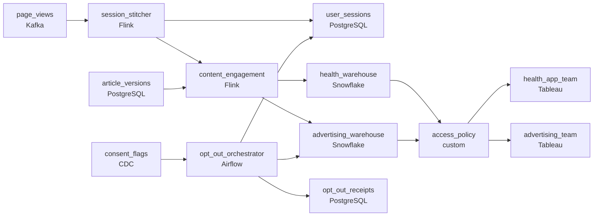

# The Consent Stitcher
_Consent was given. Or was it? Stitch the records together._

- **Domain:** pipeline_architecture
- **Difficulty:** Medium
- **Est. time:** 10 min
- **URL:** https://datadriven.io/problems/the_consent_stitcher

## Problem

Our platform gets 100 million visitors a month and we monetize through health advertising and a premium membership. The problem is that most visitors start as anonymous users, then some create accounts during the session. Right now our analytics treats the pre-login and post-login parts of the same visit as two separate users, so we undercount engagement and overcount unique visitors. Design a pipeline that stitches sessions and handles the consent propagation required when users change their privacy settings.

**Concepts tested:** `paBackfill`, `paBatchProcessing`, `paDagOrchestration`, `paDataLake`, `paDataQuality`, `paDeduplication`, `paEventPlatforms`, `paFullVsIncremental`, `paIdempotency`, `paLateData`, `paMedallion`, `paMonitoring`, `paPartitioning`, `paScdPipeline`, `paTableFormats`

## Requirements

- Most visitors browse anonymously and some create an account mid-session; analytics today counts the pre-login and post-login parts as two separate users.
- Health profiles, symptom data, and medication tracker entries are HIPAA-governed; advertising teams can never see them.
- Treating a CCPA opt-out as a flag that reports skip is not real opt-out; advertising analytics has to physically forget the user.
- Medical articles are updated to reflect new research; an advertiser buying readers of our current arthritis content shouldn't get readers of an old superseded version.

## Must-have components

- Anonymous events have to be linked to the user within minutes of login while content engagement metrics need 5-minute freshness. Add a streaming layer on the event path or set SLA Freshness to real-time / < 1min on the stitcher.
- Health-tier and advertising-tier data live in separate governed warehouse databases with column-level encryption and access controls. Without a warehouse tier there's nowhere to enforce the HIPAA/ad isolation. Add Snowflake, BigQuery, Redshift, Databricks, or equivalent.

**Expected stages:** `user_sessions` → `page_views` → `content_engagement` → `consent_flags`

## Solution walkthrough

### What this really is

This is an identity-merge problem dressed up as analytics hygiene, and it comes with three governance requirements. Almost everyone draws a stream that links the anonymous id to the user id at login. **Candidates separate on the other three questions.** Is the health boundary enforced by the platform or by a BI filter? Is opt-out a real erasure or a flag? Is engagement joined to the article as it was read, or as it reads today? Get any of these wrong and the design passes the demo but fails the HIPAA review, the CCPA audit and the advertiser's invoice.

> **Stitch at login, govern at the engine**
>
> The stitch is stateful streaming keyed by session: when the login event arrives, every buffered anonymous event in that session is rewritten to the user id. Everything else is about where each rule is enforced. Isolation lives in separate warehouse databases, erasure is a pseudonymization job with a receipt, and version attribution happens at ingest.

### Walk the requirements

**Step 1: Collapse the session into one user**

`session_stitcher` holds state per open session. On the login event it emits a mapping from anonymous id to user id into `user_sessions` and re-keys the pre-login `page_views`. Use upsert idempotency, because a replayed login must not create a second mapping. A nightly batch stitch would leave the day's dashboards double-counting until morning.

**Step 2: Split the tiers before they land**

`content_engagement` routes health events (symptoms, medication tracker entries) to `health_warehouse` and strips health detail from the events bound for `advertising_warehouse`. Two governed databases with role grants mean an advertising query cannot reach health rows however it is written. A column mask in the dashboard stops the dashboard. It does not stop a SQL client.

**Step 3: Make opt-out physical and provable**

A change in `consent_flags` triggers `opt_out_orchestrator`, which pseudonymizes the user's identifier in `advertising_warehouse` and `user_sessions`. It then writes a completion row per request to `opt_out_receipts`. The alert fires when a request passes the regulatory window unfinished.

**Step 4: Attribute to the version that was read**

`content_engagement` joins each event to `article_versions` on the event timestamp: the version with `valid_from <= read_at < valid_to`. Joining on article id alone silently credits old-version readers to today's arthritis content.

### The reference design

| node | type | tech | details |
|---|---|---|---|
| page_views | source | Kafka |  |
| consent_flags | source | CDC |  |
| session_stitcher | transform | Flink | slaFreshness: real-time; idempotencyStrategy: upsert |
| user_sessions | storage | PostgreSQL | slaFreshness: < 1min |
| article_versions | storage | PostgreSQL |  |
| content_engagement | transform | Flink | slaFreshness: < 15min |
| health_warehouse | storage | Snowflake | slaFreshness: < 1h |
| advertising_warehouse | storage | Snowflake | slaFreshness: < 1h |
| access_policy | quality_gate | custom | errorAction: alert |
| opt_out_orchestrator | transform | Airflow | errorAction: alert; monitorAlert: Opt-out pseudonymization overdue |
| opt_out_receipts | storage | PostgreSQL |  |
| health_app_team | consumer | Tableau | slaFreshness: < 1h |
| advertising_team | consumer | Tableau | slaFreshness: < 1h |

| Opt-out as a flag | Opt-out as erasure |
|---|---|
| `do_not_target = true` on the user row. Every report has to remember to filter on it, and the identifier still sits in every fact table. An auditor asks you to prove the user is forgotten, and you cannot. | The orchestrator replaces the user id with a random token in `advertising_warehouse` and `user_sessions`, then records the request in `opt_out_receipts`. Aggregates survive and the person does not. Each receipt is the proof. |

> **Today's article is not the one they read**
>
> Candidates version the article table and then join engagement on `article_id` at query time, which picks up the current row. To attribute correctly, stamp `article_version_id` on the event at ingest, while the version in effect is still known.

> **Where is the boundary enforced?**
>
> Point at the two Snowflake databases and say which role can read each one. That signals seniority. "We mask it in the dashboard" is the answer that ends the HIPAA conversation badly.

- **A login arrives 20 minutes after the session's last anonymous event. Does the stitch still happen?**
  - _Tests session-window state retention and late data in `session_stitcher`._
- **A user opts out while a backfill of `advertising_warehouse` is running. What stops the backfill from restoring their identifier?**
  - _Tests whether erasure is replayed against backfills rather than applied once._
