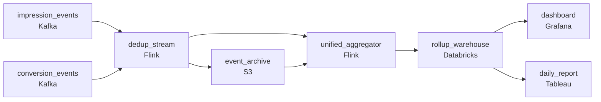

# The Dashboard and the Attribution Model
_Streaming and batch. One pipeline to rule them._

- **Domain:** pipeline_architecture
- **Difficulty:** Hard
- **Est. time:** 10 min
- **URL:** https://datadriven.io/problems/the_dashboard_and_the_attribution_model

## Problem

Our digital marketing platform generates a continuous stream of ad impression and conversion events that need to feed both a real-time campaign performance dashboard and a daily attribution model. We have been running separate streaming and batch pipelines that have drifted out of sync, causing discrepancies between the live dashboard and the daily report. Design a unified architecture on Azure Databricks that eliminates the discrepancy.

**Concepts tested:** `paBatchProcessing`, `paBatchVsStreaming`, `paDagOrchestration`, `paDataQuality`, `paDeduplication`, `paEltVsEtl`, `paEventDriven`, `paIdempotency`, `paKappaArch`, `paLateData`, `paMedallion`, `paMonitoring`, `paPartitioning`, `paRetryHandling`, `paStreamProcessing`, `paTableFormats`

## Requirements

- The daily attribution report is what we bill against and the live dashboard has to show the same numbers for the same period; today they diverge.
- Mobile impressions arrive hours late; both the dashboard and the daily report have to attribute each event to the time it actually happened.
- Attribution credits the last impression seen within the lookback window before a conversion; the daily report has to read the relevant historical window for each day's conversions.
- Today the dashboard's approximate dedup misses duplicates that arrive late while the batch report removes them exactly; the unified view can't keep that gap.

## Must-have components

- The dashboard refreshes every five minutes from the same path that produces the daily report; without a streaming / sub-minute path the dashboard is too slow. Add a streaming layer on the impression and conversion paths or set SLA Freshness to real-time / < 1min on the processor.
- Dashboard and daily report read from the same warehouse so they can't drift. Without a warehouse tier there's no shared serving layer. Add Snowflake, BigQuery, Redshift, or Databricks.

**Expected stages:** `event_raw_stream` → `impression_silver` → `conversion_silver` → `campaign_performance_gold` → `attribution_model_features`

## Solution walkthrough

### The trap

This is a consistency problem wearing a streaming-vs-batch costume. Anyone can draw a fast path for the dashboard and a slow path for the report. That is exactly the architecture that is drifting today. The real skill is making the daily report a **closed-window read of the same rollups** the dashboard reads, so the two views have nothing to disagree about. Keep two computations and every rule gets written twice: dedup, lateness, the attribution lookback. The invoice you bill against then stops matching the number the client watched all day.

### Build it in four decisions

**Step 1: Dedup once, upstream of both views**

Drop duplicates on a stable event id in `dedup_stream`, before anything aggregates. Today the streaming side dedups approximately and the batch side dedups exactly, and that gap is where the dashboard overcounts. A duplicate that arrives late is still caught, because dedup keys on the id and not on arrival order.

**Step 2: Window on event time, with a lateness allowance**

`unified_aggregator` buckets by when the impression happened, not when it arrived. A mobile event that shows up three hours late updates its own hour, and because both views read that bucket, both restate together.

**Step 3: Give attribution the history it needs**

Last-touch credit needs the impressions from before today. `event_archive` holds the deduped history, and the aggregator reads the lookback window from it for each conversion. A same-day-only lookup silently drops credit for yesterday's impression.

**Step 4: Serve both views from one warehouse table**

Rollups land in `rollup_warehouse`. The dashboard reads the open periods and the report reads yesterday's closed window. Same rows, two queries, no reconciliation job.

### The reference design

| node | type | tech | details |
|---|---|---|---|
| impression_events | source | Kafka |  |
| conversion_events | source | Kafka |  |
| dedup_stream | transform | Flink | slaFreshness: real-time; idempotencyStrategy: upsert |
| event_archive | storage | S3 | backfillStrategy: partition_overwrite |
| unified_aggregator | transform | Flink | slaFreshness: real-time; idempotencyStrategy: upsert |
| rollup_warehouse | storage | Databricks | slaFreshness: < 1min; backfillStrategy: partition_overwrite |
| dashboard | consumer | Grafana | slaFreshness: < 1min |
| daily_report | consumer | Tableau | slaFreshness: < 24h |

| Two synchronized pipelines | One computation, two reads |
|---|---|
| Stream dedups approximately, batch exactly. Stream buckets by arrival, batch by event time. Each owns its own attribution window. Numbers diverge, and someone writes a reconciliation job. | `dedup_stream` and `unified_aggregator` run once. The report is a filter on `rollup_warehouse`, so any disagreement would have to come from a query, not a pipeline. |

> **Sharing code is not sharing a computation**
>
> Candidates often answer with a shared attribution library called from both a streaming job and a batch job. That still gives two runs over two inputs with two dedup states, so the views still drift. The fix is one output table, not one codebase.

> **Say where late data lands**
>
> The senior tell is naming the lateness allowance and what happens past it. An event inside the window rewrites its bucket through the `upsert` on `unified_aggregator`. An event past it gets replayed from `event_archive` with `partition_overwrite`. Either way, both views restate together.

- **An impression arrives a week late, past the lateness allowance. What do the dashboard and the report show?**
  - _Tests a replay path from `event_archive` that overwrites the old partition, so both views restate the same period._
- **The attribution lookback grows from 7 to 30 days. What gets expensive?**
  - _Tests whether the candidate sees that aggregator state and archive reads scale with the window, and how partitioning by event date keeps the read bounded._
