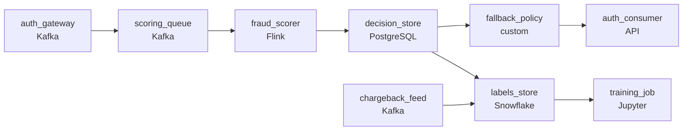

# The Decision Before the Door Closes
_The window to stop it is smaller than you think._

- **Domain:** pipeline_architecture
- **Difficulty:** Hard
- **Est. time:** 30 min
- **URL:** https://datadriven.io/problems/the_decision_before_the_door_closes

## Problem

What pipeline scores millions of card transactions a day for fraud before each authorization completes, well under a second after it starts? When scoring is unavailable, a fallback still decides every transaction: small ones go through and large ones are blocked. Chargebacks confirm fraud weeks later and have to reach the weekly model retrain.

**Concepts tested:** `paApiIngestion`, `paBatchVsStreaming`, `paDataQuality`, `paDeadLetterQueue`, `paDeduplication`, `paEventDriven`, `paIdempotency`, `paMonitoring`, `paPartitioning`, `paRetryHandling`, `paStreamProcessing`

## Requirements

- Authorization completes in well under a second and the fraud score has to fit inside that budget; otherwise we either delay the customer or skip fraud.
- If the scoring service is unavailable we still have to return an approve or block decision by a documented fallback policy; that fallback has to be a real path in the pipeline, not something handled by hand during an incident.
- The model retrains weekly and quality silently degrades without confirmed fraud labels feeding back; chargebacks have to reach training.

## Must-have components

- Authorization completes in well under a second and fraud has to fit inside that budget; that's a streaming workload, not batch. Add a streaming layer on the transaction path or set SLA Freshness to real-time / < 1min on the scoring node.
- Scoring is decoupled from the payment gateway and a scoring outage routes to a review path. Without a queue/log tier between gateway and scoring there's nothing to decouple them or buffer the review path. Add Kafka, Kinesis, SQS, or equivalent.

**Expected stages:** `Transaction Source` → `Scoring Queue` → `Fraud Scorer` → `Fallback Policy` → `Chargeback Feedback`

## Solution walkthrough

### Why this problem exists in real interviews

Card auth in well under a second with fraud scoring inside that budget, plus a sane fallback when scoring is unavailable, plus a feedback loop from chargebacks. The trap is wiring scoring synchronously into auth and treating chargebacks as 'we'll add later'; both shortcuts compound until either auth latency breaks or model accuracy plateaus.

The default reach is a synchronous call from auth into the scoring service for every transaction. The first time scoring is slow, auth times out and the on-call engineer adds an approve-on-timeout. The fallback policy emerges in hotfixes; nobody documents what 'big' means versus 'small'. Chargebacks land weeks later in a separate system the model never sees.

> **Trick to Solving**
>
> Decouple scoring through a queue with a deadline; when scoring is unavailable, fall back per the documented size-based policy; chargebacks loop back as labels.
>
> 1. A queue between auth and scoring decouples them. Auth publishes the transaction with the scoring deadline; the scorer reads, scores, returns. Auth proceeds on the fallback if no decision in time.
> 2. When scoring is unavailable, the documented policy gates: small transactions approve, big ones block. The threshold lives in policy config, not in on-call code.
> 3. Chargebacks (confirmed weeks later) feed a labels store the next training run reads alongside scoring decisions, so the model learns from real outcomes.

---

### Walk the requirements

**Step 1: Score inside the auth budget on a decoupled path**

Auth publishes each transaction with its scoring deadline onto the queue; the scoring service reads, scores, writes the decision back inside the deadline. Auth waits up to the deadline and proceeds. End-to-end fits inside the well-under-a-second budget. A synchronous call into the scoring service is the version where a slow score blocks auth and timeouts pile up; the queue is what gives the deadline a real bound.

**Step 2: Size-based fallback when scoring is unavailable, by policy**

When scoring is unavailable or the deadline expires, the fallback applies the documented policy: small transactions approve, large ones block. The threshold is config the business has signed off on. The fallback path is part of the design, not a hotfix from on-call. Letting auth implement the fallback ad-hoc is the version where the policy emerges from incident decisions; the documented threshold is what makes the failure mode predictable.

**Step 3: Chargebacks loop into training as real labels**

Chargebacks confirm fraud weeks after the score. A labels store records each transaction's score, the actual outcome, and the gap. Retraining reads predictions joined to labels and learns from real outcomes. Without the loop, the model retrains on prior predictions and accuracy plateaus; with it, the model gets better as chargebacks accumulate.

---

### The shape that fits

| node | type | tech | details |
|---|---|---|---|
| auth_gateway | source | Kafka |  |
| scoring_queue | queue | Kafka | parallelism: 16 partitions |
| fraud_scorer | transform | Flink | slaFreshness: real-time; idempotencyStrategy: upsert |
| decision_store | storage | PostgreSQL | slaFreshness: real-time |
| fallback_policy | quality_gate | custom | errorAction: alert |
| chargeback_feed | source | Kafka |  |
| labels_store | storage | Snowflake | slaFreshness: < 24h |
| training_job | consumer | Jupyter | slaFreshness: < 24h |
| auth_consumer | consumer | API | slaFreshness: real-time |

> **What this design gives up**
>
> A queue between auth and scoring is more infrastructure than a synchronous call; an explicit fallback policy adds config and a review queue for fallback approvals; the chargeback labels store grows for years and joins back to historical scores. Implementation cost is the price; the win is auth latency that doesn't break under scoring slowness, an outage policy the business signed for, and a model that learns from real fraud.

> **What reviewers check**
>
> A reviewer looks at the canvas for these properties:
> - A queue decouples authorization from scoring with a deadline so a slow score doesn't block auth.
> - A fallback policy path applies when scoring is unavailable and still returns an approve or block decision.
> - Confirmed chargeback labels feed back into the model's training data alongside the scoring decisions.

> **The mistake that ships**
>
> What gets shipped wires auth synchronously to scoring. The first time scoring is slow, auth hangs and the on-call engineer adds approve-on-timeout. The fallback policy emerges from hotfixes. Chargebacks land in a separate system the model never reads; the model retrains on prior predictions and stops improving. The eventual rebuild adds the queue, the documented size-based fallback, and the chargeback feedback loop.

---

- **The fallback policy approves a large transaction during a scoring outage and it turns out to be fraud. What does this design surface, and where does the post-mortem look?**
  - _Tests whether the candidate sees that the fallback approval is logged with the policy version applied, the chargeback eventually labels the transaction as fraud, and the post-mortem reads the policy + chargeback log to assess whether the threshold needs adjustment. The fallback isn't a free pass; it's a tradeoff the business signed for._
- **A scorer change causes a small uptick in chargebacks two weeks later. What in this design makes that visible, and how does the training loop respond?**
  - _Tests whether the candidate sees the labels store joining scoring decisions to chargeback outcomes; the next training reads the joined labels and learns from the change. A regression in scoring quality shows up in retrospective metrics the team can investigate before the next deploy._
