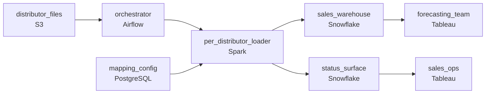

# The Distributor Filing Problem
_Hundreds of suppliers. One warehouse. One deadline._

- **Domain:** pipeline_architecture
- **Difficulty:** Medium
- **Est. time:** 25 min
- **URL:** https://datadriven.io/problems/the_distributor_filing_problem

## Problem

We are a large consumer goods company that receives weekly sales data files from hundreds of independent distributors. Each distributor uses its own reporting format, and the data feeds centralized analytics used by the sales forecasting and supply chain teams. Design the pipeline that ingests, normalizes, and loads this distributed data into the central warehouse.

**Concepts tested:** `paBatchProcessing`, `paBatchVsStreaming`, `paDagOrchestration`, `paDataLake`, `paDataQuality`, `paDataSkew`, `paDeadLetterQueue`, `paEltVsEtl`, `paFileIngestion`, `paFullVsIncremental`, `paIdempotency`, `paMedallion`, `paPartitioning`, `paRetryHandling`, `paSchemaEvolution`, `paSmallFiles`

## Requirements

- The Monday morning sales report runs on data from hundreds of distributors; every available file has to be loaded by Sunday midnight, and late files loaded retroactively.
- Each distributor uses its own column names and units; a quirky file or quality failure can't block the other distributors from loading.
- The sales ops team chases distributors who haven't delivered; today they file tickets to engineers because there's no self-service view.

## Must-have components

- Hundreds of distributors deliver weekly with a Sunday-midnight cutoff, late files, per-distributor isolation, and a self-service status dashboard. Without an orchestration layer there's nothing to coordinate that. Add Airflow, Dagster, Prefect, or Composer.
- The Monday morning sales report runs from the warehouse; without a warehouse tier there's nowhere for the normalised sales fact to land. Add Snowflake, BigQuery, Synapse, or Databricks.

**Expected stages:** `Distributor Files` → `Landing Zone` → `Normalization Layer` → `Validation Layer` → `Central Warehouse`

## Solution walkthrough

### Why this problem exists in real interviews

Hundreds of distributor files in their own formats with a Monday morning deadline, late arrivals that have to load retroactively, per-distributor failures that can't block the rest, and a self-service view for sales ops chasing missing distributors. The trap is one file ingester treating every distributor's format as a parser variant; one quirky file blocks Monday morning.

The default reach is one ingester that infers the format and loads everything. The first quirky file fails and blocks Monday morning's sales report; sales ops files a ticket and engineering chases it. Late files don't load retroactively because the loader keys on 'this Sunday's drop.' Sales ops has no self-service view of which distributors haven't delivered.

> **Trick to Solving**
>
> Per-distributor mappings, partial loading so one failure stays its own, retroactive loading by reporting period, a status surface sales ops can read.
>
> 1. Each distributor has a registered mapping from its column names and units to the canonical schema. A new distributor adds a config; the loader reads the config rather than inferring.
> 2. Per-distributor tasks run in parallel under the orchestrator; one distributor's failure stays its task and the rest continue.
> 3. Late files load retroactively by reporting period (partition-overwrite on the period the file covers); the Monday report uses what's available and updates as late files arrive.
> 4. A status surface in the warehouse shows sales ops which distributors have delivered, which haven't, and how late.

---

### Walk the requirements

**Step 1: Load by Sunday midnight; late files apply retroactively**

The orchestrator runs per-distributor loading on Sunday with sensors firing if any distributor's file hasn't arrived. Files that arrive late this week (or in subsequent weeks) load retroactively against the reporting period they cover via partition-overwrite. Monday's report uses what's available and updates as late files arrive. Without orchestration nothing watches the deadline; without a warehouse the loaded data has nowhere to land.

**Step 2: Per-distributor mappings, per-distributor isolation**

Each distributor has a registered mapping from its column names and units to the canonical schema. The loader reads the mapping; a new distributor adds a config row, not a code change. Each distributor's task runs in parallel; one quirky file fails its own task and emits an alert; the other distributors continue loading. A 'one ingester for all distributors' design is the version where the first quirky file blocks Monday's report.

**Step 3: Self-service status for sales ops**

A status surface in the warehouse shows per-distributor: delivered, late, missing, with the last-load timestamp and the period covered. Sales ops queries it directly to chase missing distributors. Without the surface, sales ops files engineering tickets to find out who hasn't delivered; with it, the chase is self-service and engineering doesn't sit in the middle of it.

---

### The shape that fits

| node | type | tech | details |
|---|---|---|---|
| distributor_files | source | S3 |  |
| orchestrator | transform | Airflow | errorAction: alert; monitorAlert: Distributor file missing or load failure |
| mapping_config | storage | PostgreSQL |  |
| per_distributor_loader | transform | Spark | errorAction: dlq; backfillStrategy: partition_overwrite; idempotencyStrategy: staging_table |
| sales_warehouse | storage | Snowflake | slaFreshness: < 24h; backfillStrategy: partition_overwrite |
| status_surface | storage | Snowflake | slaFreshness: < 24h |
| sales_ops | consumer | Tableau | slaFreshness: < 24h |
| forecasting_team | consumer | Tableau | slaFreshness: < 24h |

> **What this design gives up**
>
> Per-distributor mappings are configuration that grows with the distributor count; per-distributor tasks make the DAG wider; retroactive loading needs partition-overwrite and reprocessing logic. Implementation cost is the price; the win is Monday's report runs on what's available, one quirky file doesn't block the rest, late files apply correctly, and sales ops self-serves the chase.

> **What reviewers check**
>
> A reviewer looks at the canvas for these properties:
> - An orchestration layer schedules per-distributor loading with partial completion handled.
> - A warehouse holds the canonicalized sales data with per-distributor mapping applied.
> - Per-distributor isolation: one distributor's quirky file does not block the others' loading.
> - Late files retroactively load against the reporting period they cover.

> **The mistake that ships**
>
> What gets shipped runs one ingester that infers each file's format and loads everything together. The first quirky file blocks Monday's report; sales ops files a ticket; engineering chases. Late files don't load retroactively because the loader keys on the current week's drop. Sales ops has no view of who's missing. The eventual rebuild adds per-distributor mappings, per-distributor tasks, retroactive loading, and the self-service status surface.

---

- **A new distributor onboards mid-quarter with a backlog of historical files. What in this design lets them backfill without delaying the live load?**
  - _Tests whether the candidate sees the new distributor's mapping registered, the live tasks unaffected, and the historical files loading via partition-overwrite for the periods they cover. The status surface reflects the backfill progress separately from the live status._
- **Two distributors send overlapping data because they share a customer. What in this design lets the warehouse model both without double-counting?**
  - _Tests whether the candidate sees that the unified sales fact carries the source distributor on each row; downstream queries can dedup or attribute appropriately. The mapping doesn't merge them at ingest; the data tells the truth and the consumer chooses how to roll it up._
