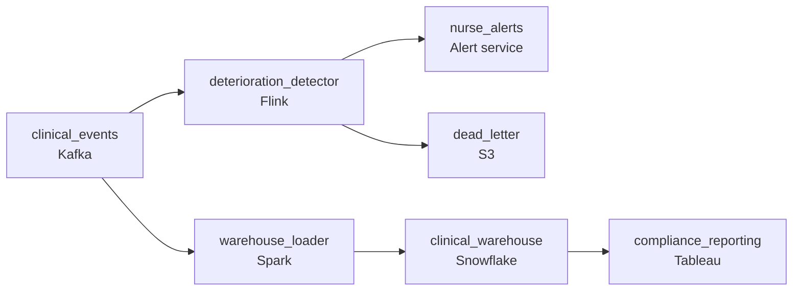

# The Early Warning

- **Domain:** pipeline_architecture
- **Difficulty:** Medium
- **Est. time:** 30 min
- **URL:** https://datadriven.io/problems/the_early_warning

## Problem

A hospital network ingests millions of vital-sign and clinical events a day from bedside monitors and EHR systems. Clinicians need patient-deterioration alerts at the nursing station within seconds of a reading crossing a threshold, while the compliance and analytics teams need every event landed exactly once for the regulatory reporting that runs the next morning. Design the pipeline that serves both.

**Concepts tested:** `paBatchProcessing`, `paBatchVsStreaming`, `paDagOrchestration`, `paDataLake`, `paDataQuality`, `paDeadLetterQueue`, `paDeduplication`, `paEventDriven`, `paEventPlatforms`, `paFullVsIncremental`, `paIdempotency`, `paLambdaArch`, `paLateData`, `paMonitoring`, `paPartitioning`, `paRetryHandling`, `paStreamProcessing`, `paTableFormats`

## Requirements

- When a patient's vitals cross a deterioration threshold, the charge nurse needs to know within seconds, not at the next shift change.
- Compliance reporting has to account for every clinical event exactly once; a duplicated or dropped event is an audit finding.
- The feed runs into the millions of events a day and spikes during rounds; the pipeline can't drop events under load.

## Must-have components

- Millions of events a day from monitors and EHRs arrive in bursts. Put a durable queue at the front so ingest spikes don't drop events or push back on the bedside devices.
- Deterioration alerts can't wait for a nightly batch. Add a stream processor that evaluates readings against thresholds as they arrive.
- Clinicians need the alert within seconds of the threshold crossing. The detection path must carry a sub-minute freshness tier, not a minutes-or-hours one.
- A detection that doesn't reach anyone is useless. Wire the stream processor to an alert destination that surfaces at the nursing station.
- Regulatory reporting and analytics read from a warehouse. Land the full event history there for the next-morning runs.
- Two consumers, two latency budgets: seconds for clinician alerts, next-day for compliance. The design should show distinct freshness tiers rather than forcing both onto one.

**Expected stages:** `Event ingestion buffer` → `Stream processing and deterioration detection` → `Clinician alert delivery` → `Exactly-once load to warehouse` → `Compliance and analytics reporting`

## Solution walkthrough

### Why this problem exists in real interviews

This looks like one pipeline but it is two consumers with opposite correctness budgets sharing a feed. Clinicians want a deterioration alert in seconds and will accept an approximate, best-effort signal; compliance wants every event counted exactly once for a report that runs tomorrow morning and does not care about latency at all. The trap is the single path that serves neither well: too slow to page a nurse, or too loose to survive an audit. The interviewer is watching whether you split the path by latency budget instead of defaulting to stream-everything.

The whiteboard reflex is to stream the whole feed into one table that both the alerting UI and the compliance report read. Alerts lag because the job is also doing the heavy exactly-once bookkeeping the report needs, and the report double-counts when the stream replays after a restart because nothing deduplicates on a stable id. Both stakeholders are unhappy in different directions, and one of them is a patient-safety problem.

> **Trick to solving**
>
> One buffered ingest, two paths sized for two budgets.
>
> 1. A durable queue fronts the millions-a-day feed so producers never push back and bursts during rounds don't drop events.
> 2. A streaming detector reads the queue, evaluates thresholds, and pages the nursing station on a sub-minute tier. Approximate is acceptable; fast is not negotiable.
> 3. A separate load into the warehouse dedupes on a stable event id and checkpoints offsets, so the nightly compliance report reconciles exactly to the source count.

---

### Walk the requirements

**Step 1: Buffer the ingest before you process anything**

Monitors and EHRs emit in bursts, heaviest during morning rounds and code events. A durable queue decouples those producers from the processing tiers: ingest spikes turn into queue depth, not dropped events or backpressure on a bedside device. It also becomes your replay log when a downstream tier needs to be rebuilt.

**Step 2: Put alerting on a streaming, sub-minute path**

The deterioration detector reads the queue, evaluates each reading against thresholds, and emits to an alert destination the charge nurse actually sees, inside 10-15 seconds. This path is allowed to be approximate (a reading briefly in flight is fine) because the cost of slowness here is measured in patient outcomes, not in a reconciliation ticket. Nothing about exactly-once belongs on this path.

**Step 3: Make the warehouse load exactly-once on a stable id**

Compliance reads next-day batch from the warehouse and must reconcile to the source event count. Each event carries a stable id from the device or EHR; the load upserts on that id so a stream restart that replays from the last checkpoint cannot double-count, and gap-free checkpointing means it cannot under-count either. This is where the exactly-once complexity lives, isolated from the latency-sensitive path.

---

### The shape that fits

| node | type | tech | details |
|---|---|---|---|
| clinical_events | source | Kafka | parallelism: 24 partitions |
| deterioration_detector | transform | Flink | slaFreshness: real-time |
| nurse_alerts | consumer | Alert service | slaFreshness: < 1min |
| warehouse_loader | transform | Spark | idempotencyStrategy: upsert |
| clinical_warehouse | storage | Snowflake | slaFreshness: < 24h |
| compliance_reporting | consumer | Tableau | slaFreshness: < 24h |
| dead_letter | storage | S3 | monitorAlert: DLQ depth above baseline |

> **Scale and cost**
>
> At 3-5M events/day the queue depth, not the detector, is the thing to watch: size partitions so the busiest hour during rounds keeps detection latency under target. The exactly-once load is the expensive half because it maintains a dedup index keyed on event id; keeping it off the alerting path is what keeps alerts cheap and fast. Streaming the warehouse load too would multiply cost for zero latency benefit, since compliance reads tomorrow regardless.

> **Interviewers watch for**
>
> A strong candidate names which consumers need streaming (only alerting) and which are fine on batch (compliance, analytics), and says exactly-once explicitly with a stable id and checkpointing. They also flag PHI: every store and hop is access-controlled and audited, on both paths.

> **Common pitfall**
>
> Streaming everything into one table because 'real-time is better.' Alerts then inherit the dedup bookkeeping and slow down, and the report inherits the stream's at-least-once delivery and double-counts on replay. The cheaper, correct design is one buffered ingest feeding two paths, and a dead-letter route so one malformed event from a misconfigured monitor can't stall the alerting path for everyone.

---

- **The detector goes down for ten minutes during a busy shift. What did clinicians miss, and how do you make sure it never happens silently?**
  - _Tests whether the candidate pages on detector health and treats an alerting gap as a safety incident, not just a metrics blip._
- **A device integration starts sending occasional duplicate events with the same id but a corrected value. What does the warehouse load do?**
  - _Tests the limits of dedup-on-id: an exact duplicate is absorbed, but a same-id-different-value correction needs an explicit last-write or versioning rule._
